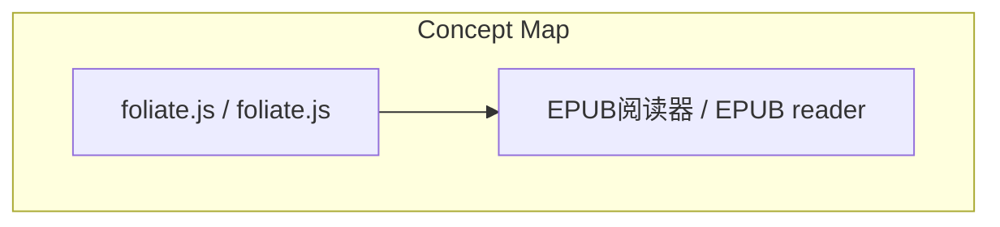
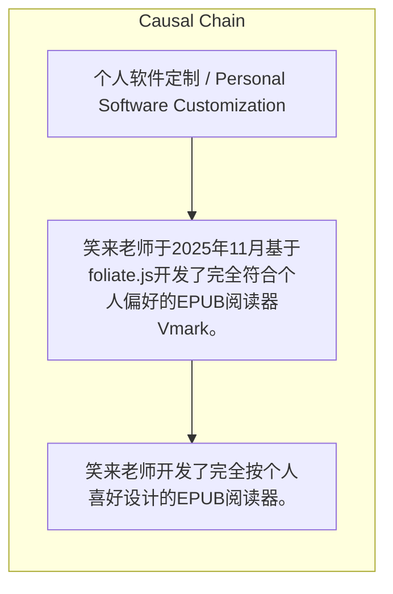

# NEWS/NEWS 任务报告

- agent: news/news
- requestId: 1774182716190-vhmxnb
- 生成时间(UTC): 2026-03-22T12:32:52.162Z

## 文本总结

# 笑来老师自建EPUB阅读器Vmark

## 整体结构化文档表达
### 文档卡片
- 主题（中文/English）：个人软件定制 / Personal Software Customization
- 一句话摘要：笑来老师于2025年11月基于foliate.js开发了完全符合个人偏好的EPUB阅读器Vmark。
- 目标读者：未提及
- 核心结论（3条）：
- 笑来老师开发了完全按个人喜好设计的EPUB阅读器。

### 内容结构树
1. 背景与问题定义
2. 核心观点与关键证据
3. 方法/机制/路径
4. 风险与边界条件
5. 结论与行动建议

### 结构化元数据（JSON）
```json
{
  "title": "笑来老师自建EPUB阅读器Vmark",
  "topic_zh": "个人软件定制",
  "topic_en": "Personal Software Customization",
  "audience": "未提及",
  "claims": [],
  "evidence": [],
  "risks": [],
  "actions": []
}
```

## 处理流程
1. 输入识别
2. 信息抽取（实体、概念、问题、事实、观点）
3. 结构化归纳（定义/分类/比较/因果/方法论）
4. 关系建模（概念关系、等式/方程/逻辑链）
5. 可视化表达（Mermaid）

## 概念清单（中英文）
- EPUB阅读器 / EPUB reader
- foliate.js / foliate.js

## 概念定义（中英文）
### EPUB阅读器 / EPUB reader
- 中文定义：用于阅读EPUB格式电子书的软件
- English Definition: Software for reading EPUB format e-books

### foliate.js / foliate.js
- 中文定义：用于构建EPUB阅读器的JavaScript库
- English Definition: JavaScript library for building EPUB readers


## 概念关联与逻辑关系（中英文）
- foliate.js/foliate.js -> EPUB阅读器/EPUB reader | concept | 基于

### 可形式化关系
- 笑来老师 构建了 EPUB阅读器
- EPUB阅读器 基于 foliate.js
- EPUB阅读器 设计为 个人喜好

## COT逻辑梳理（定义/分类/比较/因果/科学方法论）
- 未发现明确逻辑步骤

## 事实与看法（区分）
### 事实
- 笑来老师于2025年11月基于foliate.js构建了EPUB阅读器。

### 看法
- 未发现明确主观看法

## FAQ（原文问题整理）
- 未发现明确 FAQ

## Visualization
### Mermaid 图 1（概念结构图）


### Mermaid 图 2（逻辑/因果图）


## 文章中的类比
- 未发现明确类比

## 10个金句
- In November 2025 I built an EPUB reader based on foliate.js designed exactly the way I liked it.

