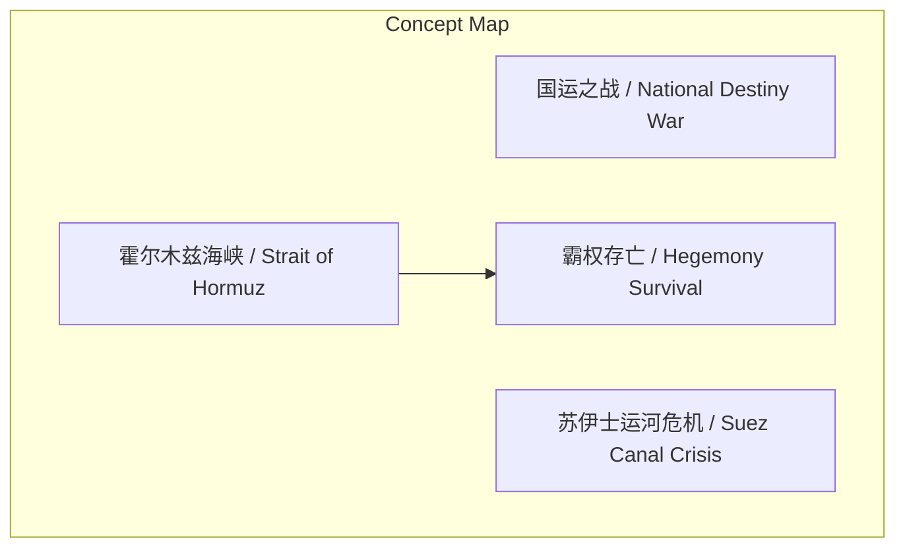
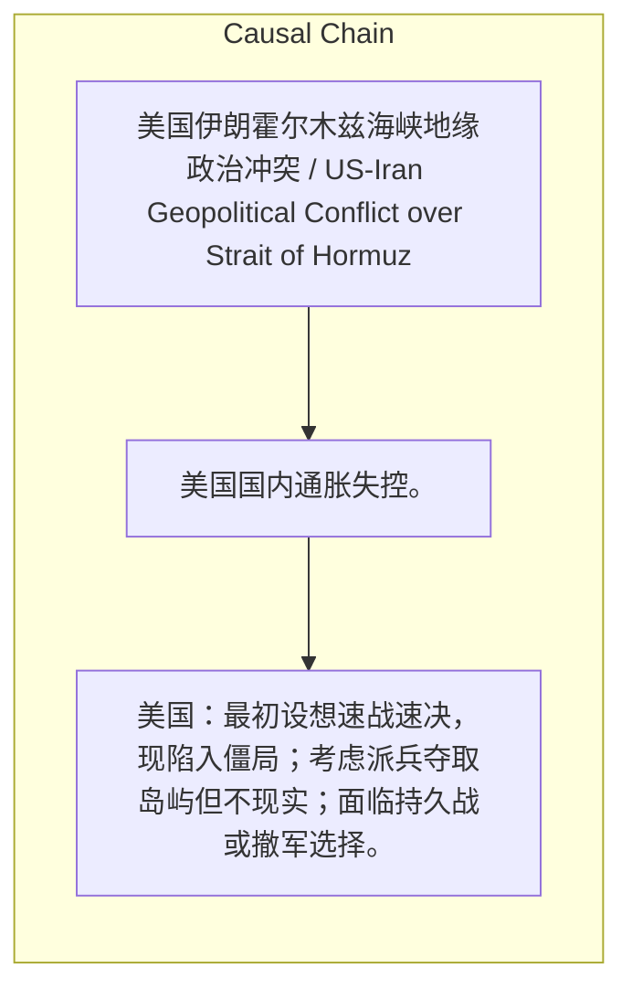

# NEWS/NEWS 任务报告

- agent: news/news
- requestId: 1774198182381-o61lg8
- 生成时间(UTC): 2026-03-22T16:50:52.442Z

### Runtime Trace
- 文本总结 | model=stepfun/step-3.5-flash:free
- 文本总结 | schema_fallback=yes
- 文本总结 | attempted_models=stepfun/step-3.5-flash:free

## 文本总结

### 运行信息
- model: stepfun/step-3.5-flash:free
- schema_fallback: yes
- attempted_models: stepfun/step-3.5-flash:free

# 美伊霍尔木兹海峡危机被比作国运之战

## 整体结构化文档表达
### 文档卡片
- 主题（中文/English）：美国伊朗霍尔木兹海峡地缘政治冲突 / US-Iran Geopolitical Conflict over Strait of Hormuz
- 一句话摘要：美国在霍尔木兹海峡的困境使其陷入类似英国失去苏伊士运河的霸权存亡考验。
- 目标读者：投资者、政策分析者、国际关系学者
- 核心结论（3条）：
- 冲突已升级为关乎美国霸权存亡的“国运之战”。
- 美国无法以低代价打赢且无法体面撤退。
- 可能重蹈英国失去苏伊士运河后丧失世界级大国地位的覆辙。

### 内容结构树
1. 背景与问题定义
2. 核心观点与关键证据
3. 方法/机制/路径
4. 风险与边界条件
5. 结论与行动建议

### 结构化元数据（JSON）
```json
{
  "title": "美伊霍尔木兹海峡危机被比作国运之战",
  "topic_zh": "美国伊朗霍尔木兹海峡地缘政治冲突",
  "topic_en": "US-Iran Geopolitical Conflict over Strait of Hormuz",
  "audience": "投资者、政策分析者、国际关系学者",
  "claims": [
    "美国预期的“速战速决”落空，陷入战略泥潭。",
    "霍尔木兹海峡的地缘绝对优势被伊朗掌握。",
    "全球经济命脉受制，美国国内通胀面临失控风险。",
    "美国进退两难，面临彻底失去海峡控制权的风险。"
  ],
  "evidence": [
    "美国设想像处理委内瑞拉那样迅速击溃伊朗但落空。",
    "霍尔木兹海峡是U型弯狭窄航道，伊朗控制长海岸线，沿岸火炮可封锁。",
    "F-35被伊朗光电防空系统配合红外热追踪导弹击伤。",
    "封锁海峡会导致全球三分之二以上石油供应受阻，油价可能超150美元。",
    "该地区控制化肥、高纯度工业氮气等关键副产品供应链。",
    "以色列刺杀伊朗领导人以加剧美伊仇恨，拖住美国。"
  ],
  "risks": [
    "美国国内通胀失控。",
    "对执政者中期选举造成毁灭性打击。",
    "彻底失去霍尔木兹海峡控制权。",
    "美国霸权落幕。"
  ],
  "actions": [
    "美国：最初设想速战速决，现陷入僵局；考虑派兵夺取岛屿但不现实；面临持久战或撤军选择。",
    "伊朗：掌握地缘优势，可能封锁海峡，宣布效仿埃及模式收取“过路费”。",
    "以色列：刺杀伊朗领导人，试图将美国拖在局势中。"
  ]
}
```

## 处理流程
1. 输入识别
2. 信息抽取（实体、概念、问题、事实、观点）
3. 结构化归纳（定义/分类/比较/因果/方法论）
4. 关系建模（概念关系、等式/方程/逻辑链）
5. 可视化表达（Mermaid）

## 概念清单（中英文）
- 国运之战 / National Destiny War
- 苏伊士运河危机 / Suez Canal Crisis
- 霍尔木兹海峡 / Strait of Hormuz
- 霸权存亡 / Hegemony Survival

## 概念定义（中英文）
### 国运之战 / National Destiny War
- 中文定义：指关乎国家命运与全球霸权存亡的关键性冲突。
- English Definition: A conflict that determines the national destiny and the survival of global hegemony.

### 苏伊士运河危机 / Suez Canal Crisis
- 中文定义：1956年历史事件，英国因被迫撤出而彻底丧失世界级大国地位。
- English Definition: A 1956 historical event where Britain lost its status as a world power after being forced to withdraw.

### 霍尔木兹海峡 / Strait of Hormuz
- 中文定义：被称为“世界石油阀门”的狭窄航道，全球三分之二以上石油经此运输。
- English Definition: A narrow waterway known as the 'world's oil valve', through which over two-thirds of global oil is transported.

### 霸权存亡 / Hegemony Survival
- 中文定义：美国全球主导地位的生死存续。
- English Definition: The survival or demise of US global dominance.


## 概念关联与逻辑关系（中英文）
- 霍尔木兹海峡/Strait of Hormuz -> 霸权存亡/Hegemony Survival | concept | 地缘控制权直接影响霸权存续
- 苏伊士运河危机/Suez Canal Crisis -> 当前局势/Current Situation | concept | 历史类比
- 封锁海峡/Blockade of the Strait -> 美国通胀/US Inflation | concept | 导致

### 可形式化关系
- 如果美国无法以低代价迅速取胜且无法体面撤退，则其霸权存亡受威胁。
- 如果伊朗掌握霍尔木兹海峡的地缘优势，则美国无法以常规军事手段夺取控制权。
- 如果霍尔木兹海峡被封锁，则全球石油供应受阻，美国通胀将面临失控风险。

## COT逻辑梳理（定义/分类/比较/因果/科学方法论）
- Step 1: 美国军事层面受挫——预期速战速决落空，伊朗抵抗使美国陷入持久战泥潭，低代价取胜无望。
- Step 2: 地缘经济层面受制——伊朗掌握霍尔木兹海峡地缘优势可封锁航道，威胁全球石油及关键供应链，推高美国通胀。
- Step 3: 战略层面陷入两难——美国无法体面撤退（将失去海权威信并可能被伊朗完全控制海峡），又无法承受持久战代价，霸权存亡面临考验。

## 事实与看法（区分）
### 事实
- 霍尔木兹海峡是U型弯的极度狭窄航道，两边全是被伊朗控制的长海岸线。
- 一架低空飞行的美军F-35隐形战斗机被伊朗的光电防空系统配合红外热追踪导弹击伤。
- 全球三分之二以上的石油供应经霍尔木兹海峡运输。
- 华尔街预测原油价格可能飙升至每桶150美元以上。
- 该地区控制着农业必需的化肥（如合成氨、尿素）以及半导体芯片制造极度依赖的高纯度工业氮气等关键副产品。

### 看法
- 伊朗局势已演变为美国的“国运之战”。
- 这场冲突可能导致美国霸权落幕。
- 达利欧等人将当前局势比作上世纪50年代的“苏伊士运河危机”。
- 英国因苏伊士运河危机而彻底丧失世界级大国地位。
- 以色列极度不希望美国撤退，正在全力刺杀伊朗领导人以加剧美伊仇恨。

## FAQ（原文问题整理）
### 为什么说美国在霍尔木兹海峡的困境是“国运之战”？
- 因为冲突已上升到可能导致美国霸权落幕的级别，类似英国失去苏伊士运河后丧失世界级大国地位的历史转折点。

### 霍尔木兹海峡的地缘特点如何使伊朗占据优势？
- 海峡是U型弯狭窄航道，伊朗控制两岸长海岸线，仅靠沿岸火炮或内陆导弹即可封锁，美军无法轻易夺取入口岛屿作为据点。

### 美国为何无法体面撤退？
- 若撤退意味着向伊朗妥协，伊朗可能效仿埃及完全掌控海峡并收取“过路费”或禁行，同时美国将丧失全球海权威信；以色列也试图拖住美国。

## Visualization
### Mermaid 图 1（概念结构图）


### Mermaid 图 2（逻辑/因果图）


## 文章中的类比
- 未发现明确类比

## 10个金句
- 原文未提供

