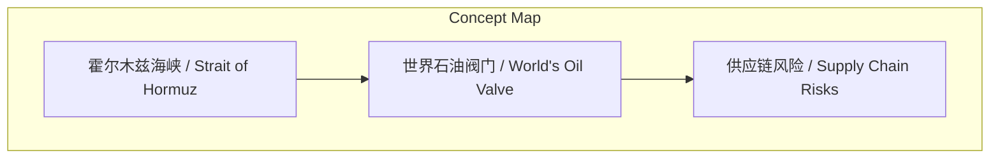
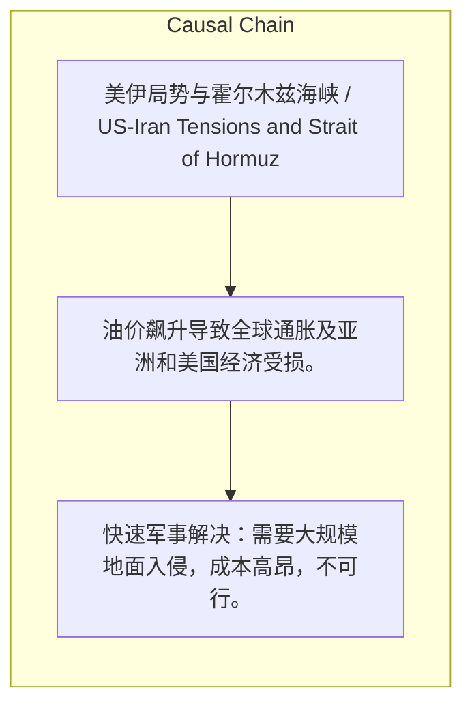

# NEWS/NEWS 任务报告

- agent: news/news
- requestId: 1774198399537-1ea0p3
- 生成时间(UTC): 2026-03-22T16:53:57.531Z

### Runtime Trace
- 文本总结 | model=stepfun/step-3.5-flash:free
- 文本总结 | schema_fallback=yes
- 文本总结 | attempted_models=stepfun/step-3.5-flash:free

## 文本总结

### 运行信息
- model: stepfun/step-3.5-flash:free
- schema_fallback: yes
- attempted_models: stepfun/step-3.5-flash:free

# 霍尔木兹海峡封锁引发三大全球供应链风险

## 整体结构化文档表达
### 文档卡片
- 主题（中文/English）：美伊局势与霍尔木兹海峡 / US-Iran Tensions and Strait of Hormuz
- 一句话摘要：伊朗可能利用霍尔木兹海峡地理优势封锁航道，导致石油、肥料和半导体供应链中断，并重演类似苏伊士运河危机的霸权转移。
- 目标读者：未提及
- 核心结论（3条）：
- 霍尔木兹海峡因地理狭窄且两侧为伊朗领土，极易被伊朗用常规武器封锁。
- 海峡封锁将引发全球石油、农业肥料和半导体制造三大供应链风险。
- 美国面临军事解决成本高昂或撤退导致伊朗永久控制海峡的战略困境，类似苏伊士运河危机。

### 内容结构树
1. 背景与问题定义
2. 核心观点与关键证据
3. 方法/机制/路径
4. 风险与边界条件
5. 结论与行动建议

### 结构化元数据（JSON）
```json
{
  "title": "霍尔木兹海峡封锁引发三大全球供应链风险",
  "topic_zh": "美伊局势与霍尔木兹海峡",
  "topic_en": "US-Iran Tensions and Strait of Hormuz",
  "audience": "未提及",
  "claims": [
    "霍尔木兹海峡是'世界石油阀门'。",
    "伊朗无需强大海军，仅用岸炮和内陆导弹即可封锁海峡。",
    "快速军事解决需要大规模地面入侵，成本高昂不可行。"
  ],
  "evidence": [
    "当前油价已突破110美元/桶。",
    "预测：如果僵持一个月，油价将达150美元/桶。",
    "TSMC库存仅够一个月。",
    "国际肥料价格已翻倍。"
  ],
  "risks": [
    "油价飙升导致全球通胀及亚洲和美国经济受损。",
    "农业肥料短缺影响春季耕作，印度、日本、韩国、东南亚急寻替代供应商。",
    "半导体制造中断引发全球科技供应链震荡。"
  ],
  "actions": [
    "快速军事解决：需要大规模地面入侵，成本高昂，不可行。",
    "撤退：伊朗永久控制海峡，有权阻止美以船只或收取过路费。"
  ]
}
```

## 处理流程
1. 输入识别
2. 信息抽取（实体、概念、问题、事实、观点）
3. 结构化归纳（定义/分类/比较/因果/方法论）
4. 关系建模（概念关系、等式/方程/逻辑链）
5. 可视化表达（Mermaid）

## 概念清单（中英文）
- 霍尔木兹海峡 / Strait of Hormuz
- 世界石油阀门 / World's Oil Valve
- 供应链风险 / Supply Chain Risks

## 概念定义（中英文）
### 霍尔木兹海峡 / Strait of Hormuz
- 中文定义：极其狭窄的U形瓶颈，两侧全是伊朗领土，是全球关键石油出口通道。
- English Definition: Extremely narrow U-shaped bottleneck, entirely flanked by Iranian territory, a critical global oil export route.

### 世界石油阀门 / World's Oil Valve
- 中文定义：指霍尔木兹海峡控制全球三分之二石油供应，其封锁将导致供应中断。
- English Definition: Refers to the Strait of Hormuz controlling two-thirds of global oil supply; its blockade would cause supply disruption.

### 供应链风险 / Supply Chain Risks
- 中文定义：指因霍尔木兹海峡封锁导致的石油、肥料和半导体三大关键物资供应中断风险。
- English Definition: Refers to the disruption risks of oil, fertilizer, and semiconductor supplies due to the Strait of Hormuz blockade.


## 概念关联与逻辑关系（中英文）
- 霍尔木兹海峡/Strait of Hormuz -> 石油供应/Oil Supply | concept | 关键通道
- 石油供应/Oil Supply -> 油价/Oil Price | concept | 直接影响
- 石油副产品/Petroleum By-products -> 农业肥料/Agricultural Fertilizer | concept | 原料来源

### 可形式化关系
- 封锁(霍尔木兹海峡) → 中断(全球石油供应)
- 中断(全球石油供应) → 飙升(油价) ∧ 短缺(石油副产品)
- 短缺(石油副产品) → 短缺(农业肥料) ∧ 中断(半导体制造)

## COT逻辑梳理（定义/分类/比较/因果/科学方法论）
- Step 1: 霍尔木兹海峡地理特征（狭窄、伊朗控制）使其易被封锁。
- Step 2: 封锁导致全球石油供应中断，引发油价飙升和石油副产品短缺。
- Step 3: 石油副产品短缺进一步导致农业肥料和半导体制造供应链中断。

## 事实与看法（区分）
### 事实
- 霍尔木兹海峡两侧全是伊朗领土。
- 伊朗可用岸炮和内陆导弹封锁海峡。
- 波斯湾产油国主要出口通道经霍尔木兹海峡。
- 封锁将中断全球三分之二石油供应。

### 看法
- 美国的快速军事解决选项成本高昂，不可行。
- 撤退将导致伊朗永久控制海峡，类似埃及控制苏伊士运河。
- 当前危机类似于苏伊士运河危机，终结了英国在该地区的霸权。

## FAQ（原文问题整理）
- 未发现明确 FAQ

## Visualization
### Mermaid 图 1（概念结构图）


### Mermaid 图 2（逻辑/因果图）


## 文章中的类比
- 未发现明确类比

## 10个金句
- 原文未提供

