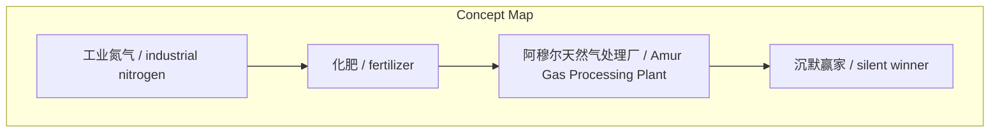
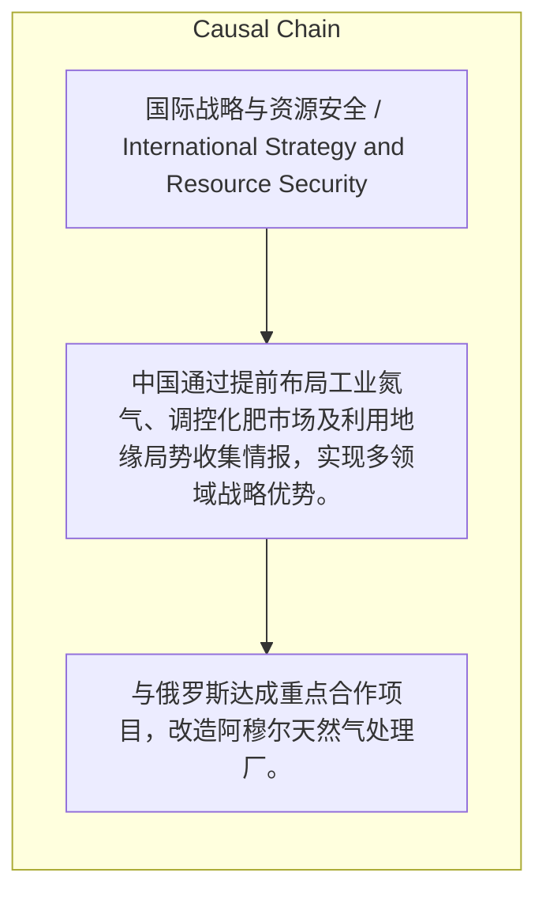

# NEWS/NEWS 任务报告

- agent: news/news
- requestId: 1774198498164-tfshtq
- 生成时间(UTC): 2026-03-22T16:55:41.555Z

### Runtime Trace
- 文本总结 | model=stepfun/step-3.5-flash:free
- 文本总结 | schema_fallback=yes
- 文本总结 | attempted_models=stepfun/step-3.5-flash:free

## 文本总结

### 运行信息
- model: stepfun/step-3.5-flash:free
- schema_fallback: yes
- attempted_models: stepfun/step-3.5-flash:free

# 中国多领域战略布局与“沉默赢家”策略分析

## 整体结构化文档表达
### 文档卡片
- 主题（中文/English）：国际战略与资源安全 / International Strategy and Resource Security
- 一句话摘要：中国通过提前布局工业氮气、调控化肥市场及利用地缘局势收集情报，实现多领域战略优势。
- 目标读者：政策制定者与战略分析师
- 核心结论（3条）：
- 中国通过与俄罗斯合作改造阿穆尔天然气处理厂，已实现对关键工业原料工业氮气的战略布局，未来产能将远超全球需求。
- 中国通过限制化肥出口和投放储备，有效稳定了国内化肥价格，保障了农业供给安全。
- 在美伊冲突中，中国作为“沉默赢家”，无需直接干预即可借机全面收集美军实战数据与装备情报。

### 内容结构树
1. 背景与问题定义
2. 核心观点与关键证据
3. 方法/机制/路径
4. 风险与边界条件
5. 结论与行动建议

### 结构化元数据（JSON）
```json
{
  "title": "中国多领域战略布局与“沉默赢家”策略分析",
  "topic_zh": "国际战略与资源安全",
  "topic_en": "International Strategy and Resource Security",
  "audience": "政策制定者与战略分析师",
  "claims": [
    "中国对工业氮气早有战略布局。",
    "限制化肥出口与投放储备保障了农业供给。",
    "中国是地缘军事上的“沉默赢家”。"
  ],
  "evidence": [
    "中俄合作改造阿穆尔天然气处理厂，位于距黑河不到200公里的西伯利亚，产量提升中，预计30年代完全投产后产能可供应全球工业氮气120%。",
    "中国全面限制化肥出口，投放储备，使国内化肥价格浮动控制在3%以内，价格仅为国际一半。",
    "中国动用探测力量在海湾地区“看戏”，获取美军实战数据和装备底细。"
  ],
  "risks": [],
  "actions": [
    "与俄罗斯达成重点合作项目，改造阿穆尔天然气处理厂。",
    "全面限制所有化肥出口，向市场投放化肥储备。",
    "在海湾地区动用探测力量收集情报。"
  ]
}
```

## 处理流程
1. 输入识别
2. 信息抽取（实体、概念、问题、事实、观点）
3. 结构化归纳（定义/分类/比较/因果/方法论）
4. 关系建模（概念关系、等式/方程/逻辑链）
5. 可视化表达（Mermaid）

## 概念清单（中英文）
- 工业氮气 / industrial nitrogen
- 化肥 / fertilizer
- 阿穆尔天然气处理厂 / Amur Gas Processing Plant
- 沉默赢家 / silent winner

## 概念定义（中英文）
### 工业氮气 / industrial nitrogen
- 中文定义：用于冷链及半导体芯片制造等的高纯度气体。
- English Definition: High-purity gas used in cold chain and semiconductor chip manufacturing.

### 化肥 / fertilizer
- 中文定义：包括合成氨和氮肥（如尿素）等农业必需品。
- English Definition: Agricultural necessities including synthetic ammonia and nitrogen fertilizers (e.g., urea).

### 阿穆尔天然气处理厂 / Amur Gas Processing Plant
- 中文定义：中俄合作改造的位于西伯利亚的天然气处理厂。
- English Definition: A gas processing plant in Siberia jointly upgraded by China and Russia.

### 沉默赢家 / silent winner
- 中文定义：在美伊冲突中无需直接干预即可获取美军情报的战略优势。
- English Definition: Strategic advantage of acquiring US military intelligence without direct intervention in the US-Iran conflict.


## 概念关联与逻辑关系（中英文）
- 工业氮气/industrial nitrogen -> 半导体芯片制造/semiconductor chip manufacturing | concept | 用于
- 化肥/fertilizer -> 合成氨/synthetic ammonia | concept | 包括
- 沉默赢家策略/silent winner strategy -> 探测力量/detection capabilities | concept | 涉及

### 可形式化关系
- 阿穆尔天然气处理厂产能提升 → 满足中国工业氮气需求
- 限制化肥出口 ∧ 投放化肥储备 → 控制国内化肥价格浮动
- 美伊冲突僵局 → 中国作为沉默赢家收集情报

## COT逻辑梳理（定义/分类/比较/因果/科学方法论）
- Step 1: 中国与俄罗斯合作改造阿穆尔天然气处理厂，提前布局工业氮气供应。
- Step 2: 中国限制化肥出口并投放储备，稳定国内农业必需品价格。
- Step 3: 中国在美伊冲突中保持沉默，借机收集美军实战数据与装备情报。

## 事实与看法（区分）
### 事实
- 阿穆尔天然气处理厂距中国黑河国境线不到200公里。
- 该厂完全投产后产能可供应全球工业氮气120%。
- 中国国内化肥价格仅为国际平均价格的一半。
- 中国国内化肥价格浮动被严格控制在3%以内。

### 看法
- 美国国际关系专家将中国视为美伊冲突中的“沉默赢家”。

## FAQ（原文问题整理）
- 未发现明确 FAQ

## Visualization
### Mermaid 图 1（概念结构图）


### Mermaid 图 2（逻辑/因果图）


## 文章中的类比
- 未发现明确类比

## 10个金句
- 沉默的赢家（silent winner）

