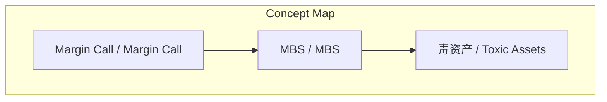
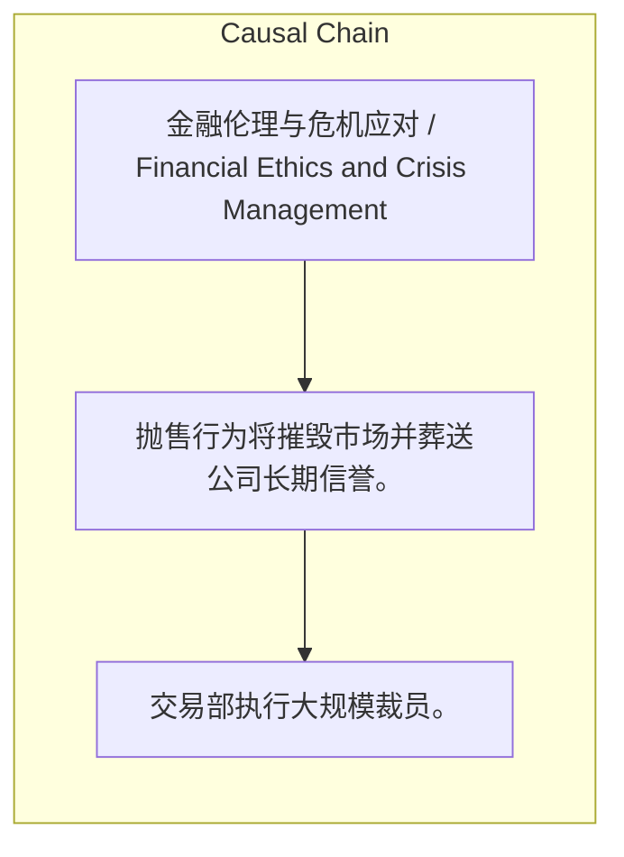

# NEWS/NEWS 任务报告

- agent: news/news
- requestId: 1774198608996-akkils
- 生成时间(UTC): 2026-03-22T16:57:31.315Z

### Runtime Trace
- 文本总结 | model=stepfun/step-3.5-flash:free
- 文本总结 | schema_fallback=yes
- 文本总结 | attempted_models=stepfun/step-3.5-flash:free

## 文本总结

### 运行信息
- model: stepfun/step-3.5-flash:free
- schema_fallback: yes
- attempted_models: stepfun/step-3.5-flash:free

# 《Margin Call》：次贷危机前夜的华尔街抉择

## 整体结构化文档表达
### 文档卡片
- 主题（中文/English）：金融伦理与危机应对 / Financial Ethics and Crisis Management
- 一句话摘要：华尔街投行在2008年次贷危机爆发前夜，面临将有害资产抛售给客户以自保的冷酷抉择。
- 目标读者：未提及
- 核心结论（3条）：
- 电影精准预演了2008年次贷危机中金融机构的关键决策时刻与道德困境。
- 揭示了金融系统中“生存”与“道德”的极端冲突，以及系统性崩盘的必然性。
- 片名“Margin Call”隐喻整个全球金融体系在危机前已处于无力支付的崩盘边缘。

### 内容结构树
1. 背景与问题定义
2. 核心观点与关键证据
3. 方法/机制/路径
4. 风险与边界条件
5. 结论与行动建议

### 结构化元数据（JSON）
```json
{
  "title": "《Margin Call》：次贷危机前夜的华尔街抉择",
  "topic_zh": "金融伦理与危机应对",
  "topic_en": "Financial Ethics and Crisis Management",
  "audience": "未提及",
  "claims": [
    "该片具备冲击奥斯卡最佳影片的水平。",
    "董事长将金融危机视为“流动性再分配”（财富转移）。",
    "抛售决定会“摧毁市场数年”并葬送公司信誉。"
  ],
  "evidence": [
    "故事浓缩在2008年危机前夜的24小时内，背景为华尔街顶级投行。",
    "被解雇风险主管留下的U盘内含未完成数学模型，揭示MBS将全面崩盘。",
    "高层在凌晨2点召开紧急董事会，决定抛售“毒资产”给不知情客户。"
  ],
  "risks": [
    "抛售行为将摧毁市场并葬送公司长期信誉。",
    "基于房贷的金融衍生品（MBS）潜在跌幅足以导致公司破产。",
    "整个金融系统在“Margin Call”边缘无力支付，可能引爆全球危机。"
  ],
  "actions": [
    "交易部执行大规模裁员。",
    "年轻分析师连夜推算发现MBS崩盘风险。",
    "高层决定在市场察觉前将“毒资产”抛售给客户。"
  ]
}
```

## 处理流程
1. 输入识别
2. 信息抽取（实体、概念、问题、事实、观点）
3. 结构化归纳（定义/分类/比较/因果/方法论）
4. 关系建模（概念关系、等式/方程/逻辑链）
5. 可视化表达（Mermaid）

## 概念清单（中英文）
- Margin Call / Margin Call
- MBS / MBS
- 毒资产 / Toxic Assets

## 概念定义（中英文）
### Margin Call / Margin Call
- 中文定义：金融术语，指当杠杆买入的资产价格暴跌超过危险线时，债主要求追加保证金的通知。影片中隐喻金融系统濒临崩盘却无力支付。
- English Definition: A financial term for a demand to deposit additional funds when the value of leveraged assets falls below a required level. In the film, it metaphorically represents the global financial system on the brink of collapse and unable to pay.

### MBS / MBS
- 中文定义：房贷抵押证券，基于房贷的金融衍生品，是引发2008年次贷危机的核心产品。
- English Definition: Mortgage-Backed Securities, financial derivatives based on mortgages, central to the 2008 subprime crisis.

### 毒资产 / Toxic Assets
- 中文定义：指价值即将归零或严重贬值的金融资产，如影片中即将崩盘的MBS。
- English Definition: Financial assets that are nearly worthless or severely devalued, such as the imploding MBS in the film.


## 概念关联与逻辑关系（中英文）
- Margin Call/Margin Call -> 全球金融系统崩盘边缘/Global Financial System on the Brink of Collapse | concept | 隐喻
- 抛售毒资产/Selling Toxic Assets -> 摧毁市场信誉/Destroying Market Trust | concept | 导致
- MBS崩盘/MBS Collapse -> 公司破产风险/Company Bankruptcy Risk | concept | 引发

### 可形式化关系
- 抛售毒资产 → 公司短期自保但长期信誉摧毁
- 追缴保证金通知（Margin Call） → 金融系统濒临崩盘边缘
- 道德困境（卖或不卖） → 人物冲突与系统危机

## COT逻辑梳理（定义/分类/比较/因果/科学方法论）
- Step 1: 交易部裁员，风险主管离职前将存有未完成数学模型的U盘交给年轻分析师。
- Step 2: 分析师连夜推算，发现公司持有的MBS即将全面崩盘，跌幅足以导致公司破产。
- Step 3: 危机上报后，高层在凌晨2点召开紧急董事会，决定在市场察觉前抛售所有毒资产以保全公司。

## 事实与看法（区分）
### 事实
- 电影《Margin Call》于2011年上映，是美国影片。
- 故事背景设定于华尔街的一家顶级投行。
- 影片中董事长角色的原型被认为是雷曼兄弟CEO理查德·福尔德。

### 看法
- 主讲人认为该片具备冲击奥斯卡最佳影片的水平。
- 董事长认为金融危机仅是“流动性再分配”，并推崇生存法则：做第一个出手的、比别人聪明、或者作弊。
- 交易部主管Sam Rogers认为抛售决定会“摧毁市场数年”。

## FAQ（原文问题整理）
### 《Margin Call》的片名有何含义？
- 本为金融术语“追缴保证金通知”，影片中隐喻整个全球金融系统在危机前已处于无力支付的崩盘边缘。

### 电影的核心道德困境是什么？
- 当明知自己的产品会坑害别人和摧毁市场时，究竟卖还是不卖。

## Visualization
### Mermaid 图 1（概念结构图）


### Mermaid 图 2（逻辑/因果图）


## 文章中的类比
- 未发现明确类比

## 10个金句
- 做第一个出手的（be first）、比别人聪明（be smarter）、或者作弊（cheat）。
- 以市场公允价格（fair market price）卖给自愿的买家（willing buyer）。
- 这会‘摧毁市场数年（kill the market for years）’并彻底葬送公司的信誉。

