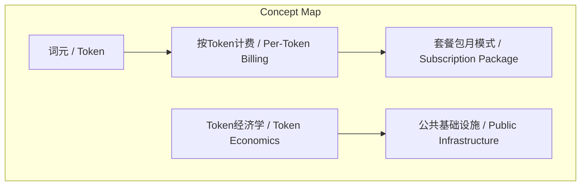
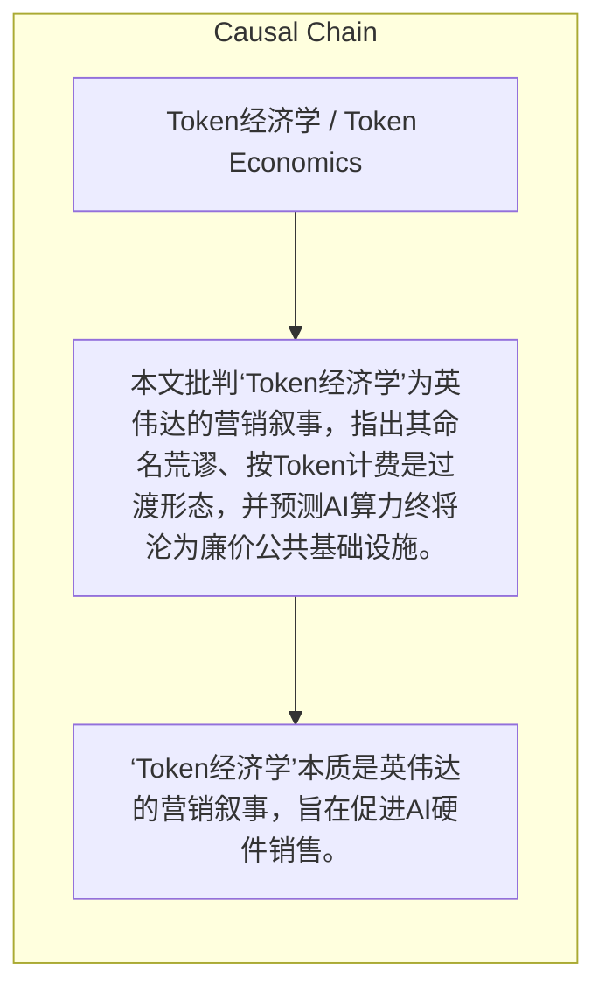

# NEWS/NEWS 任务报告

- agent: news/news
- requestId: 1774198688137-3rmor6
- 生成时间(UTC): 2026-03-22T16:59:31.154Z

### Runtime Trace
- 文本总结 | model=stepfun/step-3.5-flash:free
- 文本总结 | schema_fallback=yes
- 文本总结 | attempted_models=stepfun/step-3.5-flash:free

## 文本总结

### 运行信息
- model: stepfun/step-3.5-flash:free
- schema_fallback: yes
- attempted_models: stepfun/step-3.5-flash:free

# 对‘Token经济学’概念的批判性分析

## 整体结构化文档表达
### 文档卡片
- 主题（中文/English）：Token经济学 / Token Economics
- 一句话摘要：本文批判‘Token经济学’为英伟达的营销叙事，指出其命名荒谬、按Token计费是过渡形态，并预测AI算力终将沦为廉价公共基础设施。
- 目标读者：对AI商业模式感兴趣的听众或从业者
- 核心结论（3条）：
- ‘Token经济学’本质是英伟达的营销叙事，旨在促进AI硬件销售。
- 以底层计量单位命名经济模式逻辑荒谬，应关注基础设施价值。
- 按Token计费是过渡阶段，AI算力将成廉价公共基础设施，计费模式将转向价值导向。

### 内容结构树
1. 背景与问题定义
2. 核心观点与关键证据
3. 方法/机制/路径
4. 风险与边界条件
5. 结论与行动建议

### 结构化元数据（JSON）
```json
{
  "title": "对‘Token经济学’概念的批判性分析",
  "topic_zh": "Token经济学",
  "topic_en": "Token Economics",
  "audience": "对AI商业模式感兴趣的听众或从业者",
  "claims": [
    "英伟达提出‘Token经济学’是为推动AI硬件销售。",
    "以底层单位命名经济模式是荒谬的。",
    "纯按Token计费模式已不适应当前AI服务发展。"
  ],
  "evidence": [
    "英伟达在Token生产端处于全球领先地位。",
    "类比水电按吨/度计价，但不称‘度经济学’或‘吨经济学’。",
    "AI coding领域已转向‘请求数+Token’套餐包月模式。"
  ],
  "risks": [],
  "actions": []
}
```

## 处理流程
1. 输入识别
2. 信息抽取（实体、概念、问题、事实、观点）
3. 结构化归纳（定义/分类/比较/因果/方法论）
4. 关系建模（概念关系、等式/方程/逻辑链）
5. 可视化表达（Mermaid）

## 概念清单（中英文）
- 词元 / Token
- Token经济学 / Token Economics
- 按Token计费 / Per-Token Billing
- 套餐包月模式 / Subscription Package
- 公共基础设施 / Public Infrastructure

## 概念定义（中英文）
### 词元 / Token
- 中文定义：大语言模型处理文本的基础单位
- English Definition: The basic unit for processing text in large language models.

### Token经济学 / Token Economics
- 中文定义：由英伟达CEO提出，以Token数量为核心计费模式的经济概念
- English Definition: An economic concept proposed by NVIDIA's CEO, centered on per-Token billing.

### 按Token计费 / Per-Token Billing
- 中文定义：根据Token数量进行计费的结算方式
- English Definition: A billing method based on the number of Tokens processed.

### 套餐包月模式 / Subscription Package
- 中文定义：结合请求数和Token数量的包月收费模式
- English Definition: A monthly subscription model combining request counts and Token allowances.

### 公共基础设施 / Public Infrastructure
- 中文定义：像水电一样普惠、充裕的基础服务定位
- English Definition: A positioning as a ubiquitous and affordable utility like water or electricity.


## 概念关联与逻辑关系（中英文）
- 词元/Token -> 按Token计费/Per-Token Billing | concept | 作为计量基础
- 按Token计费/Per-Token Billing -> 套餐包月模式/Subscription Package | concept | 正在被替代
- Token经济学/Token Economics -> 公共基础设施/Public Infrastructure | concept | 是过渡阶段，最终将让位于

### 可形式化关系
- Token是按Token计费的核心计量单位。
- 按Token计费是当前AI服务核算成本的常见方式。
- 套餐包月模式正在替代纯按Token计费。

## COT逻辑梳理（定义/分类/比较/因果/科学方法论）
- Step 1: 指出‘Token经济学’由英伟达CEO提出，本质是营销叙事。
- Step 2: 批判该命名逻辑荒谬，类比水电计价单位。
- Step 3: 分析按Token计费是过渡阶段，预测AI算力将成廉价公共基础设施。

## 事实与看法（区分）
### 事实
- 英伟达CEO黄仁勋在开发者大会上提出‘Token经济学’。
- Token是大语言模型处理文本的基础单位。
- 国内官方媒体将Token翻译为‘词元’。
- AI coding领域已转向套餐包月模式。

### 看法
- 认为‘Token经济学’命名极其荒谬。
- 认为纯按Token计费‘极度不合理’。
- 预测AI算力将沦为廉价公共基础设施。

## FAQ（原文问题整理）
### Token是什么？
- 大语言模型处理文本的基础单位，国内官方翻译为‘词元’。

### 为什么说‘Token经济学’是营销叙事？
- 因为英伟达在Token生产端领先，抛出概念旨在促进硬件销售。

### 按Token计费会持续吗？
- 不会，已是过渡阶段，正向套餐包月模式转变。

## Visualization
### Mermaid 图 1（概念结构图）


### Mermaid 图 2（逻辑/因果图）


## 文章中的类比
- 将Token计费比作按‘度’或‘吨’计价，但人类步入电力时代时不称‘度经济学’。

## 10个金句
- 原文未提供

