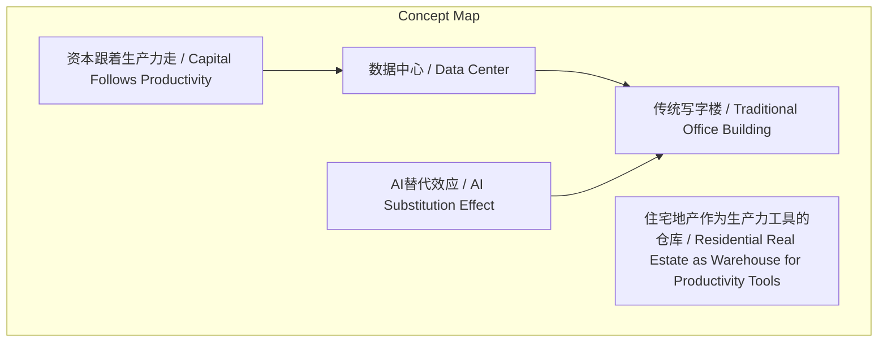
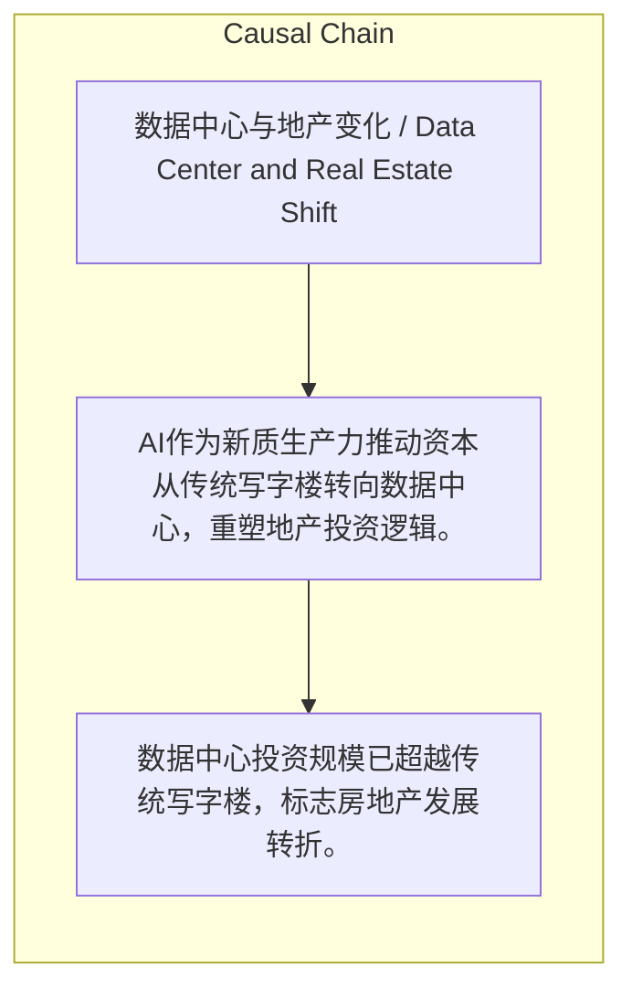

# NEWS/NEWS 任务报告

- agent: news/news
- requestId: 1774276475395-i3v8z6
- 生成时间(UTC): 2026-03-23T14:36:11.080Z

### Runtime Trace
- 文本总结 | model=stepfun/step-3.5-flash:free
- 文本总结 | schema_fallback=yes
- 文本总结 | attempted_models=stepfun/step-3.5-flash:free

## 文本总结

### 运行信息
- model: stepfun/step-3.5-flash:free
- schema_fallback: yes
- attempted_models: stepfun/step-3.5-flash:free

# 数据中心投资超越写字楼：AI驱动地产逻辑转变

## 整体结构化文档表达
### 文档卡片
- 主题（中文/English）：数据中心与地产变化 / Data Center and Real Estate Shift
- 一句话摘要：AI作为新质生产力推动资本从传统写字楼转向数据中心，重塑地产投资逻辑。
- 目标读者：未提及
- 核心结论（3条）：
- 数据中心投资规模已超越传统写字楼，标志房地产发展转折。
- AI替代效应直接削减传统办公空间需求。
- 资本投资重心随生产力更迭，从写字楼流向数据中心。

### 内容结构树
1. 背景与问题定义
2. 核心观点与关键证据
3. 方法/机制/路径
4. 风险与边界条件
5. 结论与行动建议

### 结构化元数据（JSON）
```json
{
  "title": "数据中心投资超越写字楼：AI驱动地产逻辑转变",
  "topic_zh": "数据中心与地产变化",
  "topic_en": "Data Center and Real Estate Shift",
  "audience": "未提及",
  "claims": [
    "数据中心投资已超越传统写字楼。",
    "AI和云端算力崛起替代人类白领工作，削弱办公楼需求。",
    "资产投资重心随生产力更迭而转移。",
    "传统商业地产投资时代已成为过去式。",
    "住宅地产被重新定义为存放人类（生产力工具）的仓库。"
  ],
  "evidence": [],
  "risks": [],
  "actions": []
}
```

## 处理流程
1. 输入识别
2. 信息抽取（实体、概念、问题、事实、观点）
3. 结构化归纳（定义/分类/比较/因果/方法论）
4. 关系建模（概念关系、等式/方程/逻辑链）
5. 可视化表达（Mermaid）

## 概念清单（中英文）
- 数据中心 / Data Center
- 传统写字楼 / Traditional Office Building
- AI替代效应 / AI Substitution Effect
- 资本跟着生产力走 / Capital Follows Productivity
- 住宅地产作为生产力工具的仓库 / Residential Real Estate as Warehouse for Productivity Tools

## 概念定义（中英文）
### 数据中心 / Data Center
- 中文定义：为GPU和算力提供居所的设施
- English Definition: Facilities housing GPUs and computing power

### 传统写字楼 / Traditional Office Building
- 中文定义：为人类提供工作场所的物理空间
- English Definition: Physical spaces for human workplaces

### AI替代效应 / AI Substitution Effect
- 中文定义：AI和云端算力替代人类白领工作，削减办公空间需求的现象
- English Definition: Phenomenon where AI and cloud computing replace human white-collar jobs, reducing office space demand

### 资本跟着生产力走 / Capital Follows Productivity
- 中文定义：资产投资重心随生产力更迭而转移的逻辑
- English Definition: Logic that asset investment focus shifts with productivity evolution

### 住宅地产作为生产力工具的仓库 / Residential Real Estate as Warehouse for Productivity Tools
- 中文定义：住宅用来存放人类（生产力工具）的仓库
- English Definition: Residential properties as warehouses storing humans (productivity tools)


## 概念关联与逻辑关系（中英文）
- 数据中心/Data Center -> 传统写字楼/Traditional Office Building | concept | 投资规模已超越
- AI替代效应/AI Substitution Effect -> 传统写字楼/Traditional Office Building | concept | 削弱需求
- 资本跟着生产力走/Capital Follows Productivity -> 数据中心/Data Center | concept | 导致资本流入

### 可形式化关系
- 数据中心投资规模 > 传统写字楼投资规模
- AI和云端算力替代人类白领工作
- 资本流向跟随生产力方向

## COT逻辑梳理（定义/分类/比较/因果/科学方法论）
- Step 1: 提出历史性拐点：数据中心投资已超越传统写字楼。
- Step 2: 分析AI替代效应：AI和云端算力替代人类白领工作，削弱办公楼需求。
- Step 3: 提炼核心逻辑：资本跟着生产力走，资金从写字楼流向数据中心；并推论住宅地产被重新定义。

## 事实与看法（区分）
### 事实
- 未发现明确客观事实

### 看法
- 数据中心投资已超越传统写字楼。
- AI和云端算力崛起替代人类白领工作，削弱办公楼需求。
- 资产投资重心随生产力更迭而转移。
- 传统商业地产投资时代已成为过去式。
- 住宅地产被重新定义为存放人类（生产力工具）的仓库。

## FAQ（原文问题整理）
- 未发现明确 FAQ

## Visualization
### Mermaid 图 1（概念结构图）


### Mermaid 图 2（逻辑/因果图）


## 文章中的类比
- 将GPU和算力比喻为‘硅基生物’，人类比喻为‘碳基生物’。
- 类比2008年电商崛起时物流仓库建设超过购物中心，当前AI成为新质生产力，数据中心投资超过写字楼。

## 10个金句
- 原文未提供

