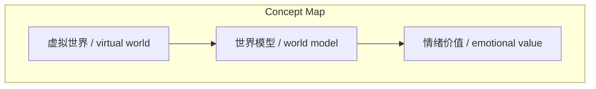
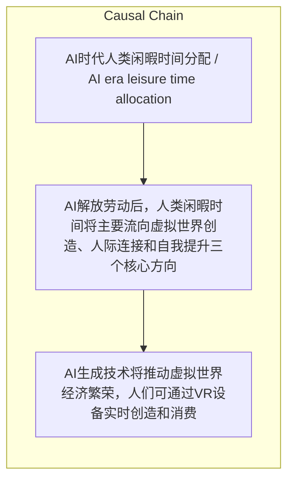

# NEWS/NEWS 任务报告

- agent: news/news
- requestId: 1774312235737-lk173e
- 生成时间(UTC): 2026-03-24T00:32:37.655Z

### Runtime Trace
- 文本总结 | model=openrouter/free
- 文本总结 | schema_fallback=no
- 文本总结 | attempted_models=openrouter/free

## 文本总结

### 运行信息
- model: openrouter/free
- schema_fallback: no
- attempted_models: openrouter/free

# AI时代闲暇时间流向分析

## 整体结构化文档表达
### 文档卡片
- 主题（中文/English）：AI时代人类闲暇时间分配 / AI era leisure time allocation
- 一句话摘要：AI解放劳动后，人类闲暇时间将主要流向虚拟世界创造、人际连接和自我提升三个核心方向
- 目标读者：对AI发展与人类生活方式变化感兴趣的读者
- 核心结论（3条）：
- AI生成技术将推动虚拟世界经济繁荣，人们可通过VR设备实时创造和消费
- 人类将回归社交本质，重视情绪价值和人际深度连接
- 闲暇时间将用于系统学习与实现创意，保持好奇心和指挥AI创造

### 内容结构树
1. 背景与问题定义
2. 核心观点与关键证据
3. 方法/机制/路径
4. 风险与边界条件
5. 结论与行动建议

### 结构化元数据（JSON）
```json
{
  "title": "AI时代闲暇时间流向分析",
  "topic_zh": "AI时代人类闲暇时间分配",
  "topic_en": "AI era leisure time allocation",
  "audience": "对AI发展与人类生活方式变化感兴趣的读者",
  "claims": [
    "AI极大解放普通劳动，让工作时间变少",
    "AI生成技术最大的用处之一是生成虚拟世界",
    "人类真正难能可贵的第二能力就是'有想法'"
  ],
  "evidence": [
    "人们只需戴上VR眼镜，扮演'导演'角色，AI就能实时生成3D虚拟世界和游戏",
    "在AI时代，人类将回归其作为'社交动物'的本质",
    "摆脱繁重工作后，人们可以利用时间专注系统学习和自我提升"
  ],
  "risks": [],
  "actions": []
}
```

## 处理流程
1. 输入识别
2. 信息抽取（实体、概念、问题、事实、观点）
3. 结构化归纳（定义/分类/比较/因果/方法论）
4. 关系建模（概念关系、等式/方程/逻辑链）
5. 可视化表达（Mermaid）

## 概念清单（中英文）
- 虚拟世界 / virtual world
- 世界模型 / world model
- 情绪价值 / emotional value

## 概念定义（中英文）
### 虚拟世界 / virtual world
- 中文定义：通过AI技术生成的互动3D环境
- English Definition: Interactive 3D environments generated through AI technology

### 世界模型 / world model
- 中文定义：AI用于生成虚拟世界的技术
- English Definition: AI technology used to generate virtual worlds

### 情绪价值 / emotional value
- 中文定义：机器无法提供的情感交流
- English Definition: Emotional exchange that machines cannot provide


## 概念关联与逻辑关系（中英文）
- 未发现明确概念关系

### 可形式化关系
- AI解放劳动 → 工作时间减少 → 闲暇时间增加
- AI生成技术 → 虚拟世界创建 → 虚拟经济繁荣
- AI替代智力工作 → 人类回归社交本质 → 重视人际连接

## COT逻辑梳理（定义/分类/比较/因果/科学方法论）
- Step 1: AI解放劳动，人类工作时间减少
- Step 2: 多出闲暇时间主要流向三个方向
- Step 3: 每个方向都产生相应经济或社会价值

## 事实与看法（区分）
### 事实
- 未发现明确客观事实

### 看法
- 摆脱了繁重的流马（牛马）工作是一件造福人类的好事
- 人类真正难能可贵的第二能力就是'有想法'

## FAQ（原文问题整理）
- 未发现明确 FAQ

## Visualization
### Mermaid 图 1（概念结构图）


### Mermaid 图 2（逻辑/因果图）


## 文章中的类比
- 未发现明确类比

## 10个金句
- AI生成技术（如世界模型）最大的用处之一就是生成虚拟世界
- 人类将回归其作为'社交动物'的本质

