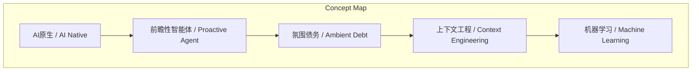
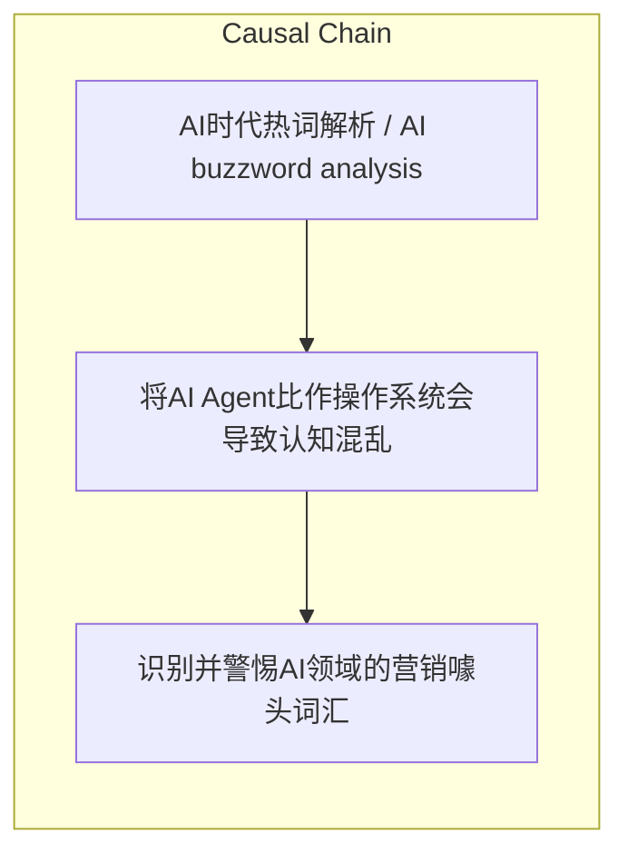

# NEWS/NEWS 任务报告

- agent: news/news
- requestId: 1774312541681-w92kzk
- 生成时间(UTC): 2026-03-24T00:38:04.590Z

### Runtime Trace
- 文本总结 | model=openrouter/free
- 文本总结 | schema_fallback=no
- 文本总结 | attempted_models=openrouter/free

## 文本总结

### 运行信息
- model: openrouter/free
- schema_fallback: no
- attempted_models: openrouter/free

# AI热词“打假”：营销噱头与技术本质

## 整体结构化文档表达
### 文档卡片
- 主题（中文/English）：AI时代热词解析 / AI buzzword analysis
- 一句话摘要：剖析AI时代流行词汇的真实含义与技术本质
- 目标读者：IT从业者、技术爱好者
- 核心结论（3条）：
- AI Native、Proactive Agent等词汇多为营销包装，缺乏技术内涵
- Context Engineering是准确切中技术本质的务实概念
- Machine Learning是最成功的概念重命名案例

### 内容结构树
1. 背景与问题定义
2. 核心观点与关键证据
3. 方法/机制/路径
4. 风险与边界条件
5. 结论与行动建议

### 结构化元数据（JSON）
```json
{
  "title": "AI热词“打假”：营销噱头与技术本质",
  "topic_zh": "AI时代热词解析",
  "topic_en": "AI buzzword analysis",
  "audience": "IT从业者、技术爱好者",
  "claims": [
    "AI Native是新入局者制造优越感的词汇",
    "Proactive Agent本质上是大语言模型的基础预测能力",
    "Ambient Debt是开发者将技术债务甩锅给AI的借口"
  ],
  "evidence": [
    "把软件界面的'loading'改成'thinking'即可自称AI Native",
    "大语言模型底层运作机制就是统计和预测",
    "操作系统有严谨的硬件抽象层和内核安全机制"
  ],
  "risks": [
    "将AI Agent比作操作系统会导致认知混乱",
    "过度包装词汇会误导技术决策"
  ],
  "actions": [
    "识别并警惕AI领域的营销噱头词汇",
    "重视Context Engineering等务实技术概念",
    "避免危险的类比思维"
  ]
}
```

## 处理流程
1. 输入识别
2. 信息抽取（实体、概念、问题、事实、观点）
3. 结构化归纳（定义/分类/比较/因果/方法论）
4. 关系建模（概念关系、等式/方程/逻辑链）
5. 可视化表达（Mermaid）

## 概念清单（中英文）
- AI原生 / AI Native
- 前瞻性智能体 / Proactive Agent
- 氛围债务 / Ambient Debt
- 上下文工程 / Context Engineering
- 机器学习 / Machine Learning

## 概念定义（中英文）
### AI原生 / AI Native
- 中文定义：新入局者制造时代感的优越感词汇
- English Definition: A buzzword created by newcomers to create a sense of superiority

### 前瞻性智能体 / Proactive Agent
- 中文定义：包装了大语言模型基础预测能力的概念
- English Definition: A concept that packages the basic predictive ability of large language models

### 氛围债务 / Ambient Debt
- 中文定义：开发者将技术债务甩锅给AI的借口
- English Definition: An excuse for developers to shift technical debt to AI

### 上下文工程 / Context Engineering
- 中文定义：通过工程手段约束和筛选AI输入信息的严谨概念
- English Definition: A rigorous concept of constraining and screening input information for AI through engineering

### 机器学习 / Machine Learning
- 中文定义：最成功的概念重命名案例
- English Definition: The most successful case of concept renaming


## 概念关联与逻辑关系（中英文）
- AI原生/AI Native -> 过度包装/Over-packaging | concept | is a type of
- 上下文工程/Context Engineering -> 务实技术概念/Practical technical concept | concept | is a type of
- 机器学习/Machine Learning -> 概念重命名/Concept renaming | concept | is the most successful case of

### 可形式化关系
- If a software interface changes 'loading' to 'thinking', then it can be called AI Native
- If large language models are compared to CPUs and context to memory, then it creates dangerous analogies
- If AI has no long-term memory, then Context Engineering is necessary to constrain and filter input information

## COT逻辑梳理（定义/分类/比较/因果/科学方法论）
- Step 1: 识别AI领域层出不穷的时髦词汇
- Step 2: 区分营销噱头词汇与务实技术概念
- Step 3: 分析概念重命名的历史案例与误导性类比

## 事实与看法（区分）
### 事实
- 大语言模型底层运作机制是统计和预测
- AI没有长久记忆，极度依赖外部上下文
- 操作系统有严谨的底层硬件抽象层和内核安全机制

### 看法
- AI Native是新入局者制造优越感的词汇
- Proactive Agent把模型基础能力包装成高深概念
- 将AI Agent比作操作系统会导致认知混乱

## FAQ（原文问题整理）
### 什么是AI Native？
- AI Native是新入局者制造优越感的词汇，本质上只是把软件界面的'loading'改成'thinking'等表面包装

### 为什么说Context Engineering是好词？
- 因为AI没有长久记忆，必须通过工程手段对输入信息进行约束和筛选，这是准确切中技术本质的概念

### Machine Learning为什么是最成功的概念重命名？
- 它将四十年代就有的'人工神经网络'包装成了仿佛带有自主智慧、类似人类大脑正在主动'学习知识'的错觉

## Visualization
### Mermaid 图 1（概念结构图）


### Mermaid 图 2（逻辑/因果图）


## 文章中的类比
- AI Native: 把'loading'改成'thinking' ≈ 换个马甲就自称AI原生
- Proactive Agent: 基础预测能力 ≈ 穿上'前瞻性'的外衣
- AI Agent比作操作系统 ≈ 把统计学概念当成严谨的硬件抽象层

## 10个金句
- 只要把软件界面的'loading'改成't thinking'，就可以自称是AI Native了
- 操作系统有非常严谨的底层硬件抽象层、驱动管理和内核安全机制，而大模型只是一个统计学概念

