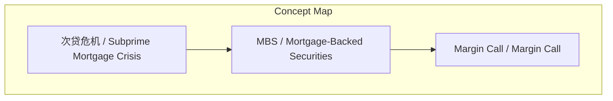
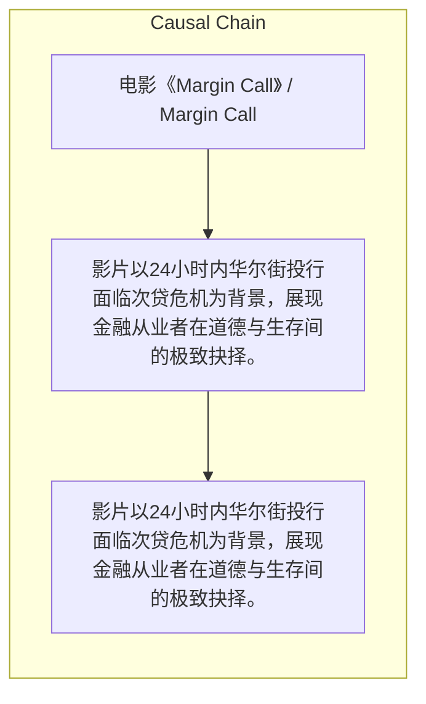

# NEWS/NEWS 任务报告

- agent: news/news
- requestId: 1774312708476-vxxayq
- 生成时间(UTC): 2026-03-24T00:40:29.102Z

### Runtime Trace
- 文本总结 | model=openrouter/free
- 文本总结 | schema_fallback=no
- 文本总结 | attempted_models=openrouter/free

## 文本总结

### 运行信息
- model: openrouter/free
- schema_fallback: no
- attempted_models: openrouter/free

# 《Margin Call》：华尔街24小时道德困局

## 整体结构化文档表达
### 文档卡片
- 主题（中文/English）：电影《Margin Call》 / Margin Call
- 一句话摘要：影片以24小时内华尔街投行面临次贷危机为背景，展现金融从业者在道德与生存间的极致抉择。
- 目标读者：对金融危机、华尔街题材感兴趣的观众
- 核心结论（3条）：
- 影片以24小时内华尔街投行面临次贷危机为背景，展现金融从业者在道德与生存间的极致抉择。
- 董事长代表的华尔街生存法则：be first、be smarter、cheat，最终选择率先抛售毒资产保全公司。
- 交易部主管Sam Rogers代表人性挣扎，最终在巨额奖金诱惑下妥协执行毁灭市场的清仓行动。

### 内容结构树
1. 背景与问题定义
2. 核心观点与关键证据
3. 方法/机制/路径
4. 风险与边界条件
5. 结论与行动建议

### 结构化元数据（JSON）
```json
{
  "title": "《Margin Call》：华尔街24小时道德困局",
  "topic_zh": "电影《Margin Call》",
  "topic_en": "Margin Call",
  "audience": "对金融危机、华尔街题材感兴趣的观众",
  "claims": [
    "影片开场是交易部残酷的大裁员，被解雇的风险主管将存有未完成数学模型的U盘交给了年轻的师。",
    "年轻师连夜推算发现公司持有的基于房贷的金融衍生品（MBS）存在巨大爆仓风险，即将全面崩盘。",
    "高层在凌晨2点召开紧急董事会，最终决定赶在市场察觉之前将这些一文不值的“毒资产”全部抛售给不知情的客户。"
  ],
  "evidence": [
    "影片展现了金融巨变下投行内部的群像戏，深入探讨了“当明知自己的产品会坑害别人和摧毁市场时，究竟卖还是不卖”的极致道德困境。",
    "董事长原型被公认是次贷危机中倒闭的雷曼兄弟CEO理查德·福尔德，其道出华尔街生存的三大残酷法则。",
    "交易部主管Sam Rogers强烈反对高层抛售决定，警告这会“摧毁市场数年”并彻底葬送公司的信誉。"
  ],
  "risks": [],
  "actions": []
}
```

## 处理流程
1. 输入识别
2. 信息抽取（实体、概念、问题、事实、观点）
3. 结构化归纳（定义/分类/比较/因果/方法论）
4. 关系建模（概念关系、等式/方程/逻辑链）
5. 可视化表达（Mermaid）

## 概念清单（中英文）
- 次贷危机 / Subprime Mortgage Crisis
- MBS / Mortgage-Backed Securities
- Margin Call / Margin Call

## 概念定义（中英文）
### 次贷危机 / Subprime Mortgage Crisis
- 中文定义：2007-2008年间因美国房地产市场泡沫破裂引发的全球性金融危机
- English Definition: A global financial crisis that occurred between 2007-2008 triggered by the collapse of the US housing market bubble

### MBS / Mortgage-Backed Securities
- 中文定义：以房地产抵押贷款为基础的金融衍生品
- English Definition: Financial derivatives based on real estate mortgage loans

### Margin Call / Margin Call
- 中文定义：当杠杆投资资产价格暴跌时，债主要求追加保证金的通知
- English Definition: A notification from a creditor demanding additional collateral when leveraged investment assets plummet in price


## 概念关联与逻辑关系（中英文）
- 未发现明确概念关系

### 可形式化关系
- 影片开场 → 交易部残酷的大裁员
- 风险主管被解雇 → 将存有未完成数学模型的U盘交给了年轻的师
- 年轻师连夜推算 → 发现公司持有的MBS存在巨大爆仓风险

## COT逻辑梳理（定义/分类/比较/因果/科学方法论）
- Step 1：影片以24小时内华尔街投行面临次贷危机为背景，展现金融从业者在道德与生存间的极致抉择。
- Step 2：董事长代表的华尔街生存法则：be first、be smarter、cheat，最终选择率先抛售毒资产保全公司。
- Step 3：交易部主管Sam Rogers代表人性挣扎，最终在巨额奖金诱惑下妥协执行毁灭市场的清仓行动。

## 事实与看法（区分）
### 事实
- 影片《Margin Call》于2011年上映，主要剖析了2008年次贷危机爆发前夜的故事。
- 影片由杰瑞米·艾恩斯、凯文·史派西、扎克瑞·昆图、保罗·贝塔尼、黛米·摩尔、西蒙·贝克等知名演员主演。
- 影片片名“Margin Call”是一个金融术语，隐喻整个全球金融系统都到了“需要交保证金”的崩盘边缘。

### 看法
- 主讲人对这部电影评价极高，认为其完全具备冲击奥斯卡最佳影片的水平。
- 董事长原型被公认是次贷危机中倒闭的雷曼兄弟CEO理查德·福尔德。
- 交易部主管Sam Rogers是片中仅存的人性代表。

## FAQ（原文问题整理）
### 《Margin Call》讲述的是什么故事？
- 影片以24小时内华尔街投行面临次贷危机为背景，展现金融从业者在道德与生存间的极致抉择。

### 影片中的董事长代表什么？
- 董事长原型被公认是次贷危机中倒闭的雷曼兄弟CEO理查德·福尔德，代表华尔街的冷酷无情和缺乏道德底线。

### 影片片名“Margin Call”有什么含义？
- “Margin Call”是一个金融术语，隐喻整个全球金融系统都到了“需要交保证金”的崩盘边缘，但整个系统根本无力支付，最终引爆了席卷全球的次贷危机。

## Visualization
### Mermaid 图 1（概念结构图）


### Mermaid 图 2（逻辑/因果图）


## 文章中的类比
- 未发现明确类比

## 10个金句
- 华尔街生存的三大残酷法则：“做第一个出手的（be first）、比别人聪明（be smarter）或者作弊（cheat）”
- 以市场公允价格（fair market price）卖给自愿的买家（willing buyer）
- 这会“摧毁市场数年（kill the market for years）”并彻底葬送公司的信誉

