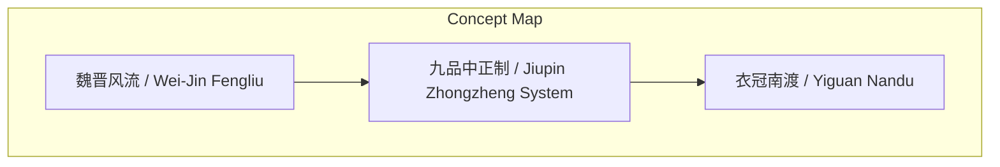
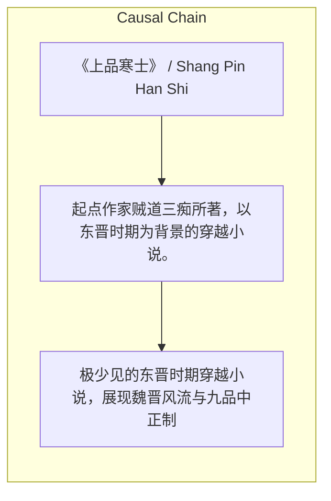

# NEWS/NEWS 任务报告

- agent: news/news
- requestId: 1774312876380-zrjqga
- 生成时间(UTC): 2026-03-24T00:41:30.791Z

### Runtime Trace
- 文本总结 | model=openrouter/free
- 文本总结 | schema_fallback=no
- 文本总结 | attempted_models=openrouter/free

## 文本总结

### 运行信息
- model: openrouter/free
- schema_fallback: no
- attempted_models: openrouter/free

# 《上品寒士》：魏晋穿越佳作

## 整体结构化文档表达
### 文档卡片
- 主题（中文/English）：《上品寒士》 / Shang Pin Han Shi
- 一句话摘要：起点作家贼道三痴所著，以东晋时期为背景的穿越小说。
- 目标读者：穿越小说读者
- 核心结论（3条）：
- 极少见的东晋时期穿越小说，展现魏晋风流与九品中正制
- 文笔优雅，克制运用现代知识，塑造丰满女性群像
- 巧妙融合历史矛盾，丰富穿越小说内涵

### 内容结构树
1. 背景与问题定义
2. 核心观点与关键证据
3. 方法/机制/路径
4. 风险与边界条件
5. 结论与行动建议

### 结构化元数据（JSON）
```json
{
  "title": "《上品寒士》：魏晋穿越佳作",
  "topic_zh": "《上品寒士》",
  "topic_en": "Shang Pin Han Shi",
  "audience": "穿越小说读者",
  "claims": [
    "《上品寒士》可能是描写魏晋南北朝时期最好的穿越小说",
    "作者贼道三痴是起点中文网著名已故作家",
    "小说成功塑造了十多位性格迥异的女性角色"
  ],
  "evidence": [
    "主讲人对该书评价极高",
    "文笔优雅，人物丰满",
    "巧妙引出南方本土士族与北方南迁士族之间的历史矛盾"
  ],
  "risks": [],
  "actions": []
}
```

## 处理流程
1. 输入识别
2. 信息抽取（实体、概念、问题、事实、观点）
3. 结构化归纳（定义/分类/比较/因果/方法论）
4. 关系建模（概念关系、等式/方程/逻辑链）
5. 可视化表达（Mermaid）

## 概念清单（中英文）
- 魏晋风流 / Wei-Jin Fengliu
- 九品中正制 / Jiupin Zhongzheng System
- 衣冠南渡 / Yiguan Nandu

## 概念定义（中英文）
### 魏晋风流 / Wei-Jin Fengliu
- 中文定义：魏晋时期文人雅士的风度气韵
- English Definition: The elegant demeanor of literati during the Wei and Jin dynasties

### 九品中正制 / Jiupin Zhongzheng System
- 中文定义：东晋时期的世袭官职选拔制度
- English Definition: Hereditary system for selecting officials in the Eastern Jin dynasty

### 衣冠南渡 / Yiguan Nandu
- 中文定义：北方士族南迁的历史事件
- English Definition: Historical event of northern aristocrats migrating southward


## 概念关联与逻辑关系（中英文）
- 未发现明确概念关系

### 可形式化关系
- If a novel is set in the Eastern Jin period and features a protagonist from a humble background, then it likely explores themes of class mobility and social mobility.
- If a novel portrays the Wei-Jin Fengliu, then it likely includes depictions of literati culture and refined tastes.
- If a novel features a protagonist who interacts with historical figures, then it likely incorporates elements of historical fiction and cultural exchange.

## COT逻辑梳理（定义/分类/比较/因果/科学方法论）
- Step 1: 小说设定在东晋时期，采用九品中正制，阶级壁垒森严
- Step 2: 男主角出身寒门，为迎娶士族千金，努力打破阶级壁垒
- Step 3: 小说通过男主角与历史名人的交集，生动展现魏晋风流

## 事实与看法（区分）
### 事实
- 小说作者是贼道三痴，已故
- 小说设定在东晋时期，采用九品中正制
- 小说塑造了十多位性格迥异的女性角色

### 看法
- 主讲人认为《上品寒士》可能是描写魏晋南北朝时期最好的穿越小说
- 小说文笔极佳，人物丰满
- 小说极大地丰富了穿越小说的内涵

## FAQ（原文问题整理）
### 《上品寒士》的作者是谁？
- 贼道三痴，起点中文网著名已故作家

### 《上品寒士》的故事背景是什么？
- 东晋时期，采用九品中正制

### 《上品寒士》的核心亮点是什么？
- 极少见的东晋时期穿越小说，展现魏晋风流与九品中正制

## Visualization
### Mermaid 图 1（概念结构图）


### Mermaid 图 2（逻辑/因果图）


## 文章中的类比
- 《上品寒士》如同《琅琊榜》之于明清穿越小说，以独特的时代背景和深刻的历史内涵，丰富了穿越小说的内涵

## 10个金句
- 极其生动地刻画出了“魏晋风流”的时代风貌与名士气韵
- 极其丰满立体的女性群像与历史矛盾

