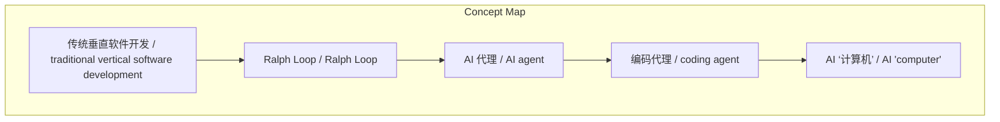
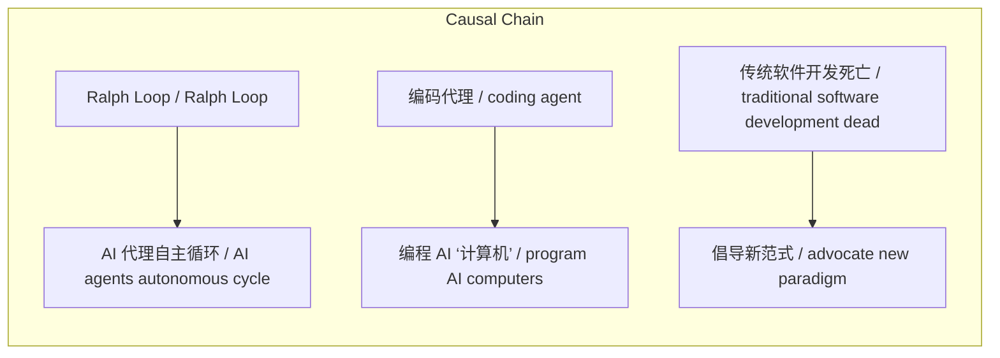

# NEWS/NEWS 任务报告

- agent: news/news
- requestId: 1774361464816-hi325b
- 生成时间(UTC): 2026-03-24T14:13:34.404Z

### Runtime Trace
- 文本总结 | model=openrouter/free
- 文本总结 | schema_fallback=no
- 文本总结 | attempted_models=openrouter/free

## 文本总结

### 运行信息
- model: openrouter/free
- schema_fallback: no
- attempted_models: openrouter/free

# AI编程范式转变 (AI Programming Paradigm Shift)

## 整体结构化文档表达
### 文档卡片
- 主题（中文/English）：AI编程范式转变 / AI Programming Paradigm Shift
- 一句话摘要：Geoffrey Huntley 宣称传统软件开发已死，倡导通过 Ralph Loop 编排模式让 AI 代理自主循环目标、故障识别与自我修正，并构建编码代理来编程新型 AI ‘计算机’。
- 目标读者：技术从业者
- 核心结论（3条）：
- 传统垂直软件开发被视为过时 (Traditional vertical software development deemed obsolete)
- Ralph Loop 编排模式让 AI 代理自主循环目标、故障识别与自我修正 (Ralph Loop orchestrator pattern enables AI agents to autonomously cycle goals, identify failures, self-correct)
- 应构建编码代理来编程新型 AI ‘计算机’，而非继续传统编程 (Build coding agents to program new AI 'computers' instead of continuing traditional programming)

### 内容结构树
1. 背景与问题定义
2. 核心观点与关键证据
3. 方法/机制/路径
4. 风险与边界条件
5. 结论与行动建议

### 结构化元数据（JSON）
```json
{
  "title": "AI编程范式转变 (AI Programming Paradigm Shift)",
  "topic_zh": "AI编程范式转变",
  "topic_en": "AI Programming Paradigm Shift",
  "audience": "技术从业者",
  "claims": [
    "软件开发现在已经“死亡” (Software development is now \"dead\")",
    "AI 代理能够自主进行目标识别、失败检测与自我纠正 (AI agents can autonomously identify goals, detect failures, and self-correct)",
    "编码代理应作为新型 AI ‘计算机’ 的程序员 (Coding agents should act as programmers for new AI 'computers')"
  ],
  "evidence": [
    "Geoffrey Huntley 描述了从传统垂直（“砖块叠砖”）软件开发的转变 (Geoffrey Huntley describes his shift from traditional vertical software development)",
    "他提出了 Ralph Loop 编排模式——AI 代理自主循环目标、识别失败并自我修正 (He proposes the Ralph Loop orchestrator pattern where AI agents autonomously cycle through goals, identify failures, and self-correct)",
    "他主张构建编码代理来编程这些新型 AI ‘计算机’ (He advocates building coding agents to program these new AI 'computers')"
  ],
  "risks": [
    "过度依赖自主 AI 代理可能带来不可预见的错误 (Over-reliance on autonomous AI agents may introduce unforeseen errors)",
    "忽视传统软件工程最佳实践可能导致可维护性下降 (Neglecting traditional software engineering best practices may reduce maintainability)",
    "AI 代理的目标循环可能陷入无效反馈循环 (The goal‑failure‑correction loop of AI agents could stall in ineffective cycles)"
  ],
  "actions": [
    "评估现有项目中是否可引入 Ralph Loop 编排模式 (Assess existing projects for applicability of the Ralph Loop orchestrator pattern)",
    "开发原型编码代理以实现对 AI ‘计算机’ 的编程 (Develop prototype coding agents to program AI 'computers')",
    "监控 AI 代理的目标‑失败‑纠正循环以防止死锁 (Monitor AI agents' goal‑failure‑correction loops to avoid deadlock)"
  ]
}
```

## 处理流程
1. 输入识别
2. 信息抽取（实体、概念、问题、事实、观点）
3. 结构化归纳（定义/分类/比较/因果/方法论）
4. 关系建模（概念关系、等式/方程/逻辑链）
5. 可视化表达（Mermaid）

## 概念清单（中英文）
- 传统垂直软件开发 / traditional vertical software development
- Ralph Loop / Ralph Loop
- AI 代理 / AI agent
- 编码代理 / coding agent
- AI ‘计算机’ / AI 'computer'

## 概念定义（中英文）
### 传统垂直软件开发 / traditional vertical software development
- 中文定义：逐块堆砖式的线性开发方式
- English Definition: a linear, brick‑by‑brick development approach

### Ralph Loop / Ralph Loop
- 中文定义：AI 代理自主循环目标、识别失败并自我修正的编排模式
- English Definition: an orchestrator pattern where AI agents autonomously cycle through goals, identify failures, and self-correct

### AI 代理 / AI agent
- 中文定义：能够感知环境、执行目标并进行自我纠正的自主软件实体
- English Definition: an autonomous software entity that perceives, pursues goals, and self-corrects

### 编码代理 / coding agent
- 中文定义：专门生成或修改程序代码的 AI 代理
- English Definition: an AI agent specialized in generating or modifying program code

### AI ‘计算机’ / AI 'computer'
- 中文定义：由 AI 代理组成并由编码代理编程的新型计算范式
- English Definition: a new computing paradigm composed of AI agents programmed by coding agents


## 概念关联与逻辑关系（中英文）
- Ralph Loop/Ralph Loop -> AI 代理自主循环/AI agents autonomous cycle | support | 提供
- 编码代理/coding agent -> 编程 AI ‘计算机’/program AI computers | support | 实现
- 传统软件开发死亡/traditional software development dead -> 倡导新范式/advocate new paradigm | support | 触发

### 可形式化关系
- Geoffrey Huntley 主张：构建编码代理 → 编程 AI 计算机 (Geoffrey Huntley advocates: build coding agents → program AI computers)
- Ralph Loop 模式：AI 代理 → 循环 (目标 → 识别失败 → 自我纠正) (Ralph Loop pattern: AI agents → cycle (goal → identify failure → self-correct))
- 传统软件开发状态：死亡 (Traditional software development state: dead)

## COT逻辑梳理（定义/分类/比较/因果/科学方法论）
- Step 1: 认识到传统垂直（“砖块叠砖”）软件开发的局限性 (Step 1: Recognize limitations of traditional vertical ('brick by brick') software development)
- Step 2: 转向 Ralph Loop 编排模式，让 AI 代理自主进行目标识别、失败检测与自我修正 (Step 2: Shift to Ralph Loop orchestrator pattern where AI agents autonomously cycle goals, identify failures, self-correct)
- Step 3: 主张软件开发已死，应构建编码代理来编程新型 AI ‘计算机’，取代传统编程 (Step 3: Advocate that software development is dead, advocate building coding agents to program new AI 'computers' instead of continuing traditional programming)

## 事实与看法（区分）
### 事实
- Geoffrey Huntley 描述了从传统垂直软件开发到 Ralph Loop 方法的转变
- Ralph Loop 方法涉及 AI 代理自主循环目标、识别失败并自我修正
- Geoffrey Huntley 认为软件开发现在已经 "死亡"
- 他主张构建编码代理来编程新型 AI ‘计算机’ 而不是继续传统编程

### 看法
- 传统垂直软件开发不再适用
- Ralph Loop 编排模式是未来软件构建的关键
- 编码代理应成为新型 AI 计算机的主要程序员

## FAQ（原文问题整理）
### 什么是 Ralph Loop？
- Ralph Loop 是一种编排模式，其中 AI 代理自主循环目标、识别失败并进行自我修正。

### Geoffrey Huntley 为什么说软件开发已经死亡？
- 他认为传统的逐块堆砖式开发方式已经过时，应由 AI 代理和编码代理取代。

### 构建编码代理的目标是什么？
- 让编码代理负责编程新型 AI ‘计算机’，以取代传统的人工编程。

## Visualization
### Mermaid 图 1（概念结构图）


### Mermaid 图 2（逻辑/因果图）


## 文章中的类比
- 传统软件开发就像手工砌砖，而 Ralph Loop 就像让机器人自动搬砖、检查质量并自行修复裂缝。

## 10个金句
- "软件开发现在已经死亡" — — Geoffrey Huntley

