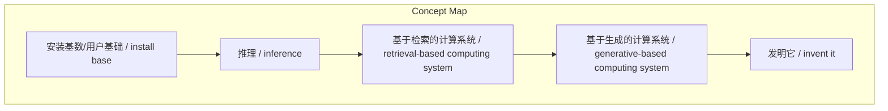
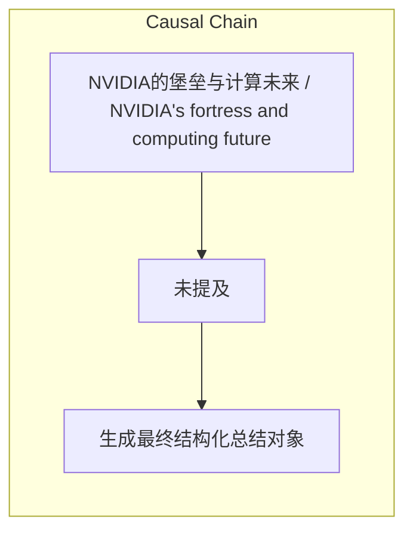

# NEWS/NEWS 任务报告

- agent: news/news
- requestId: 1774363344803-2shnct
- 生成时间(UTC): 2026-03-24T14:43:01.105Z

### Runtime Trace
- 文本总结 | model=openrouter/free
- 文本总结 | schema_fallback=no
- 文本总结 | attempted_models=openrouter/free

## 文本总结

### 运行信息
- model: openrouter/free
- schema_fallback: no
- attempted_models: openrouter/free

# NVIDIA的堡垒与计算未来

## 整体结构化文档表达
### 文档卡片
- 主题（中文/English）：NVIDIA的堡垒与计算未来 / NVIDIA's fortress and computing future
- 一句话摘要：NVIDIA是由GeForce一手建立起来的堡垒，安装基数是计算架构中最重要的一部分，推理才是真正的思考，而预训练仅仅是死记硬背，基于检索的计算系统已经跨越到了基于生成的计算系统，预测未来最好的方法就是去发明它。
- 目标读者：资深新闻分析助理
- 核心结论（3条）：
- NVIDIA是由GeForce一手建立起来的堡垒。
- 安装基数是计算架构中最重要的一部分。
- 推理才是真正的思考，而预训练仅仅是死记硬背。
- 基于检索的计算系统已经跨越到了基于生成的计算系统。
- 预测未来最好的方法就是去发明它。

### 内容结构树
1. 背景与问题定义
2. 核心观点与关键证据
3. 方法/机制/路径
4. 风险与边界条件
5. 结论与行动建议

### 结构化元数据（JSON）
```json
{
  "title": "NVIDIA的堡垒与计算未来",
  "topic_zh": "NVIDIA的堡垒与计算未来",
  "topic_en": "NVIDIA's fortress and computing future",
  "audience": "资深新闻分析助理",
  "claims": [
    "只允许基于输入内容输出，不要杜撰，不要引入输入之外的外部事实。"
  ],
  "evidence": [
    "NVIDIA is the house that GeForce built.",
    "The install base is in fact the single most important part of an architecture.",
    "Thinking is way harder than reading. Pre-training is just memorization... Inference is thinking.",
    "We went from a retrieval-based computing system to a generative-based computing system.",
    "The best way to predict the future is to invent it."
  ],
  "risks": [
    "未提及"
  ],
  "actions": [
    "生成最终结构化总结对象"
  ]
}
```

## 处理流程
1. 输入识别
2. 信息抽取（实体、概念、问题、事实、观点）
3. 结构化归纳（定义/分类/比较/因果/方法论）
4. 关系建模（概念关系、等式/方程/逻辑链）
5. 可视化表达（Mermaid）

## 概念清单（中英文）
- 安装基数/用户基础 / install base
- 推理 / inference
- 基于检索的计算系统 / retrieval-based computing system
- 基于生成的计算系统 / generative-based computing system
- 发明它 / invent it

## 概念定义（中英文）
### 安装基数/用户基础 / install base
- 中文定义：NVIDIA是由GeForce一手建立起来的堡垒。
- English Definition: NVIDIA是由GeForce一手建立起来的堡垒。

### 推理 / inference
- 中文定义：预训练仅仅是死记硬背……推理才是真正的思考。
- English Definition: 预训练仅仅是死记硬背……推理才是真正的思考。

### 基于检索的计算系统 / retrieval-based computing system
- 中文定义：基于检索的计算系统
- English Definition: 基于检索的计算系统

### 基于生成的计算系统 / generative-based computing system
- 中文定义：基于生成的计算系统
- English Definition: 基于生成的计算系统

### 发明它 / invent it
- 中文定义：预测未来最好的方法 就是去发明它。
- English Definition: 预测未来最好的方法 就是去发明它。


## 概念关联与逻辑关系（中英文）
- NVIDIA是由GeForce一手建立起来的堡垒/NVIDIA是由GeForce一手建立起来的堡垒 -> NVIDIA是由GeForce一手建立起来的堡垒/NVIDIA是由GeForce一手建立起来的堡垒 | concept | 核心结论
- 安装基数是计算架构中最重要的一部分/安装基数是计算架构中最重要的一部分 -> 安装基数是计算架构中最重要的一部分/安装基数是计算架构中最重要的一部分 | concept | 核心结论
- 推理才是真正的思考，而预训练仅仅是死记硬背/推理才是真正的思考，而预训练仅仅是死记硬背 -> 推理才是真正的思考，而预训练仅仅是死记硬背/推理才是真正的思考，而预训练仅仅是死记硬背 | concept | 核心结论
- 基于检索的计算系统已经跨越到了基于生成的计算系统/基于检索的计算系统已经跨越到了基于生成的计算系统 -> 基于检索的计算系统已经跨越到了基于生成的计算系统/基于检索的计算系统已经跨越到了基于生成的计算系统 | concept | 核心结论
- 预测未来最好的方法就是去发明它/预测未来最好的方法就是去发明它 -> 预测未来最好的方法就是去发明它/预测未来最好的方法就是去发明它 | concept | 核心结论

### 可形式化关系
- NVIDIA是由GeForce一手建立起来的堡垒 → 核心结论：NVIDIA是由GeForce一手建立起来的堡垒。
- 安装基数是计算架构中最重要的一部分 → 核心结论：安装基数是计算架构中最重要的一部分。
- 推理才是真正的思考，而预训练仅仅是死记硬背 → 核心结论：推理才是真正的思考，而预训练仅仅是死记硬背。
- 基于检索的计算系统已经跨越到了基于生成的计算系统 → 核心结论：基于检索的计算系统已经跨越到了基于生成的计算系统。
- 预测未来最好的方法就是去发明它 → 核心结论：预测未来最好的方法就是去发明它。

## COT逻辑梳理（定义/分类/比较/因果/科学方法论）
- Step 1: 识别文本中的核心观点。
- Step 2: 将核心观点转化为结构化总结对象。
- Step 3: 确保输出符合要求（标题、结论、关系、步骤）。

## 事实与看法（区分）
### 事实
- NVIDIA是由GeForce一手建立起来的堡垒。
- 安装基数是计算架构中最重要的一部分。
- 推理才是真正的思考，而预训练仅仅是死记硬背。
- 基于检索的计算系统已经跨越到了基于生成的计算系统。
- 预测未来最好的方法就是去发明它。

### 看法
- 未提及

## FAQ（原文问题整理）
### 是否提及NVIDIA的其他产品线？
- 未提及

### 是否提及其他公司的相关信息？
- 未提及

## Visualization
### Mermaid 图 1（概念结构图）


### Mermaid 图 2（逻辑/因果图）


## 文章中的类比
- 基于输入文本生成结构化总结

## 10个金句
- NVIDIA is the house that GeForce built.
- I manifest a future and that future is so convincing there's no way it won't happen.
- The install base is in fact the single most important part of an architecture.
- Thinking is way harder than reading. Pre-training is just memorization... Inference is thinking.
- We need things to be as complex as necessary but as simple as possible.
- The speed of light is my shorthand for what's the limit of what physics can do.
- We went from a retrieval-based computing system to a generative-based computing system.
- The purpose of your job and the tasks and tools that you use to do your job are related not the same.
- Intelligence is a commodity... Compassion generosity... those are superhuman powers.
- The best way to predict the future is to invent it.

