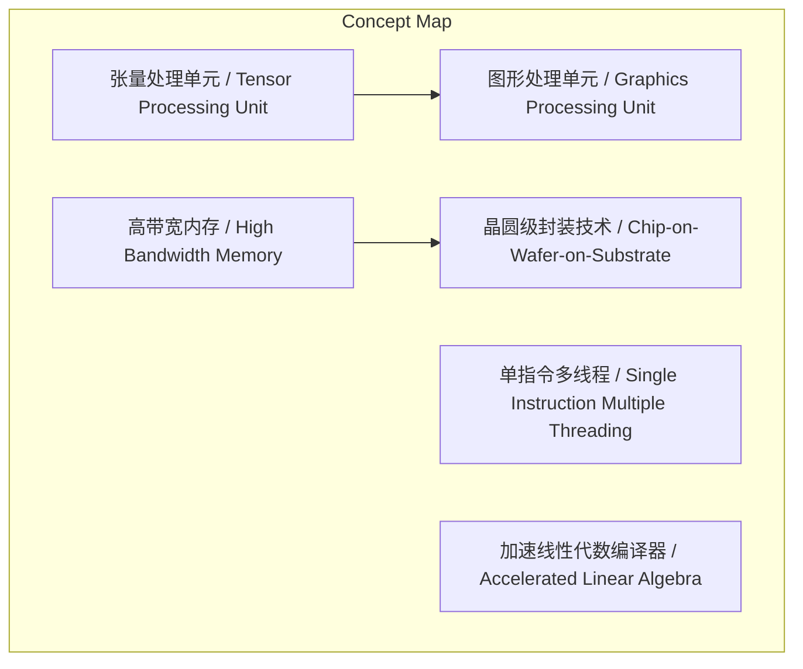
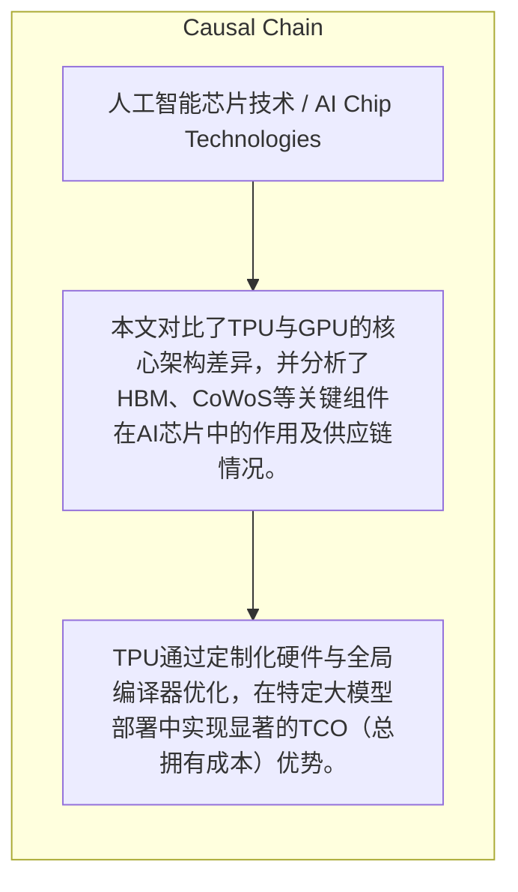

# NEWS/NEWS 任务报告

- agent: news/news
- requestId: 1774445534262-bmolk3
- 生成时间(UTC): 2026-03-25T13:32:53.870Z

### Runtime Trace
- 文本总结 | model=stepfun/step-3.5-flash:free
- 文本总结 | schema_fallback=yes
- 文本总结 | attempted_models=stepfun/step-3.5-flash:free

## 文本总结

### 运行信息
- model: stepfun/step-3.5-flash:free
- schema_fallback: yes
- attempted_models: stepfun/step-3.5-flash:free

# AI芯片技术对比：TPU与GPU及相关组件分析

## 整体结构化文档表达
### 文档卡片
- 主题（中文/English）：人工智能芯片技术 / AI Chip Technologies
- 一句话摘要：本文对比了TPU与GPU的核心架构差异，并分析了HBM、CoWoS等关键组件在AI芯片中的作用及供应链情况。
- 目标读者：未提及
- 核心结论（3条）：
- TPU通过定制化硬件与全局编译器优化，在特定大模型部署中实现显著的TCO（总拥有成本）优势。
- GPU凭借成熟的生态与极强的并行计算能力，目前仍是AI训练芯片市场的垄断者。
- HBM内存与CoWoS封装是当前AI芯片产能的核心瓶颈，且供应链高度集中。

### 内容结构树
1. 背景与问题定义
2. 核心观点与关键证据
3. 方法/机制/路径
4. 风险与边界条件
5. 结论与行动建议

### 结构化元数据（JSON）
```json
{
  "title": "AI芯片技术对比：TPU与GPU及相关组件分析",
  "topic_zh": "人工智能芯片技术",
  "topic_en": "AI Chip Technologies",
  "audience": "未提及",
  "claims": [],
  "evidence": [],
  "risks": [],
  "actions": []
}
```

## 处理流程
1. 输入识别
2. 信息抽取（实体、概念、问题、事实、观点）
3. 结构化归纳（定义/分类/比较/因果/方法论）
4. 关系建模（概念关系、等式/方程/逻辑链）
5. 可视化表达（Mermaid）

## 概念清单（中英文）
- 张量处理单元 / Tensor Processing Unit
- 图形处理单元 / Graphics Processing Unit
- 单指令多线程 / Single Instruction Multiple Threading
- 加速线性代数编译器 / Accelerated Linear Algebra
- 高带宽内存 / High Bandwidth Memory
- 晶圆级封装技术 / Chip-on-Wafer-on-Substrate
- 芯片间互联 / Inter-Core Interconnect
- 光路交换机 / Optical Circuit Switch
- 混合专家模型 / Mixture of Experts
- 总拥有成本 / Total Cost of Ownership
- 语言处理单元 / Language Processing Unit

## 概念定义（中英文）
### 张量处理单元 / Tensor Processing Unit
- 中文定义：谷歌自主研发的针对机器学习的定制加速器，核心侧重于矩阵计算。
- English Definition: Google's custom-built accelerator for machine learning, focusing on matrix computations.

### 图形处理单元 / Graphics Processing Unit
- 中文定义：最初用于游戏显卡的芯片，采用多线程单一指令架构，具备极强的并行计算能力，是目前AI训练芯片的垄断者。
- English Definition: A chip originally for graphics cards, using a multi-threaded single-instruction architecture with strong parallel computing power, currently the monopoly in AI training chips.

### 单指令多线程 / Single Instruction Multiple Threading
- 中文定义：GPU采用的架构，类似厨房里同时安排多个具备独立思考能力的大厨独立完成，强调并行处理。
- English Definition: The architecture used by GPUs, analogous to assigning multiple independent-thinking chefs in a kitchen to work in parallel.

### 加速线性代数编译器 / Accelerated Linear Algebra
- 中文定义：谷歌为TPU开发的静态编译器，能在系统全局层面对工作负载进行内存分配和算子融合等全局优化，对外部开发者而言像一个“黑盒”。
- English Definition: A static compiler developed by Google for TPU, performing global optimizations like memory allocation and operator fusion at the system level, acting as a 'black box' to external developers.

### 高带宽内存 / High Bandwidth Memory
- 中文定义：高带宽的内存组件，目前主要由SK海力士、三星和美光三家垄断，是解决大模型“内存瓶颈”的核心硬件。
- English Definition: High-bandwidth memory component, currently monopolized by SK Hynix, Samsung, and Micron, core hardware for solving the 'memory bound' problem in large models.

### 晶圆级封装技术 / Chip-on-Wafer-on-Substrate
- 中文定义：台积电的一种2.5D高级封装技术，用于将HBM内存芯片和计算芯片集成封装在一块芯片上，是当前产能的核心瓶颈之一。
- English Definition: TSMC's 2.5D advanced packaging technology for integrating HBM memory chips and compute chips onto a single package, one of the current core bottlenecks in capacity.

### 芯片间互联 / Inter-Core Interconnect
- 中文定义：TPU采用的芯片与芯片之间的直接通信技术，不依赖昂贵的交换机，使用铜线连接，极大地降低了数据中心层面的组网成本。
- English Definition: TPU's direct chip-to-chip communication technology, not relying on expensive switches, using copper connections to significantly reduce data center networking costs.

### 光路交换机 / Optical Circuit Switch
- 中文定义：一种可通过软件编程配置的光纤交换机，谷歌在TPU V4时引入以支持3D Torus拓扑网络，极大地提升了MOE架构的运行效率。
- English Definition: A software-programmable fiber optic switch introduced by Google with TPU v4 to support 3D Torus topology, greatly improving the runtime efficiency of MOE architectures.

### 混合专家模型 / Mixture of Experts
- 中文定义：一种需要进行路由分发的模型架构，早年不适配TPU，但在TPU引入OCS交换机和软件优化后得以高效运行。
- English Definition: A model architecture requiring routing and distribution, initially not suitable for TPU, but became efficient after TPU introduced OCS switches and software optimizations.

### 总拥有成本 / Total Cost of Ownership
- 中文定义：针对自有定制的大模型或大规模部署时，芯片从购买、组网到运行推理的总成本，这也是TPU相比GPU最大的优势。
- English Definition: The total cost of a chip from purchase, networking (without expensive switches), to inference operation for custom large models or large-scale deployment, TPU's biggest advantage over GPU.

### 语言处理单元 / Language Processing Unit
- 中文定义：Groq公司设计的专门针对低延迟推理的芯片，其特点是单用户独占极大资源，实现极快的单Token生成速度。
- English Definition: A chip designed by Groq specifically for low-latency inference, characterized by dedicating massive resources to a single user for extremely fast per-token generation.


## 概念关联与逻辑关系（中英文）
- 张量处理单元/Tensor Processing Unit -> 图形处理单元/Graphics Processing Unit | concept | 在AI芯片领域存在竞争与替代关系
- 高带宽内存/High Bandwidth Memory -> 晶圆级封装技术/Chip-on-Wafer-on-Substrate | concept | 通过CoWoS技术进行物理集成
- 光路交换机/Optical Circuit Switch -> 混合专家模型/Mixture of Experts | concept | 其引入使得MOE架构在TPU上高效运行成为可能

### 可形式化关系
- TPU → 使用 → XLA (Accelerated Linear Algebra)
- TPU → 采用 → ICI (Inter-Core Interconnect)
- OCS (Optical Circuit Switch) → 支持 → MOE (Mixture of Experts)

## COT逻辑梳理（定义/分类/比较/因果/科学方法论）
- Step 1: 定义核心AI加速器：介绍TPU（谷歌定制，侧重矩阵计算）与GPU（通用并行计算，市场垄断者）的基本定位与核心架构（如SIMT）。
- Step 2: 阐述软件栈优化：说明谷歌为TPU开发的静态编译器XLA如何通过全局优化（内存分配、算子融合）提升效率，形成软硬件协同。
- Step 3: 分析关键硬件组件：指出HBM是解决大模型内存瓶颈的核心，但其与计算芯片的集成依赖CoWoS封装，二者共同构成当前产能瓶颈。
- Step 4: 描述互联与网络技术：解释TPU通过ICI（芯片间铜线直连）降低组网成本，并引入OCS（光路交换机）以支持3D Torus网络，从而适配特定模型。
- Step 5: 关联模型与成本优势：说明OCS等技术使原本不适配的MOE模型得以高效运行，并最终归结到TPU在大规模部署时基于TCO（总拥有成本）的核心优势。

## 事实与看法（区分）
### 事实
- GPU是目前AI训练芯片的垄断者。
- HBM内存目前主要由SK海力士、三星和美光三家垄断。
- CoWoS是台积电的一种2.5D高级封装技术。
- 谷歌在TPU V4时引入了OCS交换机。

### 看法
- 未发现明确主观看法

## FAQ（原文问题整理）
- 未发现明确 FAQ

## Visualization
### Mermaid 图 1（概念结构图）


### Mermaid 图 2（逻辑/因果图）


## 文章中的类比
- 未发现明确类比

## 10个金句
- 原文未提供

