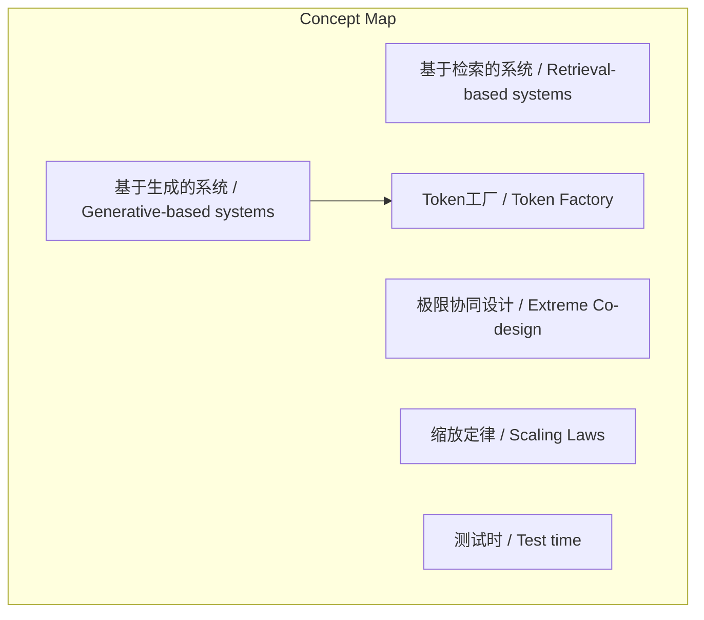
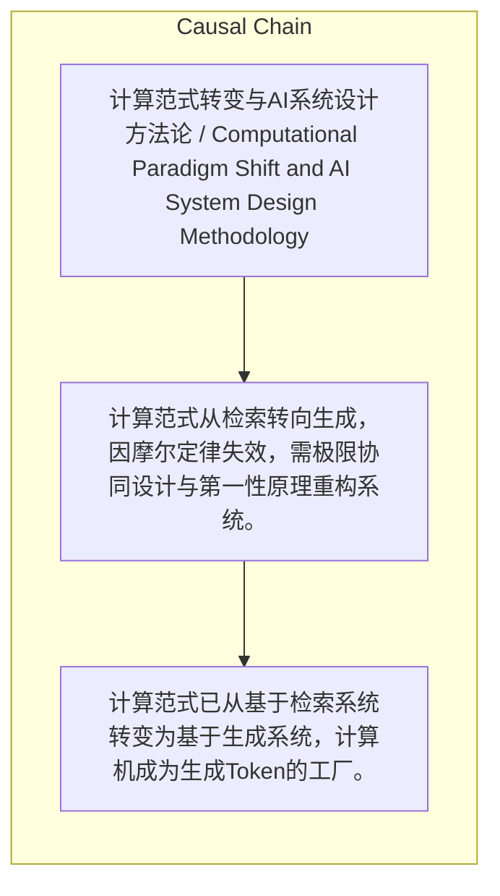

# NEWS/NEWS 任务报告

- agent: news/news
- requestId: 1774445605611-gatr0y
- 生成时间(UTC): 2026-03-25T13:34:13.822Z

### Runtime Trace
- 文本总结 | model=stepfun/step-3.5-flash:free
- 文本总结 | schema_fallback=yes
- 文本总结 | attempted_models=stepfun/step-3.5-flash:free

## 文本总结

### 运行信息
- model: stepfun/step-3.5-flash:free
- schema_fallback: yes
- attempted_models: stepfun/step-3.5-flash:free

# 计算范式转向生成式与极限协同

## 整体结构化文档表达
### 文档卡片
- 主题（中文/English）：计算范式转变与AI系统设计方法论 / Computational Paradigm Shift and AI System Design Methodology
- 一句话摘要：计算范式从检索转向生成，因摩尔定律失效，需极限协同设计与第一性原理重构系统。
- 目标读者：技术决策者与AI研究者
- 核心结论（3条）：
- 计算范式已从基于检索系统转变为基于生成系统，计算机成为生成Token的工厂。
- 因摩尔定律和登纳德缩放定律失效，需通过极限协同设计应对极大算力需求。
- 通过分解系统、满足物理极限和多学科协作，实现系统重构与效率突破。

### 内容结构树
1. 背景与问题定义
2. 核心观点与关键证据
3. 方法/机制/路径
4. 风险与边界条件
5. 结论与行动建议

### 结构化元数据（JSON）
```json
{
  "title": "计算范式转向生成式与极限协同",
  "topic_zh": "计算范式转变与AI系统设计方法论",
  "topic_en": "Computational Paradigm Shift and AI System Design Methodology",
  "audience": "技术决策者与AI研究者",
  "claims": [
    "计算的范式已经发生根本性转变：从基于检索的系统转变为基于生成的系统。",
    "未来的计算机不再是存储文件的仓库而是生成Token的工厂。",
    "为了支撑Token工厂，需要极大的算力。",
    "摩尔定律和登纳德缩放定律已经基本失效。",
    "无法单靠一块芯片解决问题，需要极限协同设计。",
    "AI能力提升可通过四种缩放定律的循环实现，包括用AI生成合成数据反哺预训练。",
    "黄仁勋的方法论基于物理学第一性原理，追求物理极限而非连续性改进。",
    "NVIDIA通过分解复杂系统、满足物理极限并让多学科专家协作，实现高密度集成。"
  ],
  "evidence": [],
  "risks": [],
  "actions": []
}
```

## 处理流程
1. 输入识别
2. 信息抽取（实体、概念、问题、事实、观点）
3. 结构化归纳（定义/分类/比较/因果/方法论）
4. 关系建模（概念关系、等式/方程/逻辑链）
5. 可视化表达（Mermaid）

## 概念清单（中英文）
- 基于检索的系统 / Retrieval-based systems
- 基于生成的系统 / Generative-based systems
- Token工厂 / Token Factory
- 极限协同设计 / Extreme Co-design
- 缩放定律 / Scaling Laws
- 测试时 / Test time
- 智能体 / Agents
- 第一性原理 / First Principles
- NVLink-72机架 / NVLink-72 Rack

## 概念定义（中英文）
### 基于检索的系统 / Retrieval-based systems
- 中文定义：传统计算机主要存储和检索文件
- English Definition: Traditional computers primarily store and retrieve files

### 基于生成的系统 / Generative-based systems
- 中文定义：未来计算机生成Token而非存储文件
- English Definition: Future computers generate Tokens instead of storing files

### Token工厂 / Token Factory
- 中文定义：计算机作为生成Token的设施
- English Definition: Computer as a facility for generating Tokens

### 极限协同设计 / Extreme Co-design
- 中文定义：多学科专家同时协作以满足物理极限的系统设计方法
- English Definition: System design method with simultaneous multidisciplinary collaboration to meet physical limits

### 缩放定律 / Scaling Laws
- 中文定义：描述AI能力提升与算力、数据等关系的规律
- English Definition: Laws describing the relationship between AI capability improvement and compute, data, etc.

### 测试时 / Test time
- 中文定义：AI模型推理或执行任务的时间阶段
- English Definition: The phase when an AI model reasons or executes tasks

### 智能体 / Agents
- 中文定义：能自主运作的AI实体
- English Definition: Autonomous AI entities capable of operation

### 第一性原理 / First Principles
- 中文定义：从物理基本定律推导解决方案的方法
- English Definition: Method of deriving solutions from fundamental physical laws

### NVLink-72机架 / NVLink-72 Rack
- 中文定义：NVIDIA集成130万个零部件的高密度计算机架
- English Definition: NVIDIA's high-density compute rack integrating 1.3 million components


## 概念关联与逻辑关系（中英文）
- 基于生成的系统/Generative-based systems -> Token工厂/Token Factory | concept | 导致
- 摩尔定律失效/Moore's Law失效 -> 极限协同设计/Extreme Co-design | concept | necessitates
- 缩放定律/Scaling Laws -> 预训练/Pre-training | concept | 影响

### 可形式化关系
- 计算范式转变 → 需要极大算力
- 摩尔定律失效 ∧ 登纳德缩放定律失效 → 需要极限协同设计
- 预训练受限于数据 → AI在测试时生成合成数据 → 合成数据反哺预训练和后训练

## COT逻辑梳理（定义/分类/比较/因果/科学方法论）
- Step 1: 将复杂系统分解为基本要素
- Step 2: 在满足物理极限前提下重构系统
- Step 3: 组织多学科顶尖专家同时协作

## 事实与看法（区分）
### 事实
- 摩尔定律和登纳德缩放定律已经基本失效
- NVIDIA能把130万个零部件塞进一个NVLink-72机架

### 看法
- 黄仁勋不接受连续性改进，主张用第一性原理追求物理极限
- 从74天向6天努力是合理目标

## FAQ（原文问题整理）
- 未发现明确 FAQ

## Visualization
### Mermaid 图 1（概念结构图）


### Mermaid 图 2（逻辑/因果图）


## 文章中的类比
- 计算机从存储文件的仓库转变为生成Token的工厂
- 将工期从74天缩短到72天 vs 从物理极限6天出发

## 10个金句
- 光速思考/Speed of Light
- 把74天的工期缩短到72天

