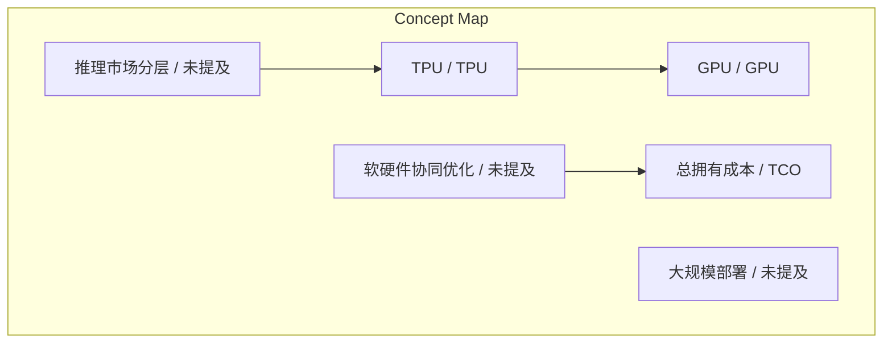
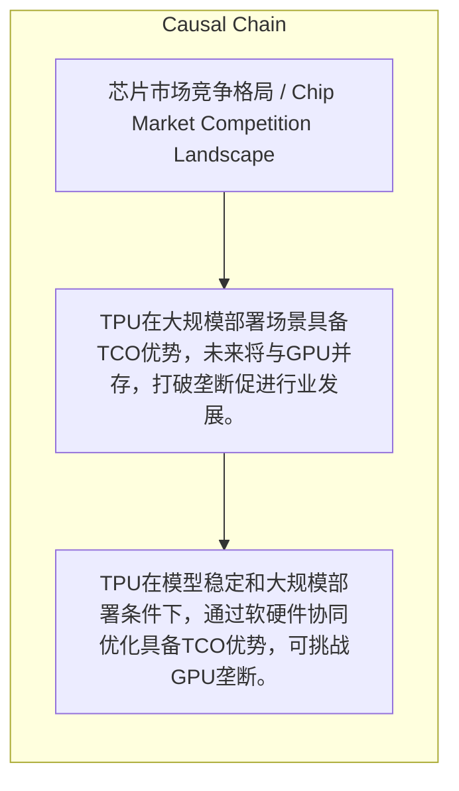

# NEWS/NEWS 任务报告

- agent: news/news
- requestId: 1774445711040-w5w1ub
- 生成时间(UTC): 2026-03-25T13:37:06.119Z

### Runtime Trace
- 文本总结 | model=stepfun/step-3.5-flash:free
- 文本总结 | schema_fallback=yes
- 文本总结 | attempted_models=stepfun/step-3.5-flash:free

## 文本总结

### 运行信息
- model: stepfun/step-3.5-flash:free
- schema_fallback: yes
- attempted_models: stepfun/step-3.5-flash:free

# TPU挑战GPU垄断与未来芯片市场格局分析

## 整体结构化文档表达
### 文档卡片
- 主题（中文/English）：芯片市场竞争格局 / Chip Market Competition Landscape
- 一句话摘要：TPU在大规模部署场景具备TCO优势，未来将与GPU并存，打破垄断促进行业发展。
- 目标读者：未提及
- 核心结论（3条）：
- TPU在模型稳定和大规模部署条件下，通过软硬件协同优化具备TCO优势，可挑战GPU垄断。
- 未来芯片市场将呈GPU与TPU并存、百花齐放的健康格局。
- 推理市场分层，TPU主导高层大规模部署，其他玩家覆盖中下层，打破垄断促进行业发展。

### 内容结构树
1. 背景与问题定义
2. 核心观点与关键证据
3. 方法/机制/路径
4. 风险与边界条件
5. 结论与行动建议

### 结构化元数据（JSON）
```json
{
  "title": "TPU挑战GPU垄断与未来芯片市场格局分析",
  "topic_zh": "芯片市场竞争格局",
  "topic_en": "Chip Market Competition Landscape",
  "audience": "未提及",
  "claims": [
    "TPU在特定条件下可挑战GPU垄断地位。",
    "未来芯片市场将是GPU和TPU并存、百花齐放。",
    "推理市场将出现分层，TPU占据高层，其他玩家占据中下层。",
    "打破垄断对行业有益，TPU作为挑战者能促进生态发展。"
  ],
  "evidence": [],
  "risks": [],
  "actions": []
}
```

## 处理流程
1. 输入识别
2. 信息抽取（实体、概念、问题、事实、观点）
3. 结构化归纳（定义/分类/比较/因果/方法论）
4. 关系建模（概念关系、等式/方程/逻辑链）
5. 可视化表达（Mermaid）

## 概念清单（中英文）
- TPU / TPU
- GPU / GPU
- 总拥有成本 / TCO
- 软硬件协同优化 / 未提及
- 大规模部署 / 未提及
- 推理市场分层 / 未提及
- 百花齐放 / 未提及

## 概念定义（中英文）
### TPU / TPU
- 中文定义：未提及
- English Definition: 未提及

### GPU / GPU
- 中文定义：未提及
- English Definition: 未提及

### 总拥有成本 / TCO
- 中文定义：总拥有成本
- English Definition: TCO

### 软硬件协同优化 / 未提及
- 中文定义：系统级的软硬件协同优化
- English Definition: 未提及

### 大规模部署 / 未提及
- 中文定义：大规模部署，如海量用户云端服务
- English Definition: 未提及

### 推理市场分层 / 未提及
- 中文定义：推理市场分层，高层大规模部署由TPU占据，中下层小规模本地由其他玩家占据
- English Definition: 未提及

### 百花齐放 / 未提及
- 中文定义：多种芯片并存的健康生态
- English Definition: 未提及


## 概念关联与逻辑关系（中英文）
- TPU/TPU -> GPU/GPU | concept | 挑战垄断
- 软硬件协同优化/未提及 -> 总拥有成本/TCO | concept | 实现优势
- 推理市场分层/未提及 -> TPU/TPU | concept | 占据高层

### 可形式化关系
- (模型稳定 ∧ 大规模部署) → TPU挑战GPU垄断 ∧ TCO优势
- ¬(GPU一统江山 ∨ TPU一统江山) ∧ GPU ∧ TPU ∧ 并存 ∧ 百花齐放
- 推理市场分层: 高层市场 → TPU；中下层市场 → 其他玩家

## COT逻辑梳理（定义/分类/比较/因果/科学方法论）
- Step 1: 基于模型稳定和大规模部署条件，分析TPU通过软硬件协同优化实现TCO优势，从而挑战GPU垄断。
- Step 2: 由此推断未来芯片市场将呈现GPU与TPU并存、百花齐放的健康格局。
- Step 3: 进一步阐述推理市场分层现象，TPU主导高层，其他玩家覆盖中下层，并强调打破垄断对行业的积极意义。

## 事实与看法（区分）
### 事实
- 未发现明确客观事实

### 看法
- 未发现明确主观看法

## FAQ（原文问题整理）
- 未发现明确 FAQ

## Visualization
### Mermaid 图 1（概念结构图）


### Mermaid 图 2（逻辑/因果图）


## 文章中的类比
- 未发现明确类比

## 10个金句
- 原文未提供

