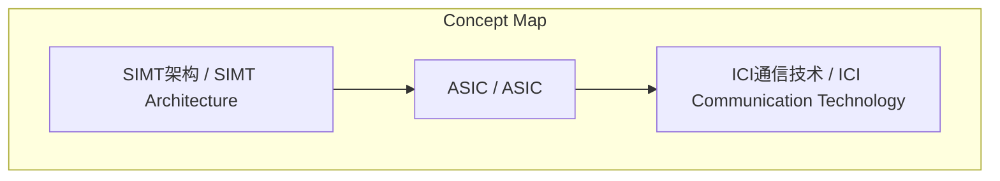
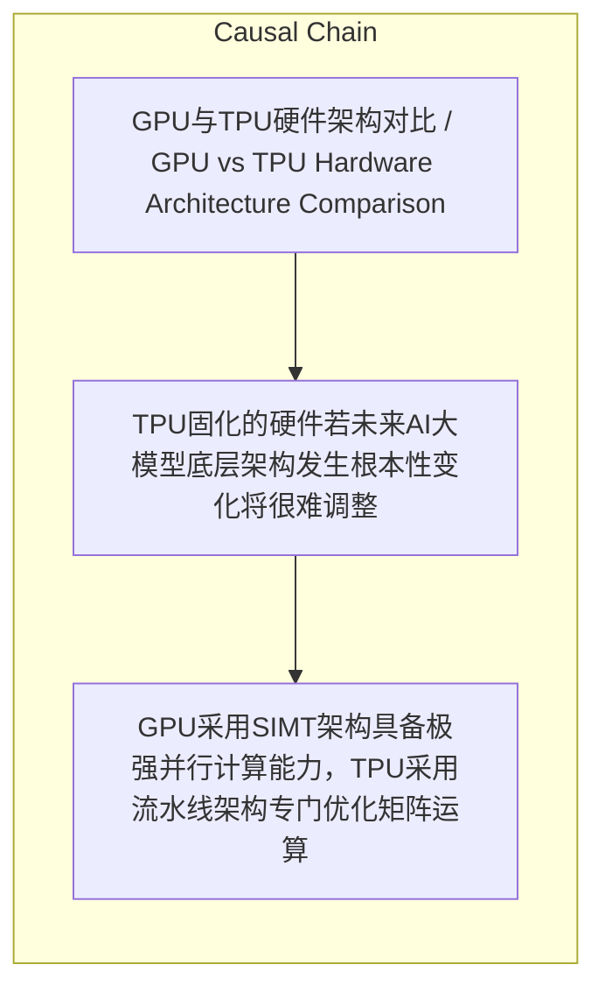

# NEWS/NEWS 任务报告

- agent: news/news
- requestId: 1774446824879-yjyfws
- 生成时间(UTC): 2026-03-25T14:00:27.969Z

### Runtime Trace
- 文本总结 | model=openrouter/free
- 文本总结 | schema_fallback=yes
- 文本总结 | attempted_models=openrouter/free

## 文本总结

### 运行信息
- model: openrouter/free
- schema_fallback: yes
- attempted_models: openrouter/free

# GPU与TPU架构差异解析

## 整体结构化文档表达
### 文档卡片
- 主题（中文/English）：GPU与TPU硬件架构对比 / GPU vs TPU Hardware Architecture Comparison
- 一句话摘要：GPU采用SIMT架构适合通用计算，TPU采用流水线架构专门优化机器学习矩阵运算
- 目标读者：AI硬件工程师、数据中心架构师
- 核心结论（3条）：
- GPU采用SIMT架构具备极强并行计算能力，TPU采用流水线架构专门优化矩阵运算
- TPU通过系统级Pod集群互联降低组网成本，GPU依赖昂贵交换机基础设施
- TPU硬件通用性较低，若AI算法架构变化将面临演进风险

### 内容结构树
1. 背景与问题定义
2. 核心观点与关键证据
3. 方法/机制/路径
4. 风险与边界条件
5. 结论与行动建议

### 结构化元数据（JSON）
```json
{
  "title": "GPU与TPU架构差异解析",
  "topic_zh": "GPU与TPU硬件架构对比",
  "topic_en": "GPU vs TPU Hardware Architecture Comparison",
  "audience": "AI硬件工程师、数据中心架构师",
  "claims": [
    "GPU硬件内部包含复杂控制和预测单元支持多线程独立调度",
    "TPU通过去除控制单元将硬件设计得更机械化",
    "TPU芯片间高频通信要求系统内每一张芯片性能必须一致"
  ],
  "evidence": [
    "GPU采用SIMT架构类似于厨房里同时安排了许多具备独立思考能力的大厨",
    "TPU采用流水线式架构类似一场接力赛",
    "TPU采用ICI通信技术芯片间直接用便宜的铜线连接"
  ],
  "risks": [
    "TPU固化的硬件若未来AI大模型底层架构发生根本性变化将很难调整"
  ],
  "actions": []
}
```

## 处理流程
1. 输入识别
2. 信息抽取（实体、概念、问题、事实、观点）
3. 结构化归纳（定义/分类/比较/因果/方法论）
4. 关系建模（概念关系、等式/方程/逻辑链）
5. 可视化表达（Mermaid）

## 概念清单（中英文）
- SIMT架构 / SIMT Architecture
- ASIC / ASIC
- ICI通信技术 / ICI Communication Technology

## 概念定义（中英文）
### SIMT架构 / SIMT Architecture
- 中文定义：单指令多线程架构，多个线程执行相同指令但处理不同数据
- English Definition: Single Instruction Multiple Thread Architecture, where multiple threads execute the same instruction but process different data

### ASIC / ASIC
- 中文定义：专用集成电路，为特定用途定制的硬件
- English Definition: Application-Specific Integrated Circuit, hardware customized for specific applications

### ICI通信技术 / ICI Communication Technology
- 中文定义：内部核心互联技术，芯片间直接通信
- English Definition: Internal Core Interconnect technology for direct chip-to-chip communication


## 概念关联与逻辑关系（中英文）
- GPU/GPU -> SIMT架构/SIMT Architecture | concept | 采用
- TPU/TPU -> 流水线架构/Pipeline Architecture | concept | 采用
- TPU/TPU -> ICI通信技术/ICI Communication Technology | concept | 采用

### 可形式化关系
- GPU采用SIMT架构 → 具备极强并行计算能力
- TPU采用流水线架构 → 省去数据调度与搬运消耗
- TPU去除控制单元 → 硬件设计更机械化

## COT逻辑梳理（定义/分类/比较/因果/科学方法论）
- Step 1: GPU采用SIMT架构，具备极强并行计算能力
- Step 2: TPU采用流水线架构，专门优化矩阵运算
- Step 3: TPU通过系统级Pod集群互联降低组网成本

## 事实与看法（区分）
### 事实
- GPU硬件内部包含复杂控制和预测单元
- TPU在硬件物理层面去掉了大量的控制单元
- GPU集群需要依赖昂贵的交换机基础设施
- TPU采用ICI通信技术芯片间直接用便宜的铜线连接

### 看法
- 未发现明确主观看法

## FAQ（原文问题整理）
### TPU相比GPU的主要优势是什么？
- TPU通过流水线架构和ICI通信技术专门优化机器学习矩阵运算，降低组网成本

### 为什么TPU的生产失败率比GPU更高？
- 因为TPU芯片间高频通信要求系统内每一张芯片性能必须一致，无法像GPU那样降级使用

## Visualization
### Mermaid 图 1（概念结构图）


### Mermaid 图 2（逻辑/因果图）


## 文章中的类比
- GPU架构类似于厨房里同时安排了许多具备独立思考能力的大厨
- TPU架构类似于一场接力赛

## 10个金句
- 原文未提供

