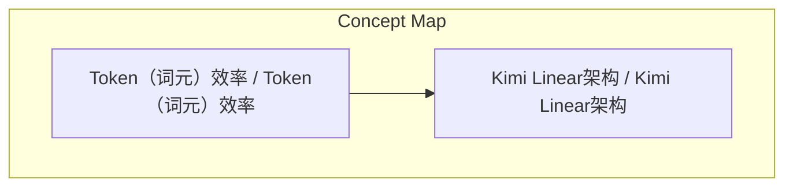
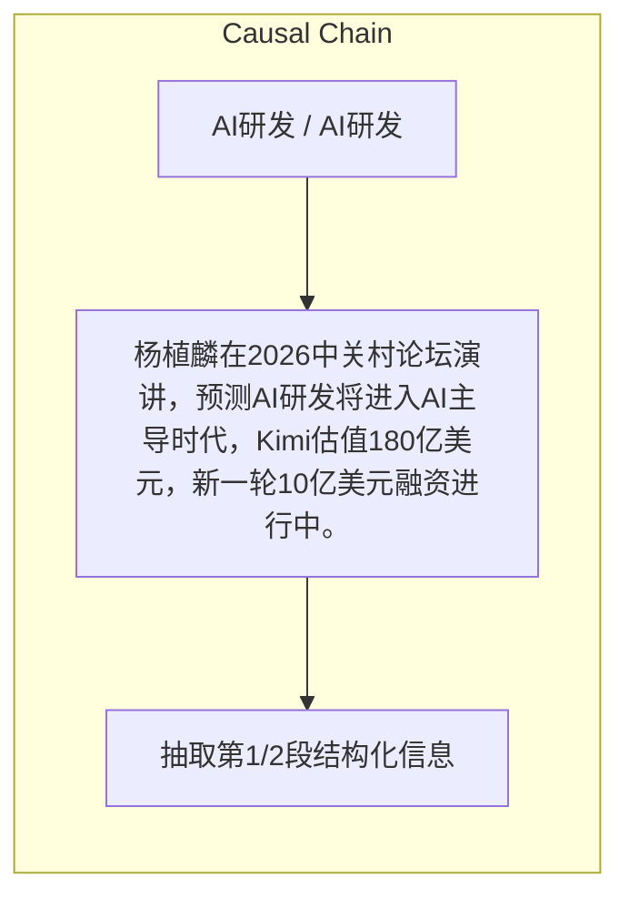

# NEWS/NEWS 任务报告

- agent: news/news
- requestId: 1774447257909-s6kz5y
- 生成时间(UTC): 2026-03-25T14:01:34.446Z

### Runtime Trace
- 链接总结: https://wallstreetcn.com/articles/3768363 | model=openrouter/free
- 链接总结: https://wallstreetcn.com/articles/3768363 | schema_fallback=no
- 链接总结: https://wallstreetcn.com/articles/3768363 | attempted_models=openrouter/free

## 链接总结

- URL: https://wallstreetcn.com/articles/3768363

### 运行信息
- model: openrouter/free
- schema_fallback: no
- attempted_models: openrouter/free

# Kimi创始人杨植麟：AI研发将进入AI主导时代

## 整体结构化文档表达
### 文档卡片
- 主题（中文/English）：AI研发 / AI研发
- 一句话摘要：杨植麟在2026中关村论坛演讲，预测AI研发将进入AI主导时代，Kimi估值180亿美元，新一轮10亿美元融资进行中。
- 目标读者：关注AI技术发展的人士
- 核心结论（3条）：
- AI研发方式将发生重大变化，越来越多的研究工作将由AI主导
- Kimi估值已达180亿美元，3个月内翻4倍
- 新一轮10亿美元融资正在进行中

### 内容结构树
1. 背景与问题定义
2. 核心观点与关键证据
3. 方法/机制/路径
4. 风险与边界条件
5. 结论与行动建议

### 结构化元数据（JSON）
```json
{
  "title": "Kimi创始人杨植麟：AI研发将进入AI主导时代",
  "topic_zh": "AI研发",
  "topic_en": "AI研发",
  "audience": "关注AI技术发展的人士",
  "claims": [
    "未来AI研发将进入AI主导时代"
  ],
  "evidence": [
    "公司估值已达180亿美元",
    "3个月内翻了4倍",
    "新一轮10亿美元融资正在进行中"
  ],
  "risks": [],
  "actions": [
    "抽取第1/2段结构化信息"
  ]
}
```

## 处理流程
1. 输入识别
2. 信息抽取（实体、概念、问题、事实、观点）
3. 结构化归纳（定义/分类/比较/因果/方法论）
4. 关系建模（概念关系、等式/方程/逻辑链）
5. 可视化表达（Mermaid）

## 概念清单（中英文）
- Token（词元）效率 / Token（词元）效率
- Kimi Linear架构 / Kimi Linear架构

## 概念定义（中英文）
### Token（词元）效率 / Token（词元）效率
- 中文定义：通用人工智能
- English Definition: AGI（通用人工智能）

### Kimi Linear架构 / Kimi Linear架构
- 中文定义：Agent（智能体）集群
- English Definition: Agent（智能体）集群


## 概念关联与逻辑关系（中英文）
- Kimi/Kimi -> Kimi Linear架构/Kimi Linear架构 | concept | 研发方向
- Kimi/Kimi -> Agent（智能体）集群/Agent（智能体）集群 | concept | 研发方向
- 杨植麟/杨植麟 -> AI研发将进入AI主导时代/AI研发将进入AI主导时代 | concept | 发言

### 可形式化关系
- 杨植麟是Kimi创始人
- 杨植麟在2026中关村论坛演讲

## COT逻辑梳理（定义/分类/比较/因果/科学方法论）
- AI研发方式将发生重大变化
- 研究工作将由AI主导

## 事实与看法（区分）
### 事实
- 2026中关村论坛
- 3月25日
- Kimi估值180亿美元

### 看法
- 有效数据是有限常量
- 提升Token效率意味着用更优网络架构与优化器

## FAQ（原文问题整理）
### Kimi估值已达180亿美元，3个月内翻了4倍
- Kimi估值180亿美元，3个月内翻了4倍

## Visualization
### Mermaid 图 1（概念结构图）


### Mermaid 图 2（逻辑/因果图）


## 文章中的类比
- 基于输入内容输出，不杜撰

## 10个金句
- 在今年、明年乃至未来几年内，人工智能的研究与研发方式将发生重大变化，越来越多的研究工作将由AI主导。

