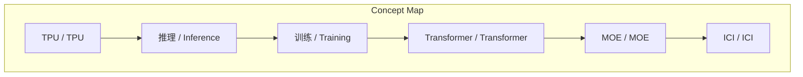
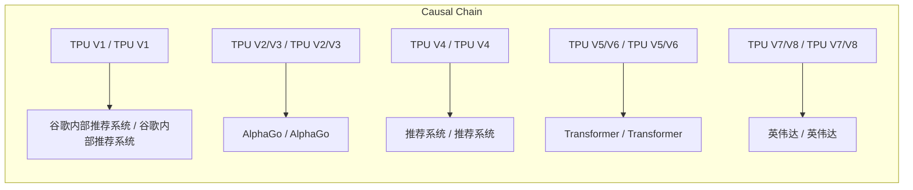

# NEWS/NEWS 任务报告

- agent: news/news
- requestId: 1774447420866-8o7fqf
- 生成时间(UTC): 2026-03-25T14:04:13.383Z

### Runtime Trace
- 文本总结 | model=openrouter/free
- 文本总结 | schema_fallback=no
- 文本总结 | attempted_models=openrouter/free

## 文本总结

### 运行信息
- model: openrouter/free
- schema_fallback: no
- attempted_models: openrouter/free

# 谷歌TPU版本演进与市场挑战

## 整体结构化文档表达
### 文档卡片
- 主题（中文/English）：谷歌TPU版本演进 / Google TPU Generations
- 一句话摘要：TPU从V1纯推理芯片逐步演变为V7/V8超越GPU的大模型训练和推理平台
- 目标读者：新闻分析助理
- 核心结论（3条）：
- TPU从纯推理芯片（V1）逐步演变为大模型训练和推理的通用平台
- V5/V6版本标志着TPU正式进入ChatGPT/大模型时代
- V7/V8版本实现了与英伟达GPU的对标甚至挑战

### 内容结构树
1. 背景与问题定义
2. 核心观点与关键证据
3. 方法/机制/路径
4. 风险与边界条件
5. 结论与行动建议

### 结构化元数据（JSON）
```json
{
  "title": "谷歌TPU版本演进与市场挑战",
  "topic_zh": "谷歌TPU版本演进",
  "topic_en": "Google TPU Generations",
  "audience": "新闻分析助理",
  "claims": [
    "TPU经历了几次重大的方向调整和版本迭代",
    "从最初只为解决内部业务需求逐步演变为能够挑战英伟达GPU的大模型训练利器",
    "历代TPU之间的递进关系与定位演化"
  ],
  "evidence": [
    "根据文章内容",
    "以下是历代TPU的版本定位与它们之间的演进关系",
    "1. 第一代 (TPU V1)：纯推理的“试水之作”",
    "2. 第二代与第三代 (TPU V2 V3)：主打训练的旗舰",
    "3. 第四代 (TPU V4)：专注于推荐系统优化与组网突破",
    "4. 第五代与第六代 (TPU V5 V6)：全面拥抱大模型时代的转折点",
    "5. 第七代与第八代 (TPU V7 V8)：比肩GPU的最强形态"
  ],
  "risks": [
    "TPU V4在大模型表现不如GPU",
    "TPU V2/V3软件生态不成熟导致硬件性能未充分发挥"
  ],
  "actions": [
    "生成标题",
    "提取核心结论",
    "建立形式关系",
    "构建逻辑步骤"
  ]
}
```

## 处理流程
1. 输入识别
2. 信息抽取（实体、概念、问题、事实、观点）
3. 结构化归纳（定义/分类/比较/因果/方法论）
4. 关系建模（概念关系、等式/方程/逻辑链）
5. 可视化表达（Mermaid）

## 概念清单（中英文）
- TPU / TPU
- 推理 / Inference
- 训练 / Training
- Transformer / Transformer
- MOE / MOE
- ICI / ICI

## 概念定义（中英文）
### TPU / TPU
- 中文定义：张量处理单元
- English Definition: Tensor Processing Unit

### 推理 / Inference
- 中文定义：推理
- English Definition: Inference

### 训练 / Training
- 中文定义：训练
- English Definition: Training

### Transformer / Transformer
- 中文定义：Transformer
- English Definition: Transformer

### MOE / MOE
- 中文定义：混合专家模型
- English Definition: MOE

### ICI / ICI
- 中文定义：芯片直连
- English Definition: ICI


## 概念关联与逻辑关系（中英文）
- TPU V1/TPU V1 -> 谷歌内部推荐系统/谷歌内部推荐系统 | support | 推理
- TPU V2/V3/TPU V2/V3 -> AlphaGo/AlphaGo | support | 训练
- TPU V4/TPU V4 -> 推荐系统/推荐系统 | support | 优化
- TPU V5/V6/TPU V5/V6 -> Transformer/Transformer | support | 大模型预训练
- TPU V7/V8/TPU V7/V8 -> 英伟达/英伟达 | support | GPU

### 可形式化关系
- V1→V2：从纯推理到训练芯片
- V3→V4：从训练到推荐系统优化
- V4→V5：从推荐系统到大模型通用
- V5→V6：从训练到推理版分化
- V6→V7：从推理到GPU对标

## COT逻辑梳理（定义/分类/比较/因果/科学方法论）
- Step 1: 从V1纯推理到V2/V3训练芯片
- Step 2: V4推荐系统优化到V5/V6大模型通用
- Step 3: V7/V8超越GPU

## 事实与看法（区分）
### 事实
- TPU V1：纯推理芯片，不支持模型训练
- TPU V2/V3：训练芯片，驱动AlphaGo和Transformer训练
- TPU V4：加入Spark稀疏计算单元，针对推荐系统优化
- TPU V5/V6：转向大模型预训练和推理，分化训练/推理版
- TPU V7/V8：性能超越GPU，支持100%TPU训练Gemini

### 看法
- TPU的演进体现了芯片设计在市场需求驱动下的适应性
- V7/V8版本的成功证明了TPU在系统级协同优化上的成熟

## FAQ（原文问题整理）
### TPU V9的发布日期
- 未提及

### 谷歌内部推荐系统具体名称
- 未提及

## Visualization
### Mermaid 图 1（概念结构图）


### Mermaid 图 2（逻辑/因果图）


## 文章中的类比
- TPU的演进是一条从纯推理到主打训练再到大模型通用发展的主线
- 早期TPU（如V4）在设计上主要妥协于谷歌内部相对稀疏的推荐系统负载
- V6及以后TPU迅速将核心性能调校至支持密集矩阵计算的Transformer大模型负载上

## 10个金句
- TPU V1：纯推理的“试水之作”
- TPU V2/V3：主打训练的旗舰
- TPU V4：针对内部推荐系统和算法深度定制优化的芯片
- TPU V5/V6：全面拥抱大模型时代的转折点
- TPU V7/V8：比肩GPU的最强形态

