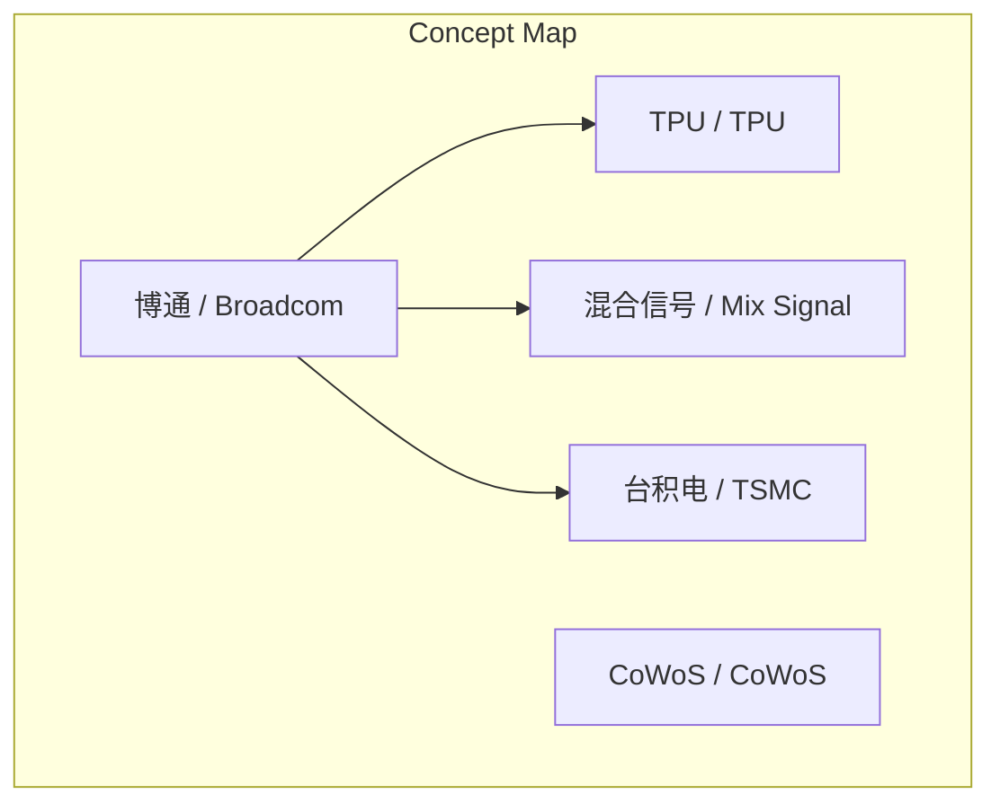
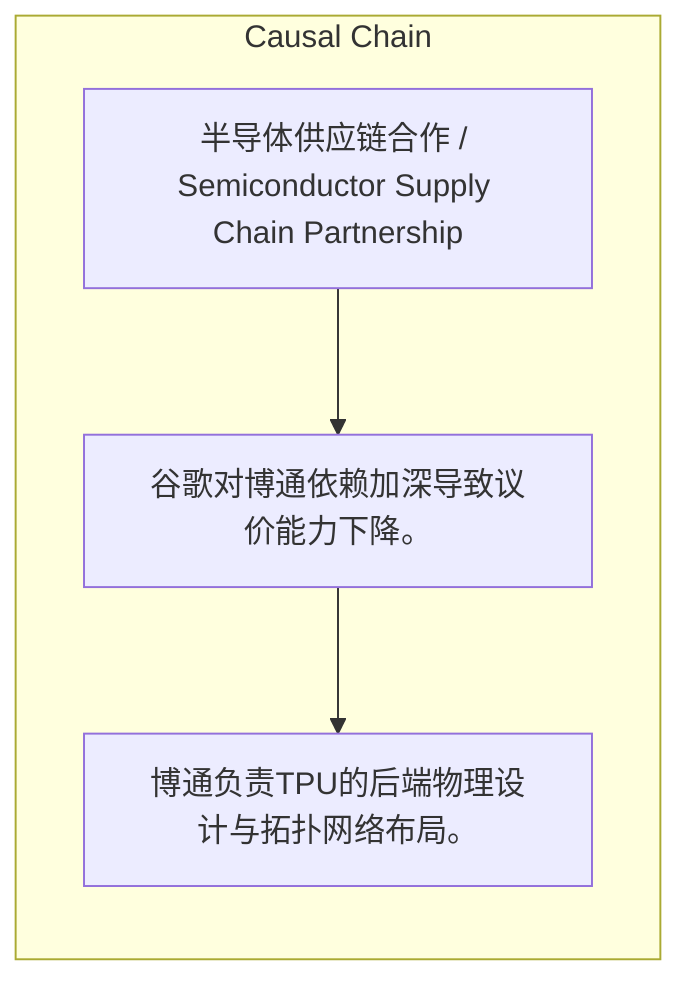

# NEWS/NEWS 任务报告

- agent: news/news
- requestId: 1774447843464-j13ht7
- 生成时间(UTC): 2026-03-25T14:12:38.371Z

### Runtime Trace
- 文本总结 | model=stepfun/step-3.5-flash:free
- 文本总结 | schema_fallback=yes
- 文本总结 | attempted_models=stepfun/step-3.5-flash:free

## 文本总结

### 运行信息
- model: stepfun/step-3.5-flash:free
- schema_fallback: yes
- attempted_models: stepfun/step-3.5-flash:free

# 博通在TPU供应链中的核心作用与长期风险

## 整体结构化文档表达
### 文档卡片
- 主题（中文/English）：半导体供应链合作 / Semiconductor Supply Chain Partnership
- 一句话摘要：博通在TPU生产后端环节具有不可替代性，但谷歌对其依赖加深可能引发长期议价权博弈。
- 目标读者：行业分析师与科技企业决策者
- 核心结论（3条）：
- 博通负责TPU的后端物理设计与拓扑网络布局。
- 博通处理高壁垒的混合信号连接，确保芯片间通信。
- 博通帮助争取台积电CoWoS产能，直接决定TPU产量。

### 内容结构树
1. 背景与问题定义
2. 核心观点与关键证据
3. 方法/机制/路径
4. 风险与边界条件
5. 结论与行动建议

### 结构化元数据（JSON）
```json
{
  "title": "博通在TPU供应链中的核心作用与长期风险",
  "topic_zh": "半导体供应链合作",
  "topic_en": "Semiconductor Supply Chain Partnership",
  "audience": "行业分析师与科技企业决策者",
  "claims": [],
  "evidence": [],
  "risks": [
    "谷歌对博通依赖加深导致议价能力下降。",
    "博通议价权增大压缩谷歌利润空间。",
    "缺乏备用代工厂方案将增加成本控制困难。"
  ],
  "actions": []
}
```

## 处理流程
1. 输入识别
2. 信息抽取（实体、概念、问题、事实、观点）
3. 结构化归纳（定义/分类/比较/因果/方法论）
4. 关系建模（概念关系、等式/方程/逻辑链）
5. 可视化表达（Mermaid）

## 概念清单（中英文）
- 博通 / Broadcom
- 台积电 / TSMC
- TPU / TPU
- CoWoS / CoWoS
- 混合信号 / Mix Signal

## 概念定义（中英文）
### 博通 / Broadcom
- 中文定义：在TPU生产供应链中负责后端设计、混合信号处理和争取CoWoS产能的公司
- English Definition: Company responsible for back-end design, mix-signal processing, and securing CoWoS capacity in TPU supply chain

### 台积电 / TSMC
- 中文定义：负责TPU最终物理生产的代工厂
- English Definition: Foundry performing final physical production of TPU

### TPU / TPU
- 中文定义：谷歌负责前端设计的芯片
- English Definition: Chip with front-end design handled by Google

### CoWoS / CoWoS
- 中文定义：台积电的高级封装技术
- English Definition: Advanced packaging technology by TSMC

### 混合信号 / Mix Signal
- 中文定义：模拟电路与数字电路叠加的复合信号
- English Definition: Composite signal combining analog and digital circuits


## 概念关联与逻辑关系（中英文）
- 博通/Broadcom -> TPU/TPU | concept | 负责后端物理设计
- 博通/Broadcom -> 混合信号/Mix Signal | concept | 处理连接
- 博通/Broadcom -> 台积电/TSMC | concept | 争取CoWoS产能

### 可形式化关系
- 博通负责TPU的后端物理设计与拓扑网络布局
- 博通处理TPU的混合信号连接
- 博通帮助谷歌争取台积电的CoWoS产能

## COT逻辑梳理（定义/分类/比较/因果/科学方法论）
- Step 1: 博通负责TPU的后端物理设计与拓扑网络布局。
- Step 2: 博通处理高壁垒的混合信号连接，确保芯片间通信。
- Step 3: 博通协助争取CoWoS产能，但长期依赖可能引发议价权风险。

## 事实与看法（区分）
### 事实
- 谷歌负责TPU的前端设计。
- 博通负责TPU的后端物理设计。
- 博通处理混合信号连接。
- 博通帮助争取台积电CoWoS产能。
- 台积电负责TPU的最终物理生产。
- 短期内合作状态不会很大改变。
- 长期博通议价权增大，谷歌利润空间减少。

### 看法
- 短期内合作不会很大改变。
- 长期面临议价权博弈隐患。

## FAQ（原文问题整理）
### 博通与谷歌在TPU生产上的合作会持续多久？
- 短期内不会改变，但长期面临议价权博弈隐患，谷歌需寻找备用代工厂方案以控制成本。

## Visualization
### Mermaid 图 1（概念结构图）


### Mermaid 图 2（逻辑/因果图）


## 文章中的类比
- 未发现明确类比

## 10个金句
- 原文未提供

