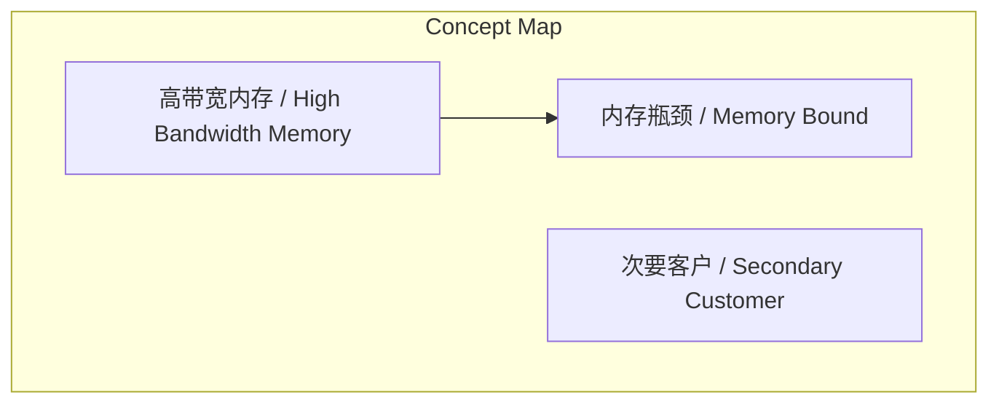
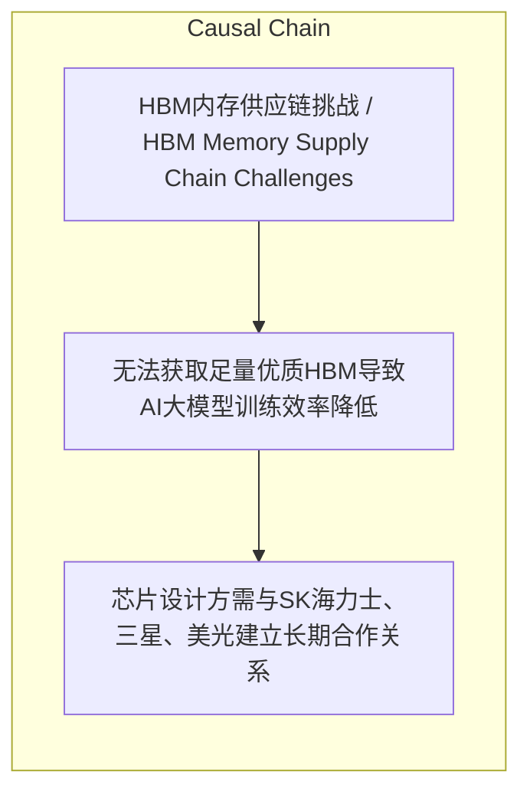

# NEWS/NEWS 任务报告

- agent: news/news
- requestId: 1774447989441-cce853
- 生成时间(UTC): 2026-03-25T14:14:07.074Z

### Runtime Trace
- 文本总结 | model=stepfun/step-3.5-flash:free
- 文本总结 | schema_fallback=yes
- 文本总结 | attempted_models=stepfun/step-3.5-flash:free

## 文本总结

### 运行信息
- model: stepfun/step-3.5-flash:free
- schema_fallback: yes
- attempted_models: stepfun/step-3.5-flash:free

# HBM内存供应链高度垄断且产能锁定

## 整体结构化文档表达
### 文档卡片
- 主题（中文/English）：HBM内存供应链挑战 / HBM Memory Supply Chain Challenges
- 一句话摘要：HBM内存因供应商垄断与英伟达锁单导致获取极难，将决定AI大模型训练效率上限。
- 目标读者：芯片设计方与AI大模型厂商
- 核心结论（3条）：
- HBM芯片生产被SK海力士、三星、美光三巨头垄断。
- 英伟达作为最大客户已锁定绝大部分产能，其他客户被视为次要客户。
- HBM产能需提前1-2年预定，临时获取极其困难。

### 内容结构树
1. 背景与问题定义
2. 核心观点与关键证据
3. 方法/机制/路径
4. 风险与边界条件
5. 结论与行动建议

### 结构化元数据（JSON）
```json
{
  "title": "HBM内存供应链高度垄断且产能锁定",
  "topic_zh": "HBM内存供应链挑战",
  "topic_en": "HBM Memory Supply Chain Challenges",
  "audience": "芯片设计方与AI大模型厂商",
  "claims": [],
  "evidence": [],
  "risks": [
    "无法获取足量优质HBM导致AI大模型训练效率降低"
  ],
  "actions": [
    "芯片设计方需与SK海力士、三星、美光建立长期合作关系"
  ]
}
```

## 处理流程
1. 输入识别
2. 信息抽取（实体、概念、问题、事实、观点）
3. 结构化归纳（定义/分类/比较/因果/方法论）
4. 关系建模（概念关系、等式/方程/逻辑链）
5. 可视化表达（Mermaid）

## 概念清单（中英文）
- 高带宽内存 / High Bandwidth Memory
- 内存瓶颈 / Memory Bound
- 次要客户 / Secondary Customer

## 概念定义（中英文）
### 高带宽内存 / High Bandwidth Memory
- 中文定义：一种高性能DRAM，用于GPU和AI加速器，提供高带宽以缓解内存瓶颈。
- English Definition: A type of high-performance DRAM used in GPUs and AI accelerators to provide high bandwidth and alleviate memory bottlenecks.

### 内存瓶颈 / Memory Bound
- 中文定义：AI计算中系统性能受内存带宽限制的状态，当前已成为核心痛点。
- English Definition: A state in AI computing where system performance is limited by memory bandwidth, now a core pain point.

### 次要客户 / Secondary Customer
- 中文定义：在供应链中优先级较低的客户，如谷歌TPU等定制芯片厂商。
- English Definition: A customer with lower priority in the supply chain, such as custom chip makers like Google TPU.


## 概念关联与逻辑关系（中英文）
- 高带宽内存/High Bandwidth Memory -> 内存瓶颈/Memory Bound | concept | 缓解

### 可形式化关系
- 供应商高度垄断 → HBM获取难度极高
- 英伟达锁定绝大部分产能 → 其他客户被视为次要客户
- 产能需提前1-2年预定 → 临时找货或调整产能极其困难

## COT逻辑梳理（定义/分类/比较/因果/科学方法论）
- Step 1: 识别HBM供应链核心挑战：供应商垄断、英伟达锁单、产能长周期。
- Step 2: 分析行业影响：AI计算瓶颈转向内存，HBM获取决定算力上限。
- Step 3: 提出解决方案：芯片设计方需与三厂商建立长期合作。

## 事实与看法（区分）
### 事实
- 全球HBM芯片生产被SK海力士、三星、美光垄断。
- 英伟达已锁定市场上绝大部分HBM产能。
- HBM产能通常需要提前一到两年预定和锁定。

### 看法
- 谷歌TPU等定制芯片在供应链眼中被视为次要客户，很难优先拿到大订单。
- HBM的获取能力将在未来几年直接决定各家AI大模型厂商算力的上限。
- 如果厂商买不到足够或优质的高性能HBM，其大模型的训练效率将会大打折扣。

## FAQ（原文问题整理）
- 未发现明确 FAQ

## Visualization
### Mermaid 图 1（概念结构图）


### Mermaid 图 2（逻辑/因果图）


## 文章中的类比
- 未发现明确类比

## 10个金句
- 原文未提供

