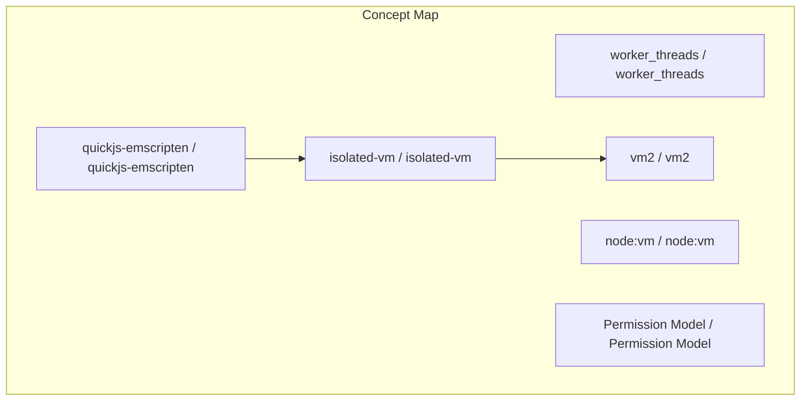
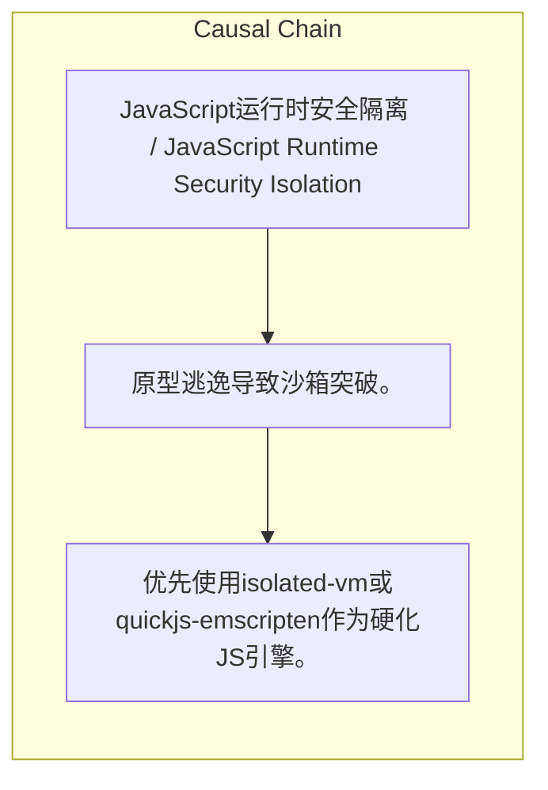

# NEWS/NEWS 任务报告

- agent: news/news
- requestId: 1774449029215-5vw6xc
- 生成时间(UTC): 2026-03-25T14:31:45.079Z

### Runtime Trace
- 文本总结 | model=stepfun/step-3.5-flash:free
- 文本总结 | schema_fallback=yes
- 文本总结 | attempted_models=stepfun/step-3.5-flash:free

## 文本总结

### 运行信息
- model: stepfun/step-3.5-flash:free
- schema_fallback: yes
- attempted_models: stepfun/step-3.5-flash:free

# JavaScript沙箱隔离方案安全评估

## 整体结构化文档表达
### 文档卡片
- 主题（中文/English）：JavaScript运行时安全隔离 / JavaScript Runtime Security Isolation
- 一句话摘要：研究评估多种JS沙箱方案，指出Node.js内置工具普遍不安全，推荐结合isolated-vm或WASM版QuickJS与OS级沙箱以实现深度防御。
- 目标读者：开发者、安全工程师
- 核心结论（3条）：
- Node.js内置沙箱工具（如vm模块、resourceLimits）存在原型逃逸等漏洞，无法抵御针对性攻击。
- isolated-vm和quickjs-emscripten提供最佳进程内隔离，前者为V8真正隔离，后者通过WASM实现最强隔离但性能代价高。
- 最高安全需求需组合硬化引擎、worker_threads、Permission Model及OS/容器沙箱，形成多层防御。

### 内容结构树
1. 背景与问题定义
2. 核心观点与关键证据
3. 方法/机制/路径
4. 风险与边界条件
5. 结论与行动建议

### 结构化元数据（JSON）
```json
{
  "title": "JavaScript沙箱隔离方案安全评估",
  "topic_zh": "JavaScript运行时安全隔离",
  "topic_en": "JavaScript Runtime Security Isolation",
  "audience": "开发者、安全工程师",
  "claims": [
    "vm模块和resourceLimits因原型逃逸和弱内存限制而不安全。",
    "Node.js Permission Model是有效的OS级安全带但可被绕过。",
    "vm2因持续安全逃逸而不推荐用于不可信代码。",
    "isolated-vm提供真正的V8隔离并支持资源限制。",
    "quickjs-emscripten提供最强的进程内隔离但性能显著下降。"
  ],
  "evidence": [
    "原型逃逸漏洞允许沙箱逃逸。",
    "resourceLimits对内存限制执行薄弱。",
    "isolated-vm处于维护模式。",
    "quickjs-emscripten通过WASM沙箱实现隔离。",
    "vm2存在持久的安全逃逸问题。",
    "Permission Model无法阻止所有I/O向量和原型逃逸。"
  ],
  "risks": [
    "原型逃逸导致沙箱突破。",
    "Permission Model被绕过导致权限提升。",
    "vm2的未修补漏洞导致代码执行。",
    "资源限制不足导致拒绝服务。",
    "仅依赖进程内隔离无法应对高度对抗性代码。"
  ],
  "actions": [
    "优先使用isolated-vm或quickjs-emscripten作为硬化JS引擎。",
    "在worker_threads中运行沙箱，结合Permission Model和剥离环境变量。",
    "对高威胁代码增加OS/容器级沙箱隔离。",
    "避免使用vm2处理不可信代码。",
    "定期审查沙箱配置和更新。"
  ]
}
```

## 处理流程
1. 输入识别
2. 信息抽取（实体、概念、问题、事实、观点）
3. 结构化归纳（定义/分类/比较/因果/方法论）
4. 关系建模（概念关系、等式/方程/逻辑链）
5. 可视化表达（Mermaid）

## 概念清单（中英文）
- worker_threads / worker_threads
- node:vm / node:vm
- Permission Model / Permission Model
- isolated-vm / isolated-vm
- vm2 / vm2
- quickjs-emscripten / quickjs-emscripten
- WASM / WASM
- 原型逃逸 / prototype escapes
- resourceLimits / resourceLimits

## 概念定义（中英文）
### worker_threads / worker_threads
- 中文定义：Node.js中用于创建工作线程的模块，提供隔离的执行环境。
- English Definition: Node.js module for creating worker threads, providing isolated execution environments.

### node:vm / node:vm
- 中文定义：Node.js中用于编译和运行代码的模块，但存在安全缺陷。
- English Definition: Node.js module for compiling and running code, but with security vulnerabilities.

### Permission Model / Permission Model
- 中文定义：Node.js的OS级权限控制机制，可限制文件系统、进程等访问。
- English Definition: Node.js's OS-level permission control mechanism, restricting filesystem, process, etc.

### isolated-vm / isolated-vm
- 中文定义：提供V8真正隔离的npm包，支持内存和CPU限制，但处于维护模式。
- English Definition: npm package providing true V8 isolation with memory and CPU restrictions, in maintenance mode.

### vm2 / vm2
- 中文定义：基于vm模块的沙箱npm包，但存在持续安全逃逸，不推荐使用。
- English Definition: Sandbox npm package based on vm module, with persistent security escapes, not recommended.

### quickjs-emscripten / quickjs-emscripten
- 中文定义：通过Emscripten编译的QuickJS引擎，提供WASM级进程内隔离，性能代价高。
- English Definition: QuickJS engine compiled via Emscripten, offering WASM-level in-process isolation at high performance cost.

### WASM / WASM
- 中文定义：WebAssembly，一种低级二进制格式，提供强隔离的沙箱环境。
- English Definition: WebAssembly, a low-level binary format providing strong sandboxed environments.

### 原型逃逸 / prototype escapes
- 中文定义：沙箱中通过原型链污染逃逸的安全漏洞。
- English Definition: Security vulnerability where prototype chain pollution allows escape from sandbox.

### resourceLimits / resourceLimits
- 中文定义：Node.js vm模块中用于限制内存和CPU的选项，但 enforcement 弱。
- English Definition: Options in Node.js vm module to limit memory and CPU, with weak enforcement.


## 概念关联与逻辑关系（中英文）
- isolated-vm/isolated-vm -> vm2/vm2 | concept | 优于
- Permission Model/Permission Model -> 原型逃逸/prototype escapes | concept | 无法阻止
- quickjs-emscripten/quickjs-emscripten -> isolated-vm/isolated-vm | concept | 提供更强进程内隔离

### 可形式化关系
- ¬Secure(vm模块) ∧ ¬Secure(resourceLimits)
- Secure(isolated-vm) ∧ InMaintenance(isolated-vm)
- StrongestIsolation(quickjs-emscripten) ∧ HighPerformanceCost(quickjs-emscripten)

## COT逻辑梳理（定义/分类/比较/因果/科学方法论）
- Step 1: 评估Node.js内置工具（vm、resourceLimits、Permission Model）的安全缺陷，发现原型逃逸和弱 enforcement。
- Step 2: 比较进程内沙箱方案（isolated-vm、vm2、quickjs-emscripten），确定isolated-vm和quickjs-emscripten为最佳，但各有权衡。
- Step 3: 提出深度防御策略，结合硬化引擎、worker_threads、Permission Model及OS/容器沙箱以应对高度威胁。

## 事实与看法（区分）
### 事实
- Node.js vm模块存在原型逃逸漏洞。
- resourceLimits对内存限制的执行较弱。
- isolated-vm处于维护模式。
- quickjs-emscripten通过WASM提供进程内隔离。
- vm2有持续的安全逃逸问题。
- Permission Model可被绕过，无法阻止所有攻击向量。

### 看法
- vm2不推荐用于不可信代码。
- Permission Model是 helpful but bypassable 的OS级安全带。
- quickjs-emscripten的性能代价显著。
- 组合方案提供最强防御-in-depth。
- 真正安全需进程隔离和OS/容器沙箱。

## FAQ（原文问题整理）
- 未发现明确 FAQ

## Visualization
### Mermaid 图 1（概念结构图）


### Mermaid 图 2（逻辑/因果图）


## 文章中的类比
- 未发现明确类比

## 10个金句
- 原文未提供

