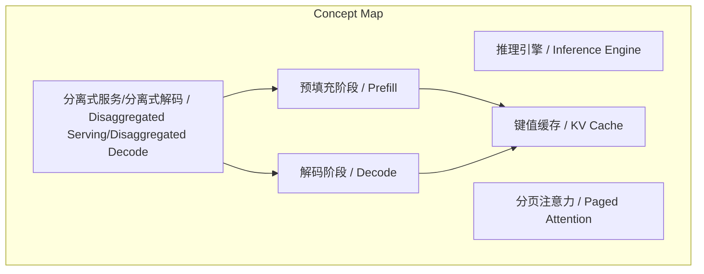
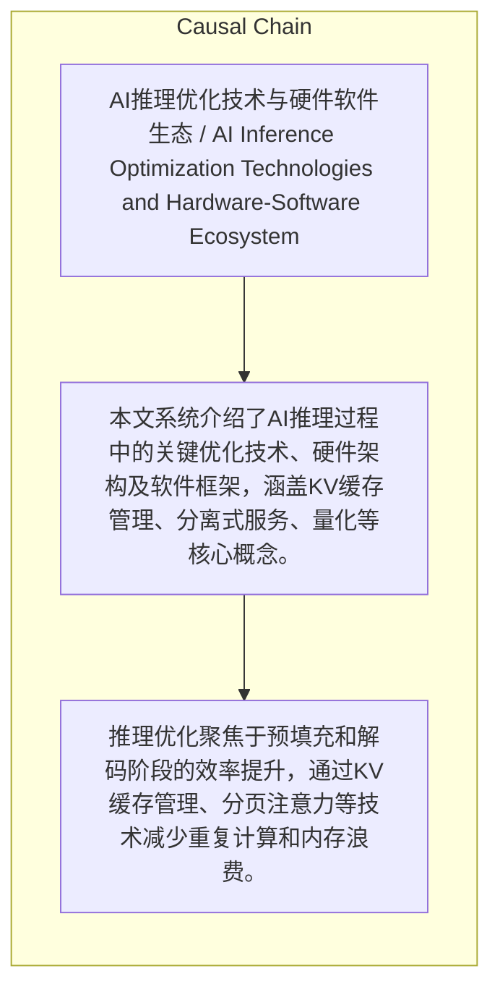

# NEWS/NEWS 任务报告

- agent: news/news
- requestId: 1774449391805-zlrgc0
- 生成时间(UTC): 2026-03-25T14:39:08.699Z

### Runtime Trace
- 文本总结 | model=stepfun/step-3.5-flash:free
- 文本总结 | schema_fallback=yes
- 文本总结 | attempted_models=stepfun/step-3.5-flash:free

## 文本总结

### 运行信息
- model: stepfun/step-3.5-flash:free
- schema_fallback: yes
- attempted_models: stepfun/step-3.5-flash:free

# AI推理优化技术概述

## 整体结构化文档表达
### 文档卡片
- 主题（中文/English）：AI推理优化技术与硬件软件生态 / AI Inference Optimization Technologies and Hardware-Software Ecosystem
- 一句话摘要：本文系统介绍了AI推理过程中的关键优化技术、硬件架构及软件框架，涵盖KV缓存管理、分离式服务、量化等核心概念。
- 目标读者：技术人员、AI研究者、工程师
- 核心结论（3条）：
- 推理优化聚焦于预填充和解码阶段的效率提升，通过KV缓存管理、分页注意力等技术减少重复计算和内存浪费。
- 硬件与软件的协同设计（如NVIDIA的块缩放）是提升推理性能的关键路径。
- 当前行业在性能评估上存在缺陷，需警惕基准测试造假（耻辱墙）和过度依赖整体准确率（安斯库姆四重奏）。

### 内容结构树
1. 背景与问题定义
2. 核心观点与关键证据
3. 方法/机制/路径
4. 风险与边界条件
5. 结论与行动建议

### 结构化元数据（JSON）
```json
{
  "title": "AI推理优化技术概述",
  "topic_zh": "AI推理优化技术与硬件软件生态",
  "topic_en": "AI Inference Optimization Technologies and Hardware-Software Ecosystem",
  "audience": "技术人员、AI研究者、工程师",
  "claims": [],
  "evidence": [],
  "risks": [],
  "actions": []
}
```

## 处理流程
1. 输入识别
2. 信息抽取（实体、概念、问题、事实、观点）
3. 结构化归纳（定义/分类/比较/因果/方法论）
4. 关系建模（概念关系、等式/方程/逻辑链）
5. 可视化表达（Mermaid）

## 概念清单（中英文）
- 推理引擎 / Inference Engine
- 键值缓存 / KV Cache
- 预填充阶段 / Prefill
- 解码阶段 / Decode
- 分离式服务/分离式解码 / Disaggregated Serving/Disaggregated Decode
- 分页注意力 / Paged Attention
- 基数树/基数注意力 / Radix Tree/Radix Attention
- 量化 / Quantization
- 块缩放 / Block Scaling
- 协同设计/机械同理心 / Co-design/Mechanical Sympathy
- 高带宽内存 / HBM/High Bandwidth Memory
- 静态随机存取存储器 / SRAM

## 概念定义（中英文）
### 推理引擎 / Inference Engine
- 中文定义：一组将已训练好的模型加载到内存中的计算机 它们共同运行专门的软件以处理用户的请求（如 ChatGPT 或 Claude）。目前数据中心里运行的大部分计算都是用于推理。
- English Definition: 未提及

### 键值缓存 / KV Cache
- 中文定义：Transformer 模型的一种优化技术。它将之前计算过的键（Keys K）和值（Values V）缓存下来 以避免在生成下一个 Token 时重复计算 从而节省算力。由于查询向量（Queries Q）在未来的计算步骤中不会被重复使用 因此只缓存 K 和 V。
- English Definition: 未提及

### 预填充阶段 / Prefill
- 中文定义：推理过程的第一个阶段。在此阶段 系统为系统提示词（System Prompt）、上下文和用户问题生成完整的键值缓存（KV Cache） 并输出第一个 Token。该阶段主要受限于计算能力。
- English Definition: 未提及

### 解码阶段 / Decode
- 中文定义：推理过程的第二个阶段。模型每次生成一个 Token 在生成过程中需要从内存中读取之前所有 Token 的 KV Cache 以及模型权重。
- English Definition: 未提及

### 分离式服务/分离式解码 / Disaggregated Serving/Disaggregated Decode
- 中文定义：一种将推理的“预填充”和“解码” 分配给不同硬件的架构。例如 NVIDIA 提出将 Transformer 层的注意力机制（Attention）交由 GPU 运行 然后将数据传输给专门处理矩阵乘法（Matrix Multiplications）的 LPU（语言处理单元）机架进行计算 以提升整体效率。
- English Definition: 未提及

### 分页注意力 / Paged Attention
- 中文定义：一种内存管理技术。它不为 KV Cache 分配连续的显存块 而是将其存储在非连续的内存块中。这可以避免显存空间的浪费以及因重新分配内存而导致的解码停顿 极大提高了显存利用率。
- English Definition: 未提及

### 基数树/基数注意力 / Radix Tree/Radix Attention
- 中文定义：由 SGLang 引入的一种数据结构 用于识别输入序列之前是否已经生成过 KV Cache。如果是 则直接复用预先计算好的 KV Cache 从而大幅减少重复计算。
- English Definition: 未提及

### 量化 / Quantization
- 中文定义：将模型权重或 KV Cache 从高精度（如浮点16位）压缩到低精度（如浮点8位或4位）的技术 这能显著减小显存占用并提高吞吐量。
- English Definition: 未提及

### 块缩放 / Block Scaling
- 中文定义：一种主要用于 FP4 硬件量化的技术。它不是将所有数字统一缩放 而是逐块（Block by Block）进行缩放 以此在极低精度下保持更好的模型准确度。
- English Definition: 未提及

### 协同设计/机械同理心 / Co-design/Mechanical Sympathy
- 中文定义：将算法、硬件和软件结合起来进行整体优化的理念。NVIDIA 在设计硬件时会直接与研究人员合作 通过硬件层面解决软件面临的挑战（例如内置的块缩放技术）。
- English Definition: 未提及

### 高带宽内存 / HBM/High Bandwidth Memory
- 中文定义：GPU 上的一种动态随机存取存储器（DRAM）。它的容量较大 在推理的第一阶段计算完 KV Cache 后会将其存储在此处 但距离实际计算单元较远。
- English Definition: 未提及

### 静态随机存取存储器 / SRAM
- 中文定义：位于 GPU 上、更靠近流式多处理器（实际执行计算的地方）的内存。在解码阶段 数据需要从 HBM 读取到 SRAM 中进行计算。
- English Definition: 未提及


## 概念关联与逻辑关系（中英文）
- 预填充阶段/Prefill -> 键值缓存/KV Cache | concept | 生成
- 解码阶段/Decode -> 键值缓存/KV Cache | concept | 使用
- 分离式服务/分离式解码/Disaggregated Serving/Disaggregated Decode -> 预填充阶段/Prefill | concept | 分配
- 分离式服务/分离式解码/Disaggregated Serving/Disaggregated Decode -> 解码阶段/Decode | concept | 分配
- 基数树/基数注意力/Radix Tree/Radix Attention -> 键值缓存/KV Cache | concept | 复用
- 高带宽内存/HBM/High Bandwidth Memory -> 键值缓存/KV Cache | concept | 存储

### 可形式化关系
- 预填充阶段生成键值缓存
- 解码阶段使用键值缓存
- 基数树/基数注意力复用键值缓存

## COT逻辑梳理（定义/分类/比较/因果/科学方法论）
- Step 1: 预填充阶段：为系统提示词、上下文和用户问题生成完整的KV缓存，并输出第一个Token。
- Step 2: 解码阶段：每次生成一个Token，从内存中读取之前所有Token的KV缓存以及模型权重。

## 事实与看法（区分）
### 事实
- 未发现明确客观事实

### 看法
- 演讲者批评当前AI行业在衡量模型量化后的性能下降时存在缺陷，过度依赖整体准确率而忽视底层模型行为的变化。

## FAQ（原文问题整理）
- 未发现明确 FAQ

## Visualization
### Mermaid 图 1（概念结构图）


### Mermaid 图 2（逻辑/因果图）


## 文章中的类比
- 未发现明确类比

## 10个金句
- 原文未提供

