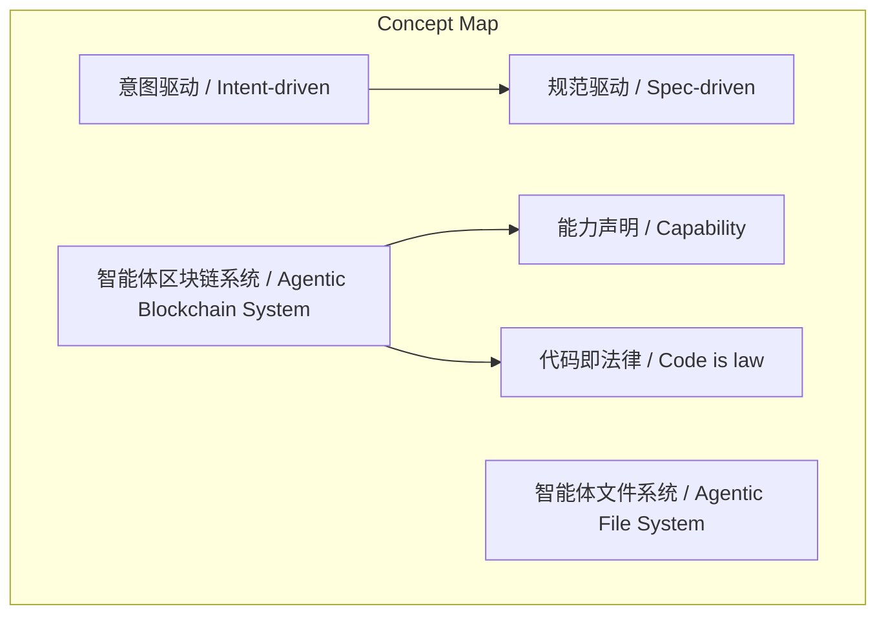
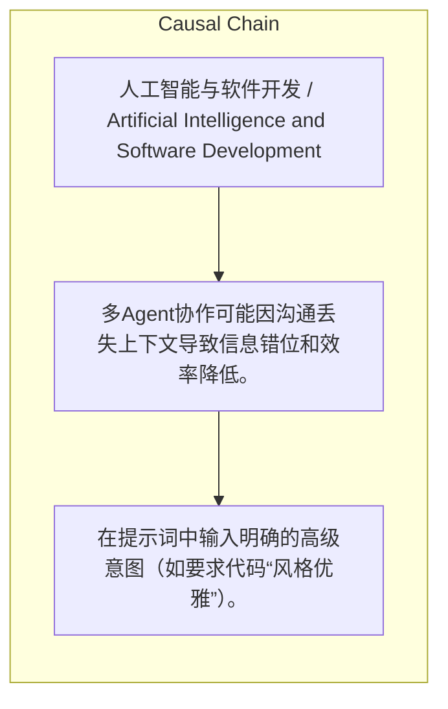

# NEWS/NEWS 任务报告

- agent: news/news
- requestId: 1774569683830-w9fhd2
- 生成时间(UTC): 2026-03-27T00:02:54.007Z

### Runtime Trace
- 文本总结 | model=stepfun/step-3.5-flash:free
- 文本总结 | schema_fallback=yes
- 文本总结 | attempted_models=stepfun/step-3.5-flash:free

## 文本总结

### 运行信息
- model: stepfun/step-3.5-flash:free
- schema_fallback: yes
- attempted_models: stepfun/step-3.5-flash:free

# AI时代软件开发范式：意图驱动与人类审美核心

## 整体结构化文档表达
### 文档卡片
- 主题（中文/English）：人工智能与软件开发 / Artificial Intelligence and Software Development
- 一句话摘要：AI在代码架构上能力卓越，但依赖人类高级意图与审美；团队需转向意图驱动协作，基础设施须将AI作为一等公民。
- 目标读者：软件开发团队、技术管理者、AI应用者
- 核心结论（3条）：
- AI在代码质量、命名规范、设计模式上已达极高水平，但需要人类给出明确的高级指导（如审美、意图）。
- 应采用“意图驱动（IDD）”管理模式，抛弃“规范驱动（SDD）”，避免微操导致AI逻辑混乱。
- 团队应将AI“人化”为超级工作伙伴，协作由AI Agent间完成，人类转为监督员；多Agent协作可能因沟通损耗降低效率，单Agent有时更优。

### 内容结构树
1. 背景与问题定义
2. 核心观点与关键证据
3. 方法/机制/路径
4. 风险与边界条件
5. 结论与行动建议

### 结构化元数据（JSON）
```json
{
  "title": "AI时代软件开发范式：意图驱动与人类审美核心",
  "topic_zh": "人工智能与软件开发",
  "topic_en": "Artificial Intelligence and Software Development",
  "audience": "软件开发团队、技术管理者、AI应用者",
  "claims": [
    "AI在代码架构能力上像“神一样的存在”。",
    "AI在设计数据库、网络协议和分布式系统等纯后端架构上的能力早已远超人类。",
    "前端网页界面因追求95分以上的极高审美，人类设计师依然不可或缺。"
  ],
  "evidence": [],
  "risks": [
    "多Agent协作可能因沟通丢失上下文导致信息错位和效率降低。",
    "AI存在幻觉风险，需通过智能体区块链系统等机制约束行为。"
  ],
  "actions": [
    "在提示词中输入明确的高级意图（如要求代码“风格优雅”）。",
    "采用意图驱动（IDD）管理模式，直接告诉AI最终目标，类似OKR。",
    "将AI视为超级工作伙伴，团队规模微缩，人类角色变为提出需求并验收结果的监督员。",
    "引入智能体文件系统（Agentic File System）和智能体区块链系统（Agentic Blockchain System）以适配AI。"
  ]
}
```

## 处理流程
1. 输入识别
2. 信息抽取（实体、概念、问题、事实、观点）
3. 结构化归纳（定义/分类/比较/因果/方法论）
4. 关系建模（概念关系、等式/方程/逻辑链）
5. 可视化表达（Mermaid）

## 概念清单（中英文）
- 意图驱动 / Intent-driven
- 规范驱动 / Spec-driven
- 智能体文件系统 / Agentic File System
- 智能体区块链系统 / Agentic Blockchain System
- 能力声明 / Capability
- 代码即法律 / Code is law

## 概念定义（中英文）
### 意图驱动 / Intent-driven
- 中文定义：一种AI管理模式，用户直接向AI表达最终意图或目标，而非提供详细规范，类似企业管理中的OKR。
- English Definition: An AI management model where users directly express final intentions or goals to AI, rather than providing detailed specifications, similar to OKR in business management.

### 规范驱动 / Spec-driven
- 中文定义：传统管理模式，将任务拆解为极细规范进行微操，不适用于高维AI，易导致逻辑混乱。
- English Definition: Traditional management model that breaks down tasks into extremely detailed specifications for micromanagement, unsuitable for high-dimensional AI and prone to logical confusion.

### 智能体文件系统 / Agentic File System
- 中文定义：升级传统文件系统，将“一切皆文件”理念变为“一切皆上下文”，使AI能更顺畅读取和理解工作环境。
- English Definition: An upgraded file system that transforms the 'everything is a file' concept into 'everything is a context', enabling AI to read and understand the work environment more smoothly.

### 智能体区块链系统 / Agentic Blockchain System
- 中文定义：利用区块链可审计、可验证特性，结合能力声明和代码即法律，在代码协议层面限制和圈定AI行为边界。
- English Definition: A system that leverages blockchain's auditability and verifiability, combined with capability declarations and 'code is law', to limit and define AI behavior boundaries at the code protocol level.

### 能力声明 / Capability
- 中文定义：在代码协议层面定义和声明AI的能力边界，用于约束AI行为。
- English Definition: Defining and declaring AI capability boundaries at the code protocol level to constrain AI behavior.

### 代码即法律 / Code is law
- 中文定义：用代码规则作为法律，限制和圈定AI的行为，构建人机信任机制。
- English Definition: Using code rules as law to restrict and define AI behavior, building a human-AI trust mechanism.


## 概念关联与逻辑关系（中英文）
- 意图驱动/Intent-driven -> 规范驱动/Spec-driven | concept | contrast
- 智能体区块链系统/Agentic Blockchain System -> 能力声明/Capability | concept | utilizes
- 智能体区块链系统/Agentic Blockchain System -> 代码即法律/Code is law | concept | implements

### 可形式化关系
- Spec-driven (SDD) ⇒ AI logical confusion and inefficiency
- Single-Agent independence ⇒ Avoidance of context loss in communication
- High aesthetic demand in frontend ⇒ Necessity of human designers

## COT逻辑梳理（定义/分类/比较/因果/科学方法论）
- Step 1: 确立核心原则：人类高级意图（如审美、风格）是驱动AI卓越代码架构能力的关键，AI需明确指导。
- Step 2: 实施意图驱动（IDD）管理，团队将AI“人化”为超级伙伴，协作由AI Agent完成，人类转为监督员；注意单Agent可能避免多Agent沟通损耗。
- Step 3: 基础设施变革：构建智能体文件系统（一切皆上下文）和智能体区块链系统（结合能力声明与代码即法律），以AI为中心设计系统。

## 事实与看法（区分）
### 事实
- 未发现明确客观事实

### 看法
- AI在代码架构能力上像“神一样的存在”。
- AI在纯后端架构设计上能力远超人类且正确性极高。
- 前端因审美需求高，人类设计师不可或缺。

## FAQ（原文问题整理）
### 如何设计更好的架构让AI（Code Agent）更好地完成开发？
- 核心在于使用者自己需要具备高级的品味（Taste）和审美。AI在代码质量、命名规范以及运用设计模式上已经达到了极高的水平，但它需要人类给出明确的高级指导。作为使用者，你不需要自己去微观架构，只需在提示词中输入明确的意图（例如要求代码“风格优雅”），AI就能迅速在其高维空间中找到匹配的经典开源架构，将其映射为运用了优秀设计模式的代码。

### AI在代码架构能力上像“神一样的存在”能具体举个例子吗？
- 这就像建房子：普通的建筑师需要考虑预算、土壤结构、环境等大量现实约束来做出权衡（trade-off），而不仅是画个图。AI在单纯的代码架构角度上，就像一个极度优秀的建筑师。只要你不是像“土豪砸钱随便建”那样缺乏沟通，而是像懂得某种高级设计风格（例如当代中世纪风 Modern Mid-Century）的客户一样向AI表达意图，它就能立刻排除不相干的设计，精准产出完美贴合你审美和意图的架构方案。

### 应该怎么指挥AI？如何让它按照你想要的东西来准确执行？
- 应该采用“意图驱动（Intent-driven / IDD）”的管理模式，抛弃传统的“规范驱动（Spec-driven / SDD）”。这意味着你要像真正的老板一样，直接告诉AI你想要达到的最终目标或意图，类似企业管理中的OKR（目标与关键结果）。千万不要把任务拆解成极细的规范（Spec）去微操它，因为AI的智商和能力远超人类，用低维的微操方式去瞎指挥，反而会导致聪明的AI陷入逻辑混乱，产生并非你真正想要的结果。

### 团队引入大量AI Agent后，应该如何调整组织结构和协作模式以提升效率？
- 团队应该把AI“人化”，将其视为超级工作伙伴。由于一个善用AI的员工抵得上过去100个人的工程团队，团队规模将极度微缩，甚至出现几个人就能维护多个产品、“一人即一公司”的极端情况。在协作模式上，过去软件工程中必须的持续集成（CI）和人工代码审查（Code Review）会被彻底废除。人类将不再干预审查，而是交由一组分工不同的AI Agent（有的写代码，有的做测试，有的做Review）相互配合完成。人类的角色则变成“提出需求并验收结果的监督员和调度员”。

### 为什么多Agent协作，有时还不如单Agent带上技能（Skill）的效率高？
- 因为无论是人类组织还是多Agent团队，大量协作问题的本质都是沟通问题。多个Agent在相互快速沟通和传导信息时，同样会丢失上下文（Context），导致信息错位（miss information）。这就如同人类在复杂的团队网络中交流一样，传递链路越长，另一方就越不明白你的真实意图。因此在某些情况下，单Agent独立作业反而能避免沟通损耗。

### 在AI时代，后端的数据库（Database）等传统架构还需要人类吗？
- 数据存储依然存在，但传统后端架构的编写几乎完全不再需要人类。AI在设计数据库、网络协议和分布式系统等纯后端架构上的能力早已远超人类，且正确性极高。反直觉的是，目前AI更难完全替代的是前端网页界面，因为前端直接关乎用户的“注意力”，追求的是95分以上的极高审美，这就使得拥有高级审美的人类设计师在前端展现环节依然不可或缺。

### 面向未来的AI Agent，底层的系统基础设施（Infra）需要发生什么变化？
- 过去的文件系统和操作系统都是以人类为主体设计的，而未来的基础设施必须把AI智能体作为一等公民。例如，将传统Unix系统中“一切皆文件”的理念升级为“智能体文件系统（Agentic File System）”下的“一切皆上下文（Everything is a context）”，使AI能更顺畅地读取和理解工作环境。同时，为解决AI的幻觉风险，需要引入智能体区块链系统（Agentic Blockchain System），利用其可审计、可验证的特性，结合“能力声明（Capability）”和“代码即法律（Code is law）”，在代码协议层面限制和圈定AI的行为边界，构建全新的人机信任机制。

## Visualization
### Mermaid 图 1（概念结构图）


### Mermaid 图 2（逻辑/因果图）


## 文章中的类比
- AI代码架构能力 vs 建筑师：AI如极度优秀的建筑师，人类如懂高级设计风格的客户。
- 意图驱动 vs OKR：意图驱动类似企业管理中的OKR（目标与关键结果）。
- 微操AI vs 土豪砸钱建房子：用低维微操指挥AI如同土豪缺乏沟通随意建房子。

## 10个金句
- 原文未提供

