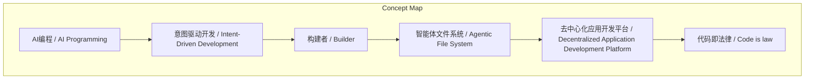
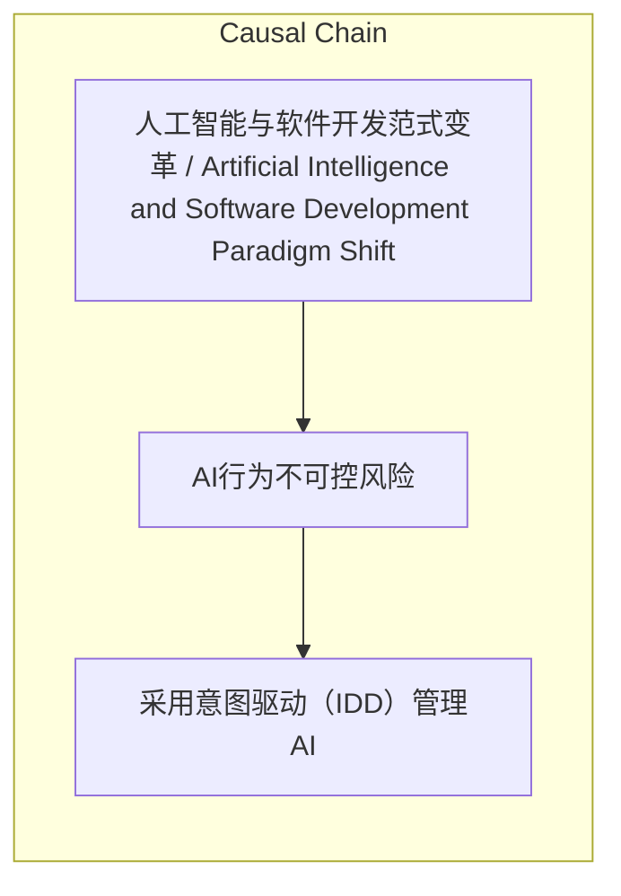

# NEWS/NEWS 任务报告

- agent: news/news
- requestId: 1774569863126-0lama7
- 生成时间(UTC): 2026-03-27T00:05:22.502Z

### Runtime Trace
- 文本总结 | model=stepfun/step-3.5-flash:free
- 文本总结 | schema_fallback=yes
- 文本总结 | attempted_models=stepfun/step-3.5-flash:free

## 文本总结

### 运行信息
- model: stepfun/step-3.5-flash:free
- schema_fallback: yes
- attempted_models: stepfun/step-3.5-flash:free

# AI编程颠覆软件工程：老帽谈团队微缩与构建者未来

## 整体结构化文档表达
### 文档卡片
- 主题（中文/English）：人工智能与软件开发范式变革 / Artificial Intelligence and Software Development Paradigm Shift
- 一句话摘要：Arcblock创始人老帽认为AI编程能力已全面超越人类，将导致软件团队规模微缩至个位数，并催生‘构建者’新角色。
- 目标读者：科技行业从业者、管理者、创业者
- 核心结论（3条）：
- AI编程能力已全面超越人类，纯手工写代码无意义
- 善于驾驭AI的团队规模可微缩至个位数，效能百倍放大
- 传统软件工程师角色消亡，全员成为‘构建者’

### 内容结构树
1. 背景与问题定义
2. 核心观点与关键证据
3. 方法/机制/路径
4. 风险与边界条件
5. 结论与行动建议

### 结构化元数据（JSON）
```json
{
  "title": "AI编程颠覆软件工程：老帽谈团队微缩与构建者未来",
  "topic_zh": "人工智能与软件开发范式变革",
  "topic_en": "Artificial Intelligence and Software Development Paradigm Shift",
  "audience": "科技行业从业者、管理者、创业者",
  "claims": [
    "AI编程能力已“秒杀”人类，从写代码角度看没有人类能超过大模型",
    "如果AI生成的代码质量不高，不应怪罪AI而是人类缺乏驾驭“千里马”的能力或提示不当",
    "管理AI应采用“意图驱动（IDD）”，而非“规范驱动（SDD）”的微观管理",
    "人类核心价值在于“品味（Taste）”与监督，AI是微观架构神级设计师",
    "团队规模微缩与效能呈百倍放大，两三人可抵过去200人团队",
    "纯手工写代码的“软件工程师”职业已失去意义，未来人人都是“构建者”",
    "SaaS（软件即服务）模式将走向终结，每个人可低成本打造个性化软件",
    "后端比前端更容易被AI替代，前端需人类审美把控"
  ],
  "evidence": [
    "老帽是Arcblock创始人兼CEO，曾在微软工作，2009年定居西雅图，公司成立于2017年",
    "Arcblock团队三个月内代码全由AI编写，人类手写代码数量为零",
    "老帽强制规定不允许员工手写代码和手写commit message",
    "Arcblock已废除传统CI和人工代码审查，全部由AI Agent自动完成",
    "科技公司Every只有9个工程师却同时维护5个软件产品",
    "西雅图大厂（微软、亚马逊）在经济良好时大规模裁员",
    "老帽今年初两个月提交1199个commit，远超去年全年2171个",
    "Arcblock发表关于“智能体文件系统”的学术论文，提出“一切皆上下文”"
  ],
  "risks": [
    "AI行为不可控风险",
    "传统SaaS行业颠覆风险"
  ],
  "actions": [
    "采用意图驱动（IDD）管理AI",
    "转型为“构建者”角色",
    "将软件团队规模控制在十人以内"
  ]
}
```

## 处理流程
1. 输入识别
2. 信息抽取（实体、概念、问题、事实、观点）
3. 结构化归纳（定义/分类/比较/因果/方法论）
4. 关系建模（概念关系、等式/方程/逻辑链）
5. 可视化表达（Mermaid）

## 概念清单（中英文）
- AI编程 / AI Programming
- 意图驱动开发 / Intent-Driven Development
- 构建者 / Builder
- 智能体文件系统 / Agentic File System
- 去中心化应用开发平台 / Decentralized Application Development Platform
- 代码即法律 / Code is law

## 概念定义（中英文）
### AI编程 / AI Programming
- 中文定义：指由人工智能模型自动生成代码的技术
- English Definition: Technology where AI models automatically generate code.

### 意图驱动开发 / Intent-Driven Development
- 中文定义：一种管理AI的方法，人类明确指定目标而非具体执行步骤
- English Definition: A management approach for AI where humans specify goals rather than step-by-step instructions.

### 构建者 / Builder
- 中文定义：未来软件开发者角色，统称有想法并实施交付的人
- English Definition: Future software developer role, encompassing those who conceive and deliver software.

### 智能体文件系统 / Agentic File System
- 中文定义：Arcblock提出的概念，扩展Unix“一切皆文件”为“一切皆上下文”
- English Definition: Concept proposed by Arcblock, extending Unix's 'everything is a file' to 'everything is a context'.

### 去中心化应用开发平台 / Decentralized Application Development Platform
- 中文定义：Arcblock公司定位，提供去中心化应用开发的基础设施
- English Definition: Arcblock's positioning, providing infrastructure for decentralized application development.

### 代码即法律 / Code is law
- 中文定义：在区块链上，代码规则自动执行，用于约束AI行为
- English Definition: On blockchain, code rules execute automatically to constrain AI behavior.


## 概念关联与逻辑关系（中英文）
- AI编程/AI Programming -> 传统程序员/Traditional Programmer | concept | 替代
- 意图驱动开发/Intent-Driven Development -> 规范驱动开发/Specification-Driven Development | concept | 优于
- 构建者/Builder -> 传统软件工程师/Traditional Software Engineer | concept | 取代
- 区块链/Blockchain -> AI/AI | concept | 约束
- 智能体文件系统/Agentic File System -> Unix文件系统/Unix File System | concept | 扩展

### 可形式化关系
- 效能 ∝ 1/团队规模（在AI辅助下）
- AI能力 > 人类能力 → 人类角色 = 监督员
- 可验证性 ∧ 可审计性 ∧ 能力权限限制 → 约束AI

## COT逻辑梳理（定义/分类/比较/因果/科学方法论）
- Step 1: 基于Arcblock团队代码全由AI编写且老帽个人AI贡献巨大，推断AI编程能力已超越人类。
- Step 2: 因此，传统依赖人工的CI/CD和代码审查流程被AI Agent取代，团队可废除这些环节。
- Step 3: 进而推导出团队规模可微缩至个位数，人类角色转为意图提供者和监督者，传统软件工程师角色消亡。

## 事实与看法（区分）
### 事实
- 老帽是Arcblock创始人兼CEO，曾在微软工作，2009年定居西雅图，公司成立于2017年
- Arcblock团队三个月内代码全由AI编写，人类手写代码数量为零
- 老帽强制规定不允许员工手写代码和手写commit message
- Arcblock已废除传统CI和人工代码审查，全部由AI Agent自动完成
- 科技公司Every只有9个工程师却同时维护5个软件产品
- 西雅图大厂（微软、亚马逊）在经济良好时大规模裁员
- 老帽今年初两个月提交1199个commit，远超去年全年2171个
- Arcblock发表关于“智能体文件系统”的学术论文，提出“一切皆上下文”

### 看法
- AI编程能力已“秒杀”人类，从写代码角度看没有人类能超过大模型
- 如果AI生成的代码质量不高，不应怪罪AI而是人类缺乏驾驭“千里马”的能力或提示不当
- 管理AI应采用“意图驱动（IDD）”，而非“规范驱动（SDD）”的微观管理
- 人类核心价值在于“品味（Taste）”与监督，AI是微观架构神级设计师
- 团队规模微缩与效能呈百倍放大，两三人可抵过去200人团队
- 纯手工写代码的“软件工程师”职业已失去意义，未来人人都是“构建者”
- SaaS（软件即服务）模式将走向终结，每个人可低成本打造个性化软件
- 后端比前端更容易被AI替代，前端需人类审美把控
- 区块链是约束AI失控的最佳底层基建，因其可验证、可审计，适合能力权限限制

## FAQ（原文问题整理）
### AI编程能力是否已超越人类？
- 老帽认为从写代码角度看，没有人类能超过大模型如Claude Opus。

### 未来软件团队规模会如何变化？
- 老帽预测超过十人会被怀疑水分，两三个工程师可等同于过去200人团队。

### 应如何管理AI？
- 应采用意图驱动（IDD），明确告诉AI目标而非教其执行步骤。

### 人类在AI时代的核心价值是什么？
- 提供高级审美和需求诱导，作为监督员验收结果。

### 为什么区块链能约束AI？
- 区块链的可验证性、可审计性及能力权限限制机制，结合“代码即法律”，可圈定AI行为。

## Visualization
### Mermaid 图 1（概念结构图）


### Mermaid 图 2（逻辑/因果图）


## 文章中的类比
- AI如“千里马”，人类需具备驾驭能力
- 人类管理AI应像“老板”一样，只给目标不给步骤

## 10个金句
- AI 编程能力已“秒杀”人类
- 如果 AI 生成的代码质量不高 不应怪罪 AI 而是人类缺乏驾驭“千里马”的能力
- 传统的“规范驱动（SDD）”式的微观管理是侮辱 AI 智商的错误方案
- 人类的角色正变成提出需求并验收结果的监督员
- 未来如果一个软件团队超过十个人 会被外界怀疑水分极大
- 纯手工写代码的“软件工程师”职业已经失去存在的意义
- SaaS（软件即服务）模式将走向终结
- 后端比前端更容易被 AI 替代
- 区块链是约束 AI 失控的最佳底层基建

