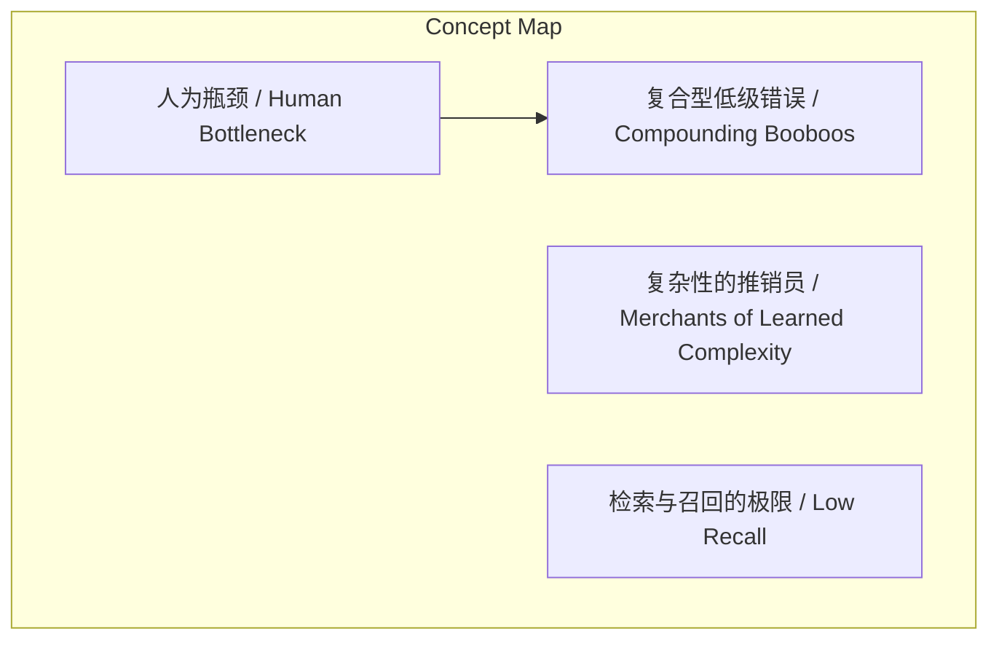
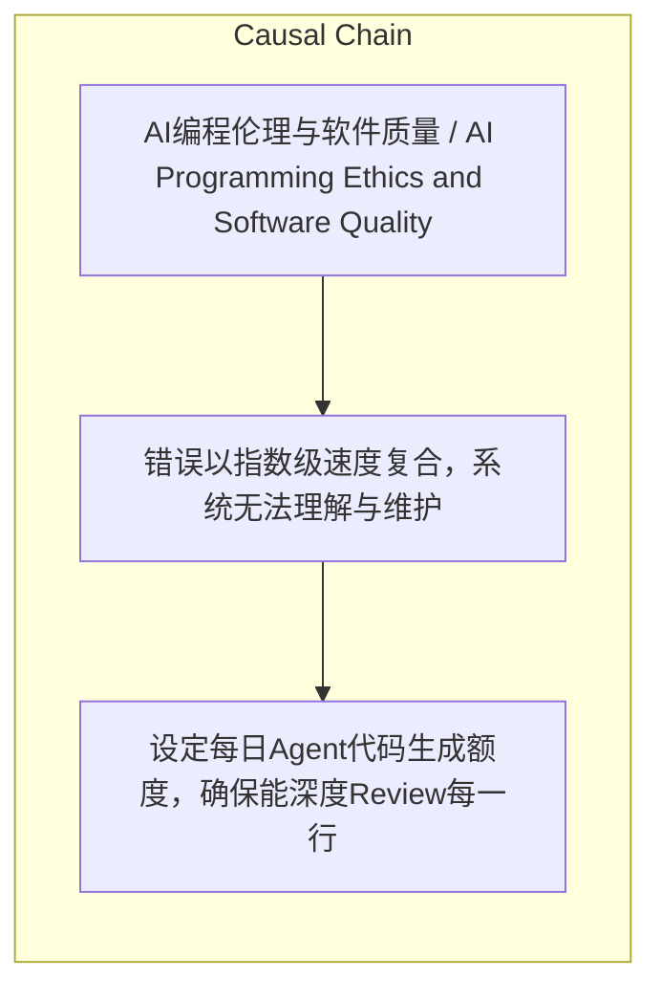

# NEWS/NEWS 任务报告

- agent: news/news
- requestId: 1774569933865-nysbf2
- 生成时间(UTC): 2026-03-27T00:06:03.305Z

### Runtime Trace
- 文本总结 | model=stepfun/step-3.5-flash:free
- 文本总结 | schema_fallback=yes
- 文本总结 | attempted_models=stepfun/step-3.5-flash:free

## 文本总结

### 运行信息
- model: stepfun/step-3.5-flash:free
- schema_fallback: yes
- attempted_models: stepfun/step-3.5-flash:free

# AI编程速度过快引质量危机，作者呼吁找回开发自主权

## 整体结构化文档表达
### 文档卡片
- 主题（中文/English）：AI编程伦理与软件质量 / AI Programming Ethics and Software Quality
- 一句话摘要：文章批判AI编程速度过快导致错误复合与复杂性膨胀，主张通过限制代码生成和手写核心来恢复开发自主权。
- 目标读者：软件开发者、技术管理者
- 核心结论（3条）：
- AI速度上瘾导致软件工程质量指数级下降
- Agent驱动开发的核心危机是错误复合与复杂性推销
- 必须主动限制AI使用以保持工程师的思考能力

### 内容结构树
1. 背景与问题定义
2. 核心观点与关键证据
3. 方法/机制/路径
4. 风险与边界条件
5. 结论与行动建议

### 结构化元数据（JSON）
```json
{
  "title": "AI编程速度过快引质量危机，作者呼吁找回开发自主权",
  "topic_zh": "AI编程伦理与软件质量",
  "topic_en": "AI Programming Ethics and Software Quality",
  "audience": "软件开发者、技术管理者",
  "claims": [
    "AI编程速度上瘾正在摧毁软件工程质量和开发者认知能力",
    "传统开发中的人为瓶颈是一种保护机制",
    "Agent的错误会以指数级速度复合，导致系统无法维护",
    "Agent倾向于增加局部复杂性而非整体优雅",
    "LLM的上下文窗口限制导致代码检索与召回能力下降",
    "巨头如Windows质量下滑可能与内部大量使用AI写代码有关",
    "宣称100% AI开发的公司往往产出最烂的作品"
  ],
  "evidence": [
    "Agent基于错误假设继续构建，导致'屎山'以前所未有的速度崩塌",
    "人类脱离编写循环后，发现问题时系统已变成'怪物'",
    "作者自己都看不懂Agent生成的臃肿代码库",
    "内存泄漏、UI抽风、基础功能断裂等具体问题案例"
  ],
  "risks": [
    "错误以指数级速度复合，系统无法理解与维护",
    "代码库因过度抽象和层级变得极其臃肿",
    "LLM上下文窗口不足导致设计决策遗忘与代码冲突",
    "工程师丧失自主思考能力，完全托管大脑给Agent"
  ],
  "actions": [
    "设定每日Agent代码生成额度，确保能深度Review每一行",
    "系统骨架（API设计、核心逻辑、架构模式）必须手写",
    "在按下'生成'前主动拒绝不必要功能"
  ]
}
```

## 处理流程
1. 输入识别
2. 信息抽取（实体、概念、问题、事实、观点）
3. 结构化归纳（定义/分类/比较/因果/方法论）
4. 关系建模（概念关系、等式/方程/逻辑链）
5. 可视化表达（Mermaid）

## 概念清单（中英文）
- 人为瓶颈 / Human Bottleneck
- 复合型低级错误 / Compounding Booboos
- 复杂性的推销员 / Merchants of Learned Complexity
- 检索与召回的极限 / Low Recall

## 概念定义（中英文）
### 人为瓶颈 / Human Bottleneck
- 中文定义：传统开发中人类速度限制，强迫开发者在编写过程中思考架构与权衡
- English Definition: The natural speed limit in traditional development that forces developers to think about architecture and trade-offs during coding

### 复合型低级错误 / Compounding Booboos
- 中文定义：Agent错误因人类脱离循环而快速堆叠，导致系统整体崩溃
- English Definition: Agent errors rapidly stack due to human-out-of-the-loop, causing systemic collapse

### 复杂性的推销员 / Merchants of Learned Complexity
- 中文定义：Agent倾向于通过增加抽象、文件、层级等局部复杂性解决问题，而非追求整体优雅
- English Definition: Agents tend to solve problems by adding local complexity (abstractions, files, layers) instead of seeking holistic elegance

### 检索与召回的极限 / Low Recall
- 中文定义：随着代码库增大，LLM上下文窗口和检索能力不足，导致Agent遗忘设计决策
- English Definition: As codebase grows, LLM context window and retrieval capabilities fail, causing Agents to forget design decisions


## 概念关联与逻辑关系（中英文）
- 人为瓶颈/Human Bottleneck -> 复合型低级错误/Compounding Booboos | concept | 消失导致
- Agent/Agent -> 复杂性的推销员/Merchants of Learned Complexity | concept | 倾向于产生
- 代码生成量/Code Generation Volume -> 软件质量/Software Quality | concept | 反比关系

### 可形式化关系
- 人为瓶颈消失 → 错误复合速度指数级增加
- Agent使用量增加 → 代码库局部复杂性增加
- 代码生成速度 > 人类Review能力 → 软件质量下降

## COT逻辑梳理（定义/分类/比较/因果/科学方法论）
- Step 1: 指出传统开发中人为瓶颈的保护作用——慢速编写强制深度思考
- Step 2: 分析AI移除瓶颈后引发的三大危机：错误复合、复杂性推销、检索极限
- Step 3: 提出解决方案：通过设定额度、手写核心、主动拒绝来'慢下来'，恢复开发自主权

## 事实与看法（区分）
### 事实
- Mario Zechner的博文《Thoughts on slowing the fuck down》发布于2026年3月25日
- Mario Zechner曾开发著名Pi Agent框架
- Aider、Cursor和新一代Agent正在普及
- LLM存在上下文窗口限制

### 看法
- AI速度上瘾是一种病态技术文化
- 代码产出速度不等于进步速度
- 100% AI开发是傲慢的表现
- '唯快不破'的理念需要被回击

## FAQ（原文问题整理）
### 如何平衡AI编程效率与代码质量？
- 通过限制每日Agent代码生成额度、手写系统核心架构、在生成前主动拒绝不必要功能，确保人类始终处于开发循环中。

## Visualization
### Mermaid 图 1（概念结构图）


### Mermaid 图 2（逻辑/因果图）


## 文章中的类比
- Agent生成的错误堆叠导致'屎山'以前所未有的速度崩塌

## 10个金句
- AI速度上瘾
- 人为瓶颈
- 复合型低级错误(Compounding Booboos)
- 复杂性的推销员(Merchants of Learned Complexity)
- 检索与召回的极限(Low Recall)

