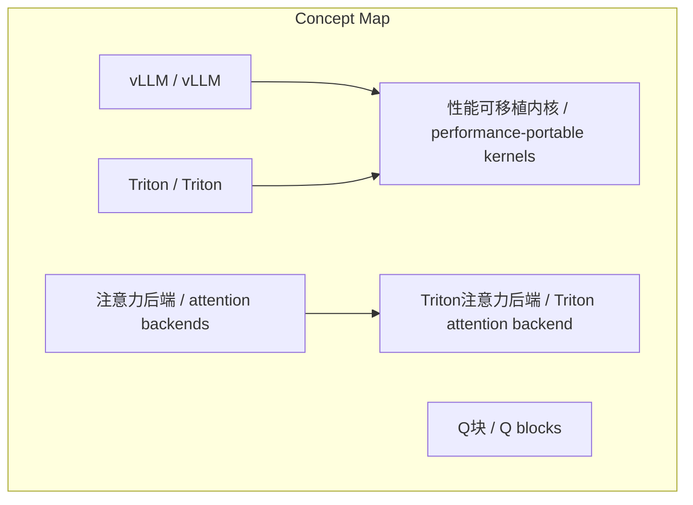
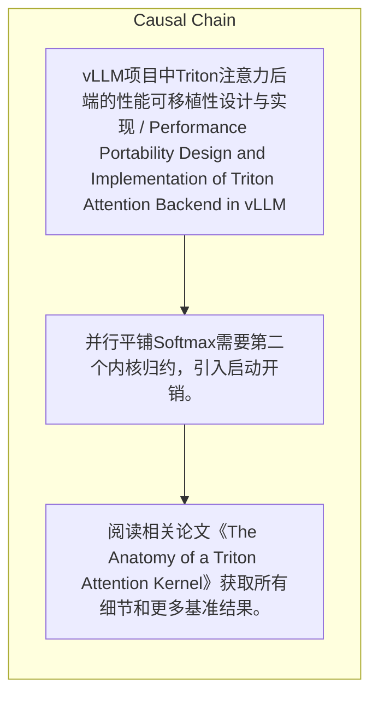

# NEWS/NEWS 任务报告

- agent: news/news
- requestId: 1774586456456-p89puk
- 生成时间(UTC): 2026-03-27T04:47:00.168Z

### Runtime Trace
- 链接总结: https://blog.vllm.ai/2026/03/04/vllm-triton-backend-deep-dive.html | model=stepfun/step-3.5-flash:free
- 链接总结: https://blog.vllm.ai/2026/03/04/vllm-triton-backend-deep-dive.html | schema_fallback=yes
- 链接总结: https://blog.vllm.ai/2026/03/04/vllm-triton-backend-deep-dive.html | attempted_models=stepfun/step-3.5-flash:free

## 链接总结

- URL: https://blog.vllm.ai/2026/03/04/vllm-triton-backend-deep-dive.html

### 运行信息
- model: stepfun/step-3.5-flash:free
- schema_fallback: yes
- attempted_models: stepfun/step-3.5-flash:free

# vLLM Triton注意力后端：跨平台性能可移植性解决方案

## 整体结构化文档表达
### 文档卡片
- 主题（中文/English）：vLLM项目中Triton注意力后端的性能可移植性设计与实现 / Performance Portability Design and Implementation of Triton Attention Backend in vLLM
- 一句话摘要：vLLM采用完全用Triton实现的注意力后端，通过性能可移植内核在NVIDIA、AMD、Intel GPU上运行相同源代码，降低维护成本并实现顶尖性能。
- 目标读者：未提及
- 核心结论（3条）：
- 性能可移植性对于应对硬件多样性至关重要。
- Triton注意力后端作为vLLM原生组件，通过单一可移植内核在多种GPU平台上实现顶尖性能。
- 该后端已成为AMD默认后端，并在NVIDIA和Intel平台上使用相同源代码高效运行。
- 优化技术包括Q块设计、并行平铺Softmax和持久化内核，但存在启动开销和执行波次等权衡。

### 内容结构树
1. 背景与问题定义
2. 核心观点与关键证据
3. 方法/机制/路径
4. 风险与边界条件
5. 结论与行动建议

### 结构化元数据（JSON）
```json
{
  "title": "vLLM Triton注意力后端：跨平台性能可移植性解决方案",
  "topic_zh": "vLLM项目中Triton注意力后端的性能可移植性设计与实现",
  "topic_en": "Performance Portability Design and Implementation of Triton Attention Backend in vLLM",
  "audience": "未提及",
  "claims": [
    "维护大量专用内核的方法不可扩展，应采用性能可移植内核。",
    "Triton注意力后端是完全用Triton实现的vLLM原生组件。",
    "该后端旨在解决性能可移植性和依赖问题。",
    "它在NVIDIA、AMD、Intel GPU上运行相同源代码。",
    "它仅依赖PyTorch和Triton。",
    "它总是作为vLLM的一部分可用。",
    "最初由IBM Research和Red Hat AI开发，现由更广泛的社区维护。",
    "优化重点在查询侧，因为KV侧受页大小限制。"
  ],
  "evidence": [
    "implemented entirely in Triton and is native to vLLM",
    "to address performance portability and dependency concerns",
    "runs the same source code on NVIDIA, AMD, and Intel GPUs",
    "depends only on PyTorch and Triton",
    "always available as part of vLLM",
    "initially developed by IBM Research and Red Hat AI, it is now maintained and extended by the broader community",
    "在H100上，Triton注意力后端达到FlashAttention 3的100.7%性能；在MI300上，提速约5.8倍。",
    "Triton分页注意力实现约800行代码，而FlashAttention3约70,000行代码。"
  ],
  "risks": [
    "并行平铺Softmax需要第二个内核归约，引入启动开销。",
    "固定启动网格在CUDA图中可能导致执行波次和浪费工作。"
  ],
  "actions": [
    "阅读相关论文《The Anatomy of a Triton Attention Kernel》获取所有细节和更多基准结果。"
  ]
}
```

## 处理流程
1. 输入识别
2. 信息抽取（实体、概念、问题、事实、观点）
3. 结构化归纳（定义/分类/比较/因果/方法论）
4. 关系建模（概念关系、等式/方程/逻辑链）
5. 可视化表达（Mermaid）

## 概念清单（中英文）
- Triton / Triton
- vLLM / vLLM
- 性能可移植内核 / performance-portable kernels
- 注意力后端 / attention backends
- Triton注意力后端 / Triton attention backend
- Q块 / Q blocks
- 并行平铺Softmax / parallel tiled softmax
- CUDA图 / CUDA graphs
- 持久化内核 / persistent kernels
- 分页注意力 / paged attention
- tl.dot / tl.dot
- 启动网格 / launch grid

## 概念定义（中英文）
### Triton / Triton
- 中文定义：一种领域特定语言，允许开发者用Python编写GPU内核（如矩阵乘法或注意力），并编译为多平台的高效GPU代码。
- English Definition: a domain-specific language that allows developers to write GPU kernels, such as matrix multiplication or attention, in Python. These kernels are compiled into efficient GPU code for multiple platforms.

### vLLM / vLLM
- 中文定义：一个旨在跨平台、模型和执行策略提供最佳推理性能的项目。
- English Definition: aims to deliver the best possible inference performance across platforms, models, and execution strategies.

### 性能可移植内核 / performance-portable kernels
- 中文定义：能自动适应其运行硬件的内核。
- English Definition: kernels that adapt automatically to the hardware they run on.

### 注意力后端 / attention backends
- 中文定义：vLLM引入的抽象层，通过通用API隔离注意力实现，并将其与线性层等简单组件分离。
- English Definition: An abstraction layer introduced by vLLM that isolates attention implementations behind a common API and separates them from simpler components such as linear layers or layer normalization.

### Triton注意力后端 / Triton attention backend
- 中文定义：完全用Triton语言实现的注意力后端，原生集成于vLLM，旨在解决性能可移植性和依赖问题。
- English Definition: An attention backend implemented entirely in Triton, native to vLLM, designed to address performance portability and dependency concerns.

### Q块 / Q blocks
- 中文定义：将多个查询头和查询token组合到单个工作项中以提高tl.dot利用率和缓存重用
- English Definition: combine multiple query heads and query tokens into a single work item to improve tl.dot utilization and cache reuse

### 并行平铺Softmax / parallel tiled softmax
- 中文定义：通过分割KV缓存遍历跨多个内核实例来并行化Softmax计算，但需要第二个内核归约
- English Definition: parallelize Softmax computation by splitting the traversal of the KV cache across multiple kernel instances, requiring a second kernel for reduction

### CUDA图 / CUDA graphs
- 中文定义：通过记录和重放固定执行图来减少内核启动开销的技术
- English Definition: a technique to reduce kernel launch overhead by recording and replaying fixed execution graphs

### 持久化内核 / persistent kernels
- 中文定义：固定数量的内核实例，每个动态分配工作，以保持启动网格恒定
- English Definition: a fixed number of kernel instances that dynamically determine work assignment to keep launch grids constant

### 分页注意力 / paged attention
- 中文定义：处理分页KV缓存的注意力机制
- English Definition: attention mechanism that handles paged KV cache

### tl.dot / tl.dot
- 中文定义：Triton中的点积操作，注意力的核心计算
- English Definition: dot product operation in Triton, core computation of attention

### 启动网格 / launch grid
- 中文定义：内核启动的线程块配置，通常由batch size和sequence length决定
- English Definition: thread block configuration for kernel launch, often dependent on batch size and sequence length


## 概念关联与逻辑关系（中英文）
- vLLM/vLLM -> 性能可移植内核/performance-portable kernels | concept | 偏好采用
- Triton/Triton -> 性能可移植内核/performance-portable kernels | concept | 使能实现
- 注意力后端/attention backends -> Triton注意力后端/Triton attention backend | concept | is a type of
- Q块/Q blocks -> tl.dot利用率/tl.dot utilization | concept | 提高
- 并行平铺Softmax/parallel tiled softmax -> 启动开销/launch overhead | concept | 引入权衡
- 持久化内核/persistent kernels -> CUDA图/CUDA graphs | concept | 实现高效重用
- Triton注意力后端/Triton attention backend -> 持久内核/persistent kernels | concept | uses
- Triton注意力后端/Triton attention backend -> CUDA图/CUDA graphs | concept | uses
- 分页注意力内核/paged attention kernel -> Helion/Helion | concept | implemented in

### 可形式化关系
- 持久化内核通过固定启动网格解决了变量启动网格与CUDA图的不兼容问题。

## COT逻辑梳理（定义/分类/比较/因果/科学方法论）
- 未发现明确逻辑步骤

## 事实与看法（区分）
### 事实
- IBM Research、Red Hat和AMD的团队已开发并上游贡献了vLLM的基于Triton的注意力后端。
- vLLM旨在跨平台、模型和执行策略提供最佳推理性能。
- Triton是一种领域特定语言，允许开发者用Python编写GPU内核。
- 这些内核被编译为多平台的高效GPU代码。
- 注意力通常是大型语言模型中最关键的性能操作。
- vLLM引入了名为注意力后端的抽象层。
- Triton注意力后端完全用Triton实现，是vLLM原生的。
- 它在NVIDIA、AMD、Intel GPU上运行相同源代码。
- 它仅依赖PyTorch和Triton。
- 它总是作为vLLM的一部分可用。

### 看法
- 维护数百个内核跨多个GPU平台很快变得不切实际。

## FAQ（原文问题整理）
- 未发现明确 FAQ

## Visualization
### Mermaid 图 1（概念结构图）


### Mermaid 图 2（逻辑/因果图）


## 文章中的类比
- 未发现明确类比

## 10个金句
- 原文未提供

