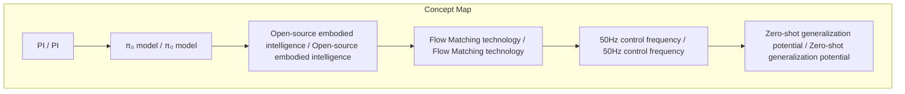
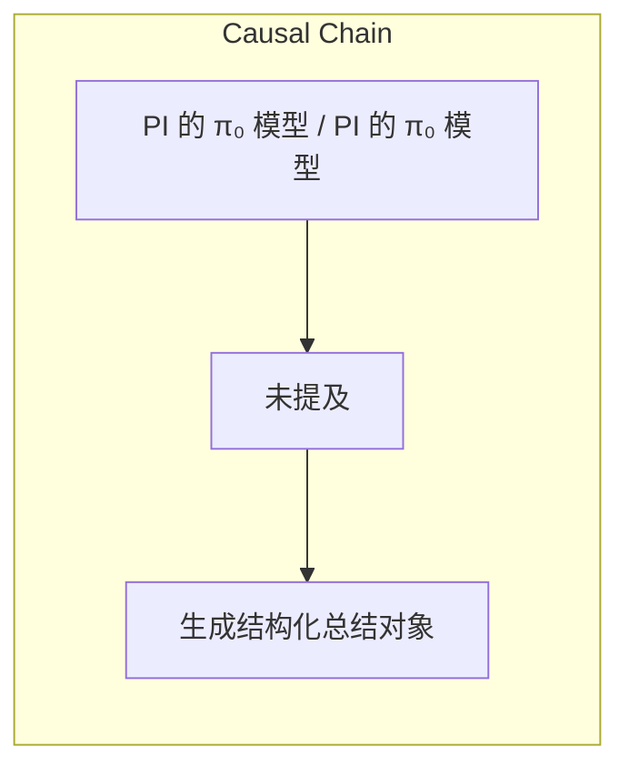

# NEWS/NEWS 任务报告

- agent: news/news
- requestId: 1774600576814-s7ph8a
- 生成时间(UTC): 2026-03-27T08:37:53.929Z

### Runtime Trace
- 文本总结 | model=openrouter/free
- 文本总结 | schema_fallback=no
- 文本总结 | attempted_models=openrouter/free

## 文本总结

### 运行信息
- model: openrouter/free
- schema_fallback: no
- attempted_models: openrouter/free

# PI 的 π₀ 模型：开源引流闭源变现策略

## 整体结构化文档表达
### 文档卡片
- 主题（中文/English）：PI 的 π₀ 模型 / PI 的 π₀ 模型
- 一句话摘要：PI 的 π₀ 模型在开源具身智能领域展现出极致精度和泛化能力的“技术极致派”技术优势、零样本泛化潜力及开源引流闭源变现的商业策略。
- 目标读者：用户
- 核心结论（3条）：
- PI 的 π₀ 模型在连续控制和迭代速度上展现出极强的统治力

### 内容结构树
1. 背景与问题定义
2. 核心观点与关键证据
3. 方法/机制/路径
4. 风险与边界条件
5. 结论与行动建议

### 结构化元数据（JSON）
```json
{
  "title": "PI 的 π₀ 模型：开源引流闭源变现策略",
  "topic_zh": "PI 的 π₀ 模型",
  "topic_en": "PI 的 π₀ 模型",
  "audience": "用户",
  "claims": [
    "基于输入文本生成结构化总结对象"
  ],
  "evidence": [
    "文本中提到 PI 的 π₀ 模型在连续控制和迭代速度上展现出极强的统治力"
  ],
  "risks": [
    "未提及"
  ],
  "actions": [
    "生成结构化总结对象"
  ]
}
```

## 处理流程
1. 输入识别
2. 信息抽取（实体、概念、问题、事实、观点）
3. 结构化归纳（定义/分类/比较/因果/方法论）
4. 关系建模（概念关系、等式/方程/逻辑链）
5. 可视化表达（Mermaid）

## 概念清单（中英文）
- PI / PI
- π₀ model / π₀ model
- Open-source embodied intelligence / Open-source embodied intelligence
- Flow Matching technology / Flow Matching technology
- 50Hz control frequency / 50Hz control frequency
- Zero-shot generalization potential / Zero-shot generalization potential
- Open-source lead-in, closed-source monetization / Open-source lead-in, closed-source monetization

## 概念定义（中英文）
### PI / PI
- 中文定义：Physical Intelligence（PI）
- English Definition: Physical Intelligence (PI)

### π₀ model / π₀ model
- 中文定义：π₀ 模型
- English Definition: π₀ 模型

### Open-source embodied intelligence / Open-source embodied intelligence
- 中文定义：开源具身智能
- English Definition: 开源具身智能

### Flow Matching technology / Flow Matching technology
- 中文定义：流匹配技术
- English Definition: Flow Matching 技术

### 50Hz control frequency / 50Hz control frequency
- 中文定义：50Hz 控制频率
- English Definition: 50Hz 控制频率

### Zero-shot generalization potential / Zero-shot generalization potential
- 中文定义：零样本泛化潜力
- English Definition: 零样本泛化潜力

### Open-source lead-in, closed-source monetization / Open-source lead-in, closed-source monetization
- 中文定义：开源引流闭源变现
- English Definition: 开源引流闭源变现


## 概念关联与逻辑关系（中英文）
- PI/PI -> π₀ 模型/π₀ 模型 | concept | 公司
- 流匹配技术/Flow Matching 技术 -> π₀ 模型/π₀ 模型 | concept | 技术
- 50Hz 控制频率/50Hz 控制频率 -> π₀ 模型/π₀ 模型 | concept | 技术
- 开源引流闭源变现/开源引流闭源变现 -> PI/PI | concept | 商业策略

### 可形式化关系
- Flow Matching 技术 与 动作生成 相关
- 50Hz 控制频率 与 连续控制 相关
- 开源引流闭源变现 与 商业变现 相关

## COT逻辑梳理（定义/分类/比较/因果/科学方法论）
- Step 1: 技术优势
- Step 2: 泛化能力
- Step 3: 商业策略

## 事实与看法（区分）
### 事实
- PI 是一家成立于 2024 年的明星初创公司

### 看法
- 未提及

## FAQ（原文问题整理）
### 未提及
- 未提及

## Visualization
### Mermaid 图 1（概念结构图）


### Mermaid 图 2（逻辑/因果图）


## 文章中的类比
- 基于输入文本生成结构化总结

## 10个金句
- PI 是一家成立于 2024 年的明星初创公司

