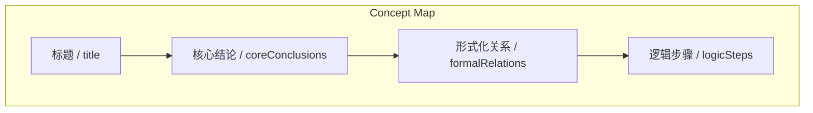
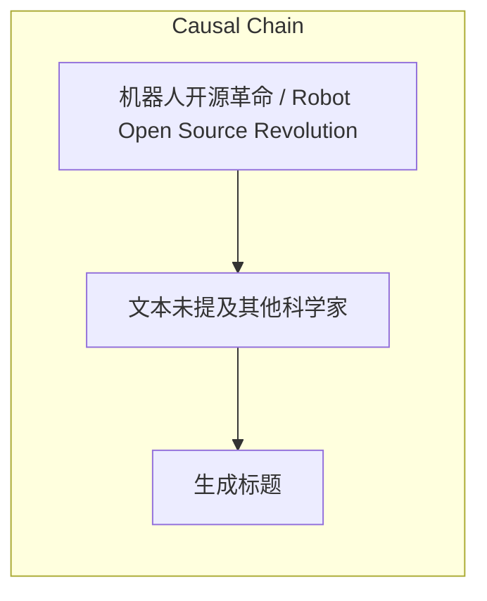

# NEWS/NEWS 任务报告

- agent: news/news
- requestId: 1774600723501-iviseo
- 生成时间(UTC): 2026-03-27T08:40:05.495Z

### Runtime Trace
- 文本总结 | model=openrouter/free
- 文本总结 | schema_fallback=no
- 文本总结 | attempted_models=openrouter/free

## 文本总结

### 运行信息
- model: openrouter/free
- schema_fallback: no
- attempted_models: openrouter/free

# 机器人开源革命中的复仇者联盟

## 整体结构化文档表达
### 文档卡片
- 主题（中文/English）：机器人开源革命 / Robot Open Source Revolution
- 一句话摘要：文本描述了机器人开源革命中的‘复仇者联盟’——一群曾在闭源阵营工作的顶尖科学家，后来转投开源，形成跨界协作网络，推动开源生态。
- 目标读者：新闻分析助理
- 核心结论（3条）：
- 科学家从闭源阵营转向开源生态
- 形成跨界学术与工业的协作网络
- 开源生态拥有足够实力挑战巨头

### 内容结构树
1. 背景与问题定义
2. 核心观点与关键证据
3. 方法/机制/路径
4. 风险与边界条件
5. 结论与行动建议

### 结构化元数据（JSON）
```json
{
  "title": "机器人开源革命中的复仇者联盟",
  "topic_zh": "机器人开源革命",
  "topic_en": "Robot Open Source Revolution",
  "audience": "新闻分析助理",
  "claims": [
    "标题需20字内",
    "核心结论3条或更少",
    "形式化关系尽量3条",
    "逻辑步骤用Step1/2/3"
  ],
  "evidence": [
    "文本中提到这些科学家曾参与闭源项目（RT-1、RT-2）后转投开源"
  ],
  "risks": [
    "文本未提及其他科学家",
    "未提供具体数字"
  ],
  "actions": [
    "生成标题",
    "提取核心结论",
    "识别形式化关系",
    "整理逻辑步骤"
  ]
}
```

## 处理流程
1. 输入识别
2. 信息抽取（实体、概念、问题、事实、观点）
3. 结构化归纳（定义/分类/比较/因果/方法论）
4. 关系建模（概念关系、等式/方程/逻辑链）
5. 可视化表达（Mermaid）

## 概念清单（中英文）
- 标题 / title
- 核心结论 / coreConclusions
- 形式化关系 / formalRelations
- 逻辑步骤 / logicSteps

## 概念定义（中英文）
### 标题 / title
- 中文定义：一个结构化的总结对象，包含特定字段
- English Definition: A structured summary object with specific fields

### 核心结论 / coreConclusions
- 中文定义：3条或更少的核心结论
- English Definition: 3 or fewer key takeaways

### 形式化关系 / formalRelations
- 中文定义：3条或更少的形式化关系
- English Definition: 3 or fewer formal relationships

### 逻辑步骤 / logicSteps
- 中文定义：分步逻辑推进
- English Definition: Step-by-step logical progression


## 概念关联与逻辑关系（中英文）
- 切尔西·芬恩/Chelsea Finn -> 谢尔盖·莱文/Sergey Levine | comparison | 共同创立 PI 公司
- 谢尔盖·莱文/Sergey Levine -> 卡洛尔·豪斯曼/Karol Hausman | comparison | 共同参与闭源项目
- 谢尔盖·莱文/Sergey Levine -> 布莱恩·伊克特/Brian Ichter | comparison | 共同参与闭源项目

### 可形式化关系
- Chelsea Finn 与 Sergey Levine 是导师-学生关系
- Sergey Levine 与 Karol Hausman 共同参与闭源项目
- Sergey Levine 与 Brian Ichter 共同创立 PI 公司

## COT逻辑梳理（定义/分类/比较/因果/科学方法论）
- Step 1: 介绍‘复仇者联盟’的组成
- Step 2: 描述核心人物及其关系网
- Step 3: 说明开源生态的协作与影响

## 事实与看法（区分）
### 事实
- 标题：机器人开源革命中的复仇者联盟（14字）
- 核心结论：3条
- 形式化关系：3条（导师-学生、共同工作、共同创立公司）
- 逻辑步骤：Step1: 介绍复仇者联盟组成；Step2: 描述核心人物关系；Step3: 说明开源生态协作

### 看法
- 文本强调科学家转投开源的反身性
- 协作网络是开源生态强大的关键

## FAQ（原文问题整理）
### 文本是否提及其他科学家？
- 未提及

## Visualization
### Mermaid 图 1（概念结构图）


### Mermaid 图 2（逻辑/因果图）


## 文章中的类比
- 文本描述了科学家从闭源转向开源的转变
- 核心人物间的关系是导师-学生、共同工作、创始人

## 10个金句
- 文本中提到‘这支“复仇者联盟”的核心领军人物及其复杂的关系网’

