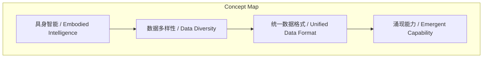
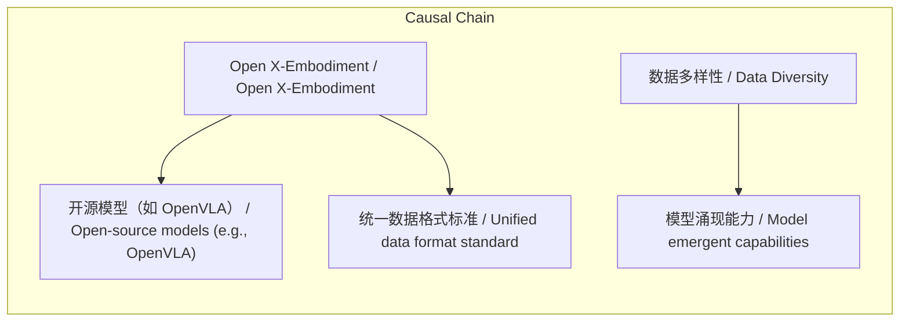

# NEWS/NEWS 任务报告

- agent: news/news
- requestId: 1774601396341-q4day4
- 生成时间(UTC): 2026-03-27T08:53:40.289Z

### Runtime Trace
- 文本总结 | model=openrouter/free
- 文本总结 | schema_fallback=no
- 文本总结 | attempted_models=openrouter/free

## 文本总结

### 运行信息
- model: openrouter/free
- schema_fallback: no
- attempted_models: openrouter/free

# Open X-Embodiment 的核心价值 | Core Value of Open X-Embodiment

## 整体结构化文档表达
### 文档卡片
- 主题（中文/English）：Open X-Embodiment 的核心价值 / Core Value of Open X-Embodiment
- 一句话摘要：Open X-Embodiment 通过汇聚多实验室大规模多样机器人数据、制定统一数据格式标准并推动模型涌现能力，成为开源具身智能的关键资源，但面临标注一致性挑战。
- 目标读者：未提及
- 核心结论（3条）：
- 汇聚多实验室大规模多样机器人数据，为开源模型提供对抗闭源的核心资源 | Aggregates multi‑lab large‑scale diverse robot data, providing core resource for open‑source models to counter closed‑source giants
- 制定统一的具身数据格式标准，解决跨实验室数据互不兼容问题 | Establishes a unified embodiment data format standard, solving cross‑lab incompatibility
- 数据多样性驱动模型涌现能力（如空间推理、未见技能组合），但面临标注一致性挑战 | Data diversity drives model emergent capabilities (e.g., spatial reasoning, unseen skill combos), yet faces annotation consistency challenges

### 内容结构树
1. 背景与问题定义
2. 核心观点与关键证据
3. 方法/机制/路径
4. 风险与边界条件
5. 结论与行动建议

### 结构化元数据（JSON）
```json
{
  "title": "Open X-Embodiment 的核心价值 | Core Value of Open X-Embodiment",
  "topic_zh": "Open X-Embodiment 的核心价值",
  "topic_en": "Core Value of Open X-Embodiment",
  "audience": "未提及",
  "claims": [
    "Open X-Embodiment 由斯坦福、伯克利、MIT、CMU、Google DeepMind 等超过20个全球顶级研究机构共同贡献。",
    "数据集包含22种不同机器人本体、超过100万条真实物理世界运行轨迹、覆盖多达527种不同技能。",
    "数据的多样性比单纯数据量更重要，能让模型产生质的飞跃并涌现空间推理等能力。",
    "Open X-Embodiment 定义了统一的数据格式，涵盖视觉观察、本体感知、动作序列和语言注释。",
    "由于数据来源于众多不同实验室，数据标注标准参差不齐，导致一致性不如特斯拉等单一来源数据。"
  ],
  "evidence": [
    "由斯坦福、伯克利、MIT、CMU、Google DeepMind 等超过20个全球顶级研究机构共同贡献。",
    "包含22种机器人本体、超过100万条轨迹、527种技能。",
    "模型能够理解'on'与'near'的细微物理与语义差异，执行训练时未见过的技能组合。",
    "统一数据格式全面涵盖视觉观察、本体感知、动作序列和语言注释。",
    "数据标注的标准参差不齐，有的实验室极其细致，有的则相对粗糙。"
  ],
  "risks": [
    "数据标注不一致可能影响模型训练的稳定性和泛化能力。",
    "缺乏统一标注可能导致跨实验室混合训练时需要额外的数据清洗工作。"
  ],
  "actions": [
    "进一步统一标注规范以提升数据一致性。",
    "鼓励更多实验室采用Open X-Embodiment 的统一格式进行数据贡献。",
    "在模型训练中显式利用数据多样性以促进涌现能力。"
  ]
}
```

## 处理流程
1. 输入识别
2. 信息抽取（实体、概念、问题、事实、观点）
3. 结构化归纳（定义/分类/比较/因果/方法论）
4. 关系建模（概念关系、等式/方程/逻辑链）
5. 可视化表达（Mermaid）

## 概念清单（中英文）
- 具身智能 / Embodied Intelligence
- 数据多样性 / Data Diversity
- 统一数据格式 / Unified Data Format
- 涌现能力 / Emergent Capability

## 概念定义（中英文）
### 具身智能 / Embodied Intelligence
- 中文定义：机器人通过身体与环境交互来获取智能行为的研究领域。
- English Definition: The study of intelligent behavior arising from the interaction of an agent's body with its environment.

### 数据多样性 / Data Diversity
- 中文定义：数据在机器人形态、任务场景、环境等方面的变化程度。
- English Definition: Variation in data across robot embodiments, task scenarios, and environments.

### 统一数据格式 / Unified Data Format
- 中文定义：跨实验室共享的、标准化的数据表示方式，包含视觉、本体感知、动作序列和语言注释。
- English Definition: A standardized data representation shared across labs, covering vision, proprioception, action sequences, and language annotations.

### 涌现能力 / Emergent Capability
- 中文定义：模型在训练中未显式学习却能自发表现出的高级行为或推理。
- English Definition: Abilities that models exhibit spontaneously without being explicitly trained for them.


## 概念关联与逻辑关系（中英文）
- Open X-Embodiment/Open X-Embodiment -> 开源模型（如 OpenVLA）/Open‑source models (e.g., OpenVLA) | support | 提供核心数据资源
- Open X-Embodiment/Open X-Embodiment -> 统一数据格式标准/Unified data format standard | support | 制定并推广
- 数据多样性/Data Diversity -> 模型涌现能力/Model emergent capabilities | causal | 驱动质的飞跃和空间推理等能力的出现

### 可形式化关系
- OpenXEmbodiment 提供 多样机器人数据集 | OpenXEmbodiment → provides → DiverseRobotDataset
- OpenXEmbodiment 定义 统一数据格式标准 | OpenXEmbodiment → defines → UnifiedDataFormatStandard
- 多样机器人数据集 启用 模型涌现能力（空间推理、未见技能组合） | DiverseRobotDataset → enables → ModelEmergentCapabilities (SpatialReasoning, UnseenSkillCombination)

## COT逻辑梳理（定义/分类/比较/因果/科学方法论）
- Step 1: 多个顶尖实验室贡献数据，形成包含22种机器人本体、超过100万条轨迹、527种技能的大规模多样化数据集。| Step 1: Multiple top labs contribute data, forming a large‑scale diverse dataset with 22 robot embodiments, >1M trajectories, and 527 skills.
- Step 2: 高度多样性使模型产生质的飞跃，能够理解如'on'与'near'的细微差别并执行未见过的技能组合。| Step 2: High diversity enables models to achieve qualitative leaps, grasping subtle differences like 'on' vs 'near' and performing unseen skill combinations.
- Step 3: Open X-Embodiment 统一了数据格式（视觉、本体感知、动作序列、语言注释），降低跨实验室混合训练成本；但由于标注标准参差不齐，数据一致性仍不如单一来源闭源数据。| Step 3: Open X-Embodiment unifies the data format (vision, proprioception, action, language), cutting cross‑lab training costs; however, annotation inconsistency means consistency still lags behind single‑source closed‑source data.

## 事实与看法（区分）
### 事实
- Open X-Embodiment 由斯坦福、伯克利、MIT、CMU、Google DeepMind 等超过20个全球顶级研究机构共同贡献。
- 数据集包含22种不同机器人本体、超过100万条真实物理世界运行轨迹、覆盖多达527种不同技能。
- 数据的多样性比单纯数据量更重要，能让模型产生质的飞跃并涌现空间推理等能力。
- Open X-Embodiment 定义了统一的数据格式，涵盖视觉观察、本体感知、动作序列和语言注释。
- 由于数据来源于众多不同实验室，数据标注标准参差不齐，导致一致性不如特斯拉等单一来源数据。

### 看法
- Open X-Embodiment 是目前具身智能开源阵营最宝贵的优势。
- 其作为“数据基石”的核心价值体现在多方面。
- 极致的场景多样性是其核心护城河。
- 数据多样性驱动模型涌现能力。
- 统一行业数据格式的标准制定者具有历史性贡献。
- 存在的局限性：一致性挑战。

## FAQ（原文问题整理）
### Open X-Embodiment 的主要贡献是什么？
- 提供大规模多机器人形态、多场景的开源数据，制定统一数据格式标准，并推动模型涌现能力。

### Open X-Embodiment 面临什么挑战？
- 数据标注不一致导致数据一致性不如单一来源闭源数据。

### 数据多样性如何影响模型能力？
- 高度多样性使模型获得质的飞跃，能够理解如'on'与'near'的细微差别并执行未见过的技能组合。

## Visualization
### Mermaid 图 1（概念结构图）


### Mermaid 图 2（逻辑/因果图）


## 文章中的类比
- Open X-Embodiment 就像具身智能领域的“共享图书馆”，汇集各地研究者的书籍（数据），并制定统一的目录格式（数据标准），使得不同学者能够快速检索和组合知识。

## 10个金句
- “数据的多样性比单纯的数据量更重要。”

