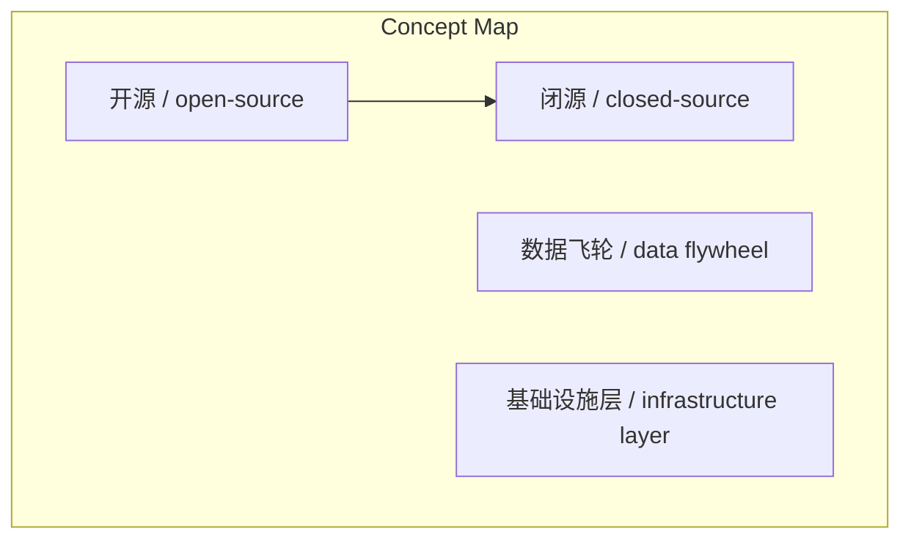
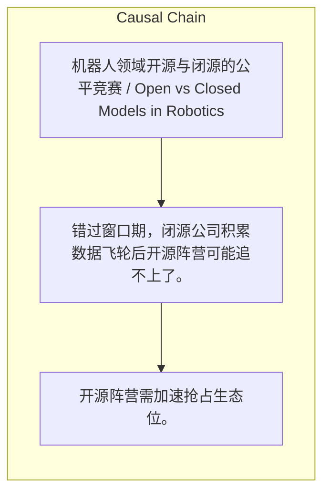

# NEWS/NEWS 任务报告

- agent: news/news
- requestId: 1774601625851-czd1zr
- 生成时间(UTC): 2026-03-27T09:00:15.561Z

### Runtime Trace
- 文本总结 | model=openrouter/free
- 文本总结 | schema_fallback=yes
- 文本总结 | attempted_models=openrouter/free

## 文本总结

### 运行信息
- model: openrouter/free
- schema_fallback: yes
- attempted_models: openrouter/free

# 机器人领域开源与闭源的公平竞赛

## 整体结构化文档表达
### 文档卡片
- 主题（中文/English）：机器人领域开源与闭源的公平竞赛 / Open vs Closed Models in Robotics
- 一句话摘要：机器人领域当前处于开放与封闭模型竞争的“公平竞赛”窗口期，开源阵营有机会挑战科技巨头，但窗口期极短，需加速行动。
- 目标读者：未提及
- 核心结论（3条）：
- 机器人领域当前处于开放与封闭模型竞争的“公平竞赛”窗口期，开源阵营有机会挑战科技巨头。
- 数据积累的“数据飞轮”威胁使窗口期极短，开源阵营需加速抢占生态位。
- 竞争边界模糊，开源与闭源相互交叉，最终目标是争夺机器人行业“基础设施层”的定义权。

### 内容结构树
1. 背景与问题定义
2. 核心观点与关键证据
3. 方法/机制/路径
4. 风险与边界条件
5. 结论与行动建议

### 结构化元数据（JSON）
```json
{
  "title": "机器人领域开源与闭源的公平竞赛",
  "topic_zh": "机器人领域开源与闭源的公平竞赛",
  "topic_en": "Open vs Closed Models in Robotics",
  "audience": "未提及",
  "claims": [
    "开源模型在机器人领域当前处于“公平竞赛”窗口期。",
    "数据积累的“数据飞轮”威胁使窗口期极短。",
    "竞争边界模糊，开源与闭源相互交叉。"
  ],
  "evidence": [
    "2024年6月开源模型OpenVLA击败谷歌闭源模型RT-2-X。",
    "谷歌闭源模型RT-2-X部分训练数据来自开源Open X-Embodiment数据集。",
    "顶尖科学家如Chelsea Finn同时参与开源和闭源项目。"
  ],
  "risks": [
    "错过窗口期，闭源公司积累数据飞轮后开源阵营可能追不上了。",
    "竞争边界模糊可能导致开源阵营资源分散。"
  ],
  "actions": [
    "开源阵营需加速抢占生态位。",
    "开源阵营需加强数据和工具组合。"
  ]
}
```

## 处理流程
1. 输入识别
2. 信息抽取（实体、概念、问题、事实、观点）
3. 结构化归纳（定义/分类/比较/因果/方法论）
4. 关系建模（概念关系、等式/方程/逻辑链）
5. 可视化表达（Mermaid）

## 概念清单（中英文）
- 开源 / open-source
- 闭源 / closed-source
- 数据飞轮 / data flywheel
- 基础设施层 / infrastructure layer

## 概念定义（中英文）
### 开源 / open-source
- 中文定义：开放源代码软件和技术的开发模式。
- English Definition: A development model for software and technology.

### 闭源 / closed-source
- 中文定义：专有软件和技术的开发模式。
- English Definition: A proprietary development model for software and technology.

### 数据飞轮 / data flywheel
- 中文定义：通过数据积累和应用增强自身优势的循环。
- English Definition: A self-reinforcing cycle where data accumulation enhances capabilities.

### 基础设施层 / infrastructure layer
- 中文定义：机器人行业的基础性技术标准和工具。
- English Definition: The foundational technical standards and tools in the robotics industry.


## 概念关联与逻辑关系（中英文）
- 开源/open-source -> 闭源/closed-source | concept | 竞争
- 数据飞轮/data flywheel -> 窗口期/window period | concept | 威胁
- 竞争边界模糊/blurred boundaries -> 开源与闭源/open-source and closed-source | concept | 关联

### 可形式化关系
- 开源模型与闭源模型之间存在竞争关系。
- 数据积累的“数据飞轮”威胁与窗口期存在因果关系。
- 竞争边界模糊与开源与闭源相互交叉存在关联。

## COT逻辑梳理（定义/分类/比较/因果/科学方法论）
- Step 1: 机器人领域当前处于开放与封闭模型竞争的“公平竞赛”窗口期。
- Step 2: 数据积累的“数据飞轮”威胁使窗口期极短，开源阵营需加速抢占生态位。
- Step 3: 竞争边界模糊，开源与闭源相互交叉，最终目标是争夺机器人行业“基础设施层”的定义权。

## 事实与看法（区分）
### 事实
- 2024年6月开源模型OpenVLA击败谷歌闭源模型RT-2-X。
- 谷歌闭源模型RT-2-X部分训练数据来自开源Open X-Embodiment数据集。
- 顶尖科学家如Chelsea Finn同时参与开源和闭源项目。

### 看法
- 未发现明确主观看法

## FAQ（原文问题整理）
### 为什么窗口期短暂？
- 数据积累的“数据飞轮”威胁使窗口期极短。

### 最终目标是什么？
- 争夺机器人行业“基础设施层”的定义权。

## Visualization
### Mermaid 图 1（概念结构图）


### Mermaid 图 2（逻辑/因果图）


## 文章中的类比
- 未发现明确类比

## 10个金句
- 原文未提供

