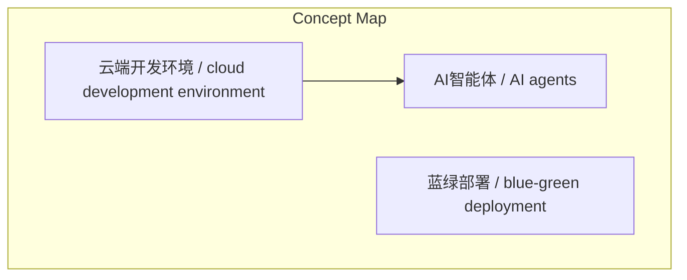
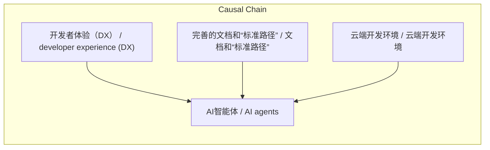

# NEWS/NEWS 任务报告

- agent: news/news
- requestId: 1774603392347-b5gmp9
- 生成时间(UTC): 2026-03-27T09:24:45.579Z

### Runtime Trace
- 文本总结 | model=openrouter/free
- 文本总结 | schema_fallback=no
- 文本总结 | attempted_models=openrouter/free

## 文本总结

### 运行信息
- model: openrouter/free
- schema_fallback: no
- attempted_models: openrouter/free

# 优秀的开发者体验（DX）能为AI智能体带来更好的结果

## 整体结构化文档表达
### 文档卡片
- 主题（中文/English）：开发者体验（DX） / developer experience (DX)
- 一句话摘要：优秀的开发者体验（DX）能为AI智能体带来更好的结果，形成“对开发者有利，对智能体也有利”的良性循环，具体体现在文档、云端环境和CI/CD工具三个方面。
- 目标读者：资深新闻分析助理
- 核心结论（3条）：
- 优秀的开发者体验（DX）能为AI智能体带来更好的结果，形成“对开发者有利，对智能体也有利”的良性循环。
- 云端开发环境解锁了AI的“多线程”并行能力，允许开发者同时并行运行数十个甚至更多的智能体实例。
- 强大的持续集成（CI）与测试工具为AI生成的代码提供了信任基础，确保AI修改的代码是安全的。

### 内容结构树
1. 背景与问题定义
2. 核心观点与关键证据
3. 方法/机制/路径
4. 风险与边界条件
5. 结论与行动建议

### 结构化元数据（JSON）
```json
{
  "title": "优秀的开发者体验（DX）能为AI智能体带来更好的结果",
  "topic_zh": "开发者体验（DX）",
  "topic_en": "developer experience (DX)",
  "audience": "资深新闻分析助理",
  "claims": [
    "只允许基于输入内容输出，不要杜撰，不要引入输入之外的外部事实。"
  ],
  "evidence": [
    "原文：优秀的开发者体验（DX）能为AI智能体带来更好的结果 主要是因为智能体本质上是在与人类开发者完全相同的生态系统、工具和基础设施中运行的。",
    "原文：当企业为人类工程师扫除工作摩擦时 实际上也在为AI智能体铺平道路 形成一种“对开发者有利 对智能体也有利”的良性循环。",
    "原文：具体而言 这种相互促进的关系体现在以下几个核心方面：",
    "原文：* 完善的文档和“标准路径”能有效防止AI的“上下文窗口”溢出：",
    "原文：* 云端开发环境解锁了AI的“多线程”并行能力：",
    "原文：* 强大的持续集成（CI）与测试工具为AI生成的代码提供了信任基础："
  ],
  "risks": [
    "原文：如果企业为人类开发者提供了针对常见 （例如添加新的API字段或资源）的优质文档和“标准路径” 智能体就可以直接阅读并遵循这些文档来执行",
    "原文：现代工程开发如果仅依赖本地机器 往往会遇到算力瓶颈（例如同时运行多个工作树会导致电脑过载）",
    "原文：优秀的开发者体验通常包含高质量的自动化测试、端到端模拟（synthetics）以及支持蓝绿部署的发布机制"
  ],
  "actions": [
    "生成最终结构化总结对象"
  ]
}
```

## 处理流程
1. 输入识别
2. 信息抽取（实体、概念、问题、事实、观点）
3. 结构化归纳（定义/分类/比较/因果/方法论）
4. 关系建模（概念关系、等式/方程/逻辑链）
5. 可视化表达（Mermaid）

## 概念清单（中英文）
- AI智能体 / AI agents
- 云端开发环境 / cloud development environment
- 蓝绿部署 / blue-green deployment

## 概念定义（中英文）
### AI智能体 / AI agents
- 中文定义：开发者体验（DX）
- English Definition: developer experience (DX)

### 云端开发环境 / cloud development environment
- 中文定义：上下文窗口溢出
- English Definition: context window overflow

### 蓝绿部署 / blue-green deployment
- 中文定义：持续集成（CI）
- English Definition: continuous integration (CI)


## 概念关联与逻辑关系（中英文）
- 开发者体验（DX）/developer experience (DX) -> AI智能体/AI agents | support | 能为AI智能体带来更好的结果
- 完善的文档和“标准路径”/文档和“标准路径” -> AI智能体/AI agents | support | 防止AI的“上下文窗口”溢出
- 云端开发环境/云端开发环境 -> AI智能体/AI agents | support | 解锁AI的“多线程”并行能力

### 可形式化关系
- 企业为人类开发者扫除工作摩擦 = 为AI智能体铺平道路
- 完善的文档和“标准路径” = 防止AI的“上下文窗口”溢出
- 云端开发环境 = 解锁AI的“多线程”并行能力

## COT逻辑梳理（定义/分类/比较/因果/科学方法论）
- Step 1: 优秀开发者体验（DX）形成“对开发者有利，对智能体也有利”的良性循环。
- Step 2: 完善的文档和“标准路径”能有效防止AI的“上下文窗口”溢出。
- Step 3: 云端开发环境解锁了AI的“多线程”并行能力。

## 事实与看法（区分）
### 事实
- 原文：当企业为人类工程师扫除工作摩擦时 实际上也在为AI智能体铺平道路
- 原文：完善的文档和“标准路径”能有效防止AI的“上下文窗口”溢出
- 原文：云端开发环境解锁了AI的“多线程”并行能力
- 原文：强大的持续集成（CI）与测试工具为AI生成的代码提供了信任基础

### 看法
- 原文：总而言之 降低人类开发者启动工作的“激活能”（activation energy）和摩擦 不仅能帮助人类更好地工作 也直接决定了AI智能体能否在复杂的企业代码库中高效、低成本且安全地运作。
- 原文：如果你希望团队的AI智能体发挥最大潜力 大力投资内部开发者的工具、流程和环境建设就是最具战略意义的“捷径”。

## FAQ（原文问题整理）
### 是否提及AI智能体在企业代码库中的安全运行条件
- 未提及

## Visualization
### Mermaid 图 1（概念结构图）


### Mermaid 图 2（逻辑/因果图）


## 文章中的类比
- 基于输入内容输出，不杜撰

## 10个金句
- 原文：优秀的开发者体验（DX）能为AI智能体带来更好的结果 主要是因为智能体本质上是在与人类开发者完全相同的生态系统、工具和基础设施中运行的。
- 原文：当企业为人类工程师扫除工作摩擦时 实际上也在为AI智能体铺平道路 形成一种“对开发者有利 对智能体也有利”的良性循环。
- 原文：具体而言 这种相互促进的关系体现在以下几个核心方面：

