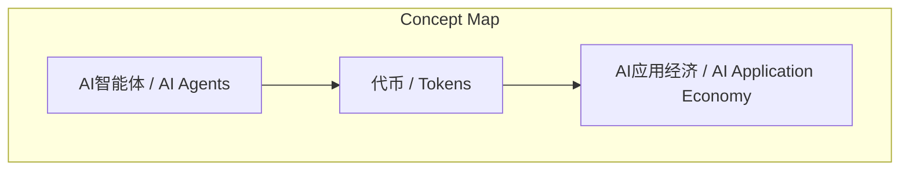
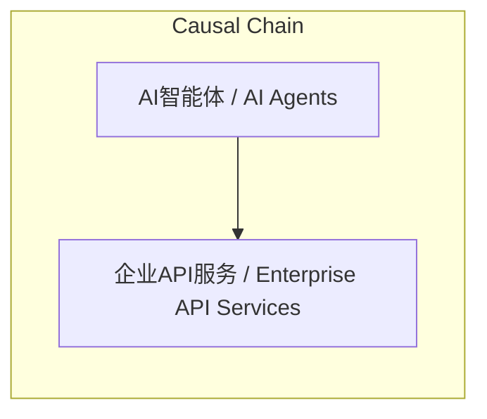

# NEWS/NEWS 任务报告

- agent: news/news
- requestId: 1774611780218-3cii0p
- 生成时间(UTC): 2026-03-27T11:47:18.609Z

### Runtime Trace
- 文本总结 | model=openrouter/free
- 文本总结 | schema_fallback=no
- 文本总结 | attempted_models=openrouter/free

## 文本总结

### 运行信息
- model: openrouter/free
- schema_fallback: no
- attempted_models: openrouter/free

# AI智能体作为经济参与者的新应用经济模式

## 整体结构化文档表达
### 文档卡片
- 主题（中文/English）：AI智能体作为经济参与者 / AI Agents as Economic Actors
- 一句话摘要：Steve预测AI智能体将通过代币消费和第三方服务参与新型经济体系，重塑企业商业模式和代币-美元价值关联。
- 目标读者：企业、开发者、投资者
- 核心结论（3条）：
- AI智能体将作为经济参与者参与新型应用经济，催生企业直接向智能体提供API服务的商业模式
- 代币消耗与美元支出形成等价关系，两者均代表购买智能、数据或服务的成本
- 企业未来可能专注于为AI智能体提供单一高价值API，而非为人类构建复杂界面

### 内容结构树
1. 背景与问题定义
2. 核心观点与关键证据
3. 方法/机制/路径
4. 风险与边界条件
5. 结论与行动建议

### 结构化元数据（JSON）
```json
{
  "title": "AI智能体作为经济参与者的新应用经济模式",
  "topic_zh": "AI智能体作为经济参与者",
  "topic_en": "AI Agents as Economic Actors",
  "audience": "企业、开发者、投资者",
  "claims": [
    "AI智能体作为经济参与者 → 新商业模式（企业提供API服务）",
    "代币消耗 = 购买服务 → 美元支出",
    "企业API服务 → 替代人类管理后台/落地页"
  ],
  "evidence": [
    "Steve明确提出AI智能体将作为经济参与者",
    "代币消耗与美元成本直接对应（如发送邮件/启动浏览器）",
    "企业未来可能转向提供API服务而非人类界面"
  ],
  "risks": [
    "AI智能体经济模式的可行性未明确验证",
    "代币-美元等价性可能受市场波动影响",
    "企业转向API模式可能面临技术壁垒"
  ],
  "actions": [
    "企业需开发面向AI智能体的API服务",
    "开发者应优化代币消耗效率",
    "投资者需关注AI智能体经济生态发展"
  ]
}
```

## 处理流程
1. 输入识别
2. 信息抽取（实体、概念、问题、事实、观点）
3. 结构化归纳（定义/分类/比较/因果/方法论）
4. 关系建模（概念关系、等式/方程/逻辑链）
5. 可视化表达（Mermaid）

## 概念清单（中英文）
- AI智能体 / AI Agents
- 代币 / Tokens
- AI应用经济 / AI Application Economy

## 概念定义（中英文）
### AI智能体 / AI Agents
- 中文定义：具备经济参与能力的智能体
- English Definition: Intelligent entities capable of economic participation

### 代币 / Tokens
- 中文定义：大模型交互的计量单位
- English Definition: Quantitative units for model interactions

### AI应用经济 / AI Application Economy
- 中文定义：围绕AI智能体的新经济体系
- English Definition: New economic system centered on AI agents


## 概念关联与逻辑关系（中英文）
- AI智能体/AI Agents -> 企业API服务/Enterprise API Services | causal | AI智能体需求驱动企业提供API服务
- 代币/Tokens -> 美元/Dollars | concept | 代币消耗与美元支出形成等价关系
- 管理后台/Management Dashboard -> API服务/API Services | comparison | API服务替代传统人类管理后台

### 可形式化关系
- AI智能体作为经济参与者 → 企业提供API服务
- 代币消耗 = 购买服务 → 美元支出
- 企业API服务 → 替代人类管理后台

## COT逻辑梳理（定义/分类/比较/因果/科学方法论）
- Step 1: 确定AI智能体作为经济参与者的前提条件
- Step 2: 分析代币消耗与美元支出的等价关系
- Step 3: 推导企业向AI智能体提供API服务的商业模式

## 事实与看法（区分）
### 事实
- Steve在访谈中明确提出AI智能体将作为经济参与者
- 代币消耗与美元成本直接对应（如发送邮件/启动浏览器）
- 企业未来可能转向提供API服务而非人类界面

### 看法
- Steve认为代币消耗与美元支出本质相同
- Steve预测代币与美元将被自然并列看待
- Steve将AI调试比作温和育儿

## FAQ（原文问题整理）
### AI智能体如何成为经济参与者？
- 通过代币消费和第三方服务参与经济活动

### 代币与美元的关系如何？
- 代币消耗等同于购买服务的美元支出

### 企业未来商业模式会如何变化？
- 可能专注于为AI智能体提供API服务

## Visualization
### Mermaid 图 1（概念结构图）


### Mermaid 图 2（逻辑/因果图）


## 文章中的类比
- Steve将AI调试比作温和育儿（指导而非直接纠正）
- AI智能体经济模式类似传统企业但以智能体为客户

## 10个金句
- Steve: '未来的智能体在解决复杂的提示时不仅会消耗大模型的代币还需要具备花钱的能力'
- Steve: '花费大量代币让大语言模型进行推理与花费几美分调用第三方服务本质相同'

