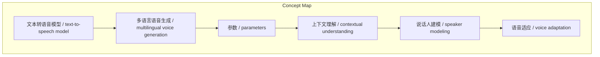
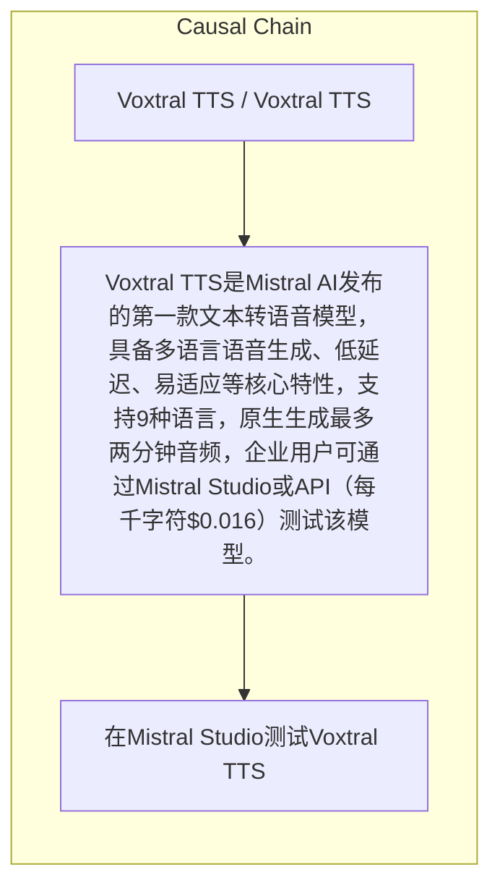

# NEWS/NEWS 任务报告

- agent: news/news
- requestId: 1774618436882-g345jl
- 生成时间(UTC): 2026-03-27T13:39:36.302Z

### Runtime Trace
- 链接总结: https://mistral.ai/news/voxtral-tts | model=openrouter/free
- 链接总结: https://mistral.ai/news/voxtral-tts | schema_fallback=yes
- 链接总结: https://mistral.ai/news/voxtral-tts | attempted_models=stepfun/step-3.5-flash:free, qwen/qwen-2.5-72b-instruct:free, deepseek/deepseek-chat:free, openrouter/free

## 链接总结

- URL: https://mistral.ai/news/voxtral-tts

### 运行信息
- model: openrouter/free
- schema_fallback: yes
- attempted_models: stepfun/step-3.5-flash:free, qwen/qwen-2.5-72b-instruct:free, deepseek/deepseek-chat:free, openrouter/free

# Voxtral TTS：Mistral AI发布的第一款文本转语音模型

## 整体结构化文档表达
### 文档卡片
- 主题（中文/English）：Voxtral TTS / Voxtral TTS
- 一句话摘要：Voxtral TTS是Mistral AI发布的第一款文本转语音模型，具备多语言语音生成、低延迟、易适应等核心特性，支持9种语言，原生生成最多两分钟音频，企业用户可通过Mistral Studio或API（每千字符$0.016）测试该模型。
- 目标读者：企业
- 核心结论（3条）：
- Voxtral TTS是Mistral AI发布的第一款文本转语音模型，具备多语言语音生成、低延迟、易适应等核心特性。
- 该模型基于Ministral 3B构建，支持9种语言，原生生成最多两分钟音频。
- Voxtral TTS在上下文理解和说话人建模方面表现出卓越的性能，支持零样本跨语言语音适应。
- 企业用户可通过Mistral Studio或API（每千字符$0.016）测试该模型。

### 内容结构树
1. 背景与问题定义
2. 核心观点与关键证据
3. 方法/机制/路径
4. 风险与边界条件
5. 结论与行动建议

### 结构化元数据（JSON）
```json
{
  "title": "Voxtral TTS：Mistral AI发布的第一款文本转语音模型",
  "topic_zh": "Voxtral TTS",
  "topic_en": "Voxtral TTS",
  "audience": "企业",
  "claims": [
    "Voxtral TTS是Voxtral TTS的第一款文本转语音模型，在多语言语音生成方面表现出卓越的性能。",
    "该模型参数规模为4B，使得Voxtral-powered agents在规模化部署时自然、可靠且成本效益高。",
    "支持9种语言，提供真实、富有情感的语音，并支持多种方言。",
    "首音频时间非常低。",
    "易于适应新声音。",
    "可在Mistral Studio测试。",
    "Voxtral TTS是企业级的文本转语音模型，支持关键语音代理工作流。",
    "Voxtral TTS在上下文理解和说话人建模方面表现出卓越的性能。"
  ],
  "evidence": [
    "模型可生成英文语音，但使用法语语音提示，结果自然且带有法语口音。",
    "首音频时间为70ms，实时因子（RTF）≈9.7x。",
    "API支持任意长度生成，通过智能交错处理。",
    "模型是Transformer-based、autoregressive、flow-matching模型，基于Ministral 3B。"
  ],
  "risks": [],
  "actions": [
    "在Mistral Studio测试Voxtral TTS",
    "Test-run the model in Mistral Studio.",
    "Get started with Voxtral TTS via API at $0.016 per 1k characters.",
    "Try it now in Mistral Studio or in Le Chat.",
    "A model with several reference voices is available as open weights on Hugging Face under CC BY NC 4.0 license.",
    "Explore the model’s documentation."
  ]
}
```

## 处理流程
1. 输入识别
2. 信息抽取（实体、概念、问题、事实、观点）
3. 结构化归纳（定义/分类/比较/因果/方法论）
4. 关系建模（概念关系、等式/方程/逻辑链）
5. 可视化表达（Mermaid）

## 概念清单（中英文）
- 文本转语音模型 / text-to-speech model
- 多语言语音生成 / multilingual voice generation
- 参数 / parameters
- 上下文理解 / contextual understanding
- 说话人建模 / speaker modeling
- 语音适应 / voice adaptation
- 企业级 / enterprise-grade
- 首音频时间 / time-to-first-audio
- 方言 / dialects
- 零样本跨语言语音适应 / zero-shot cross-lingual voice adaptation

## 概念定义（中英文）
### 文本转语音模型 / text-to-speech model
- 中文定义：将文本转换为语音的AI模型
- English Definition: An AI model that converts text to speech

### 多语言语音生成 / multilingual voice generation
- 中文定义：支持多种语言生成语音的能力
- English Definition: The ability to generate speech in multiple languages

### 参数 / parameters
- 中文定义：模型参数数量，表示模型大小
- English Definition: The number of model parameters, indicating model size

### 上下文理解 / contextual understanding
- 中文定义：理解文本情感（如中性、快乐、讽刺等）以决定生成语音是否准确或机械的能力
- English Definition: The ability to understand context and emotion in text to determine if generated speech is accurate or robotic

### 说话人建模 / speaker modeling
- 中文定义：捕捉特定个人自然说话方式的能力
- English Definition: The ability to capture how a specific person naturally speaks

### 语音适应 / voice adaptation
- 中文定义：适应新声音并捕捉说话人个性、自然停顿、节奏、语调和情感敏捷性的能力
- English Definition: The ability to adapt to new voices and capture speaker personality, including natural pauses, rhythm, intonation, and emotional dexterity

### 企业级 / enterprise-grade
- 中文定义：满足企业关键工作流要求的可靠性
- English Definition: Reliability that meets the requirements of critical enterprise workflows

### 首音频时间 / time-to-first-audio
- 中文定义：从输入到生成首个音频的延迟时间
- English Definition: The latency time from input to generating the first audio

### 方言 / dialects
- 中文定义：语言的地域或社会变体
- English Definition: Regional or social variants of a language

### 零样本跨语言语音适应 / zero-shot cross-lingual voice adaptation
- 中文定义：模型在未针对特定语言对训练的情况下，能使用一种语言的语音提示生成另一种语言的语音，并模仿提示的口音。
- English Definition: The model's ability to generate speech in a different language than the voice prompt without explicit training, adopting the accent of the prompt


## 概念关联与逻辑关系（中英文）
- Voxtral TTS/Voxtral TTS -> Ministral 3B/Ministral 3B | concept | built on
- 零样本跨语言语音适应/zero-shot cross-lingual voice adaptation -> 级联语音到语音翻译/cascaded speech-to-speech translation | concept | enables

### 可形式化关系
- Voxtral TTS基于Ministral 3B构建

## COT逻辑梳理（定义/分类/比较/因果/科学方法论）
- 输入语音提示（5-25秒）和文本提示（支持9种语言）
- Transformer backbone为每个音频帧预测语义标记
- Flow-matching transformer运行16次NFEs产生声学潜在表示
- 神经音频编解码器使用语义VQ和声学FSQ处理，以12.5Hz帧率生成音频

## 事实与看法（区分）
### 事实
- 模型延迟：70ms（典型输入10秒语音样本和500字符）
- 实时因子（RTF）≈9.7x
- 原生生成最多两分钟音频
- 参数规模：3.4B transformer decoder backbone, 390M flow-matching acoustic transformer, 300M neural audio codec
- 支持9种语言
- 语音提示时长：5-25秒
- 编解码器帧率：12.5Hz
- 每帧NFEs：16次
- 语义VQ词汇量：8192
- 声学FSQ：36维和21级

### 看法
- Voxtral TTS为企业语音工作流提供了一个能通过人类测试的输出层。

## FAQ（原文问题整理）
- 未发现明确 FAQ

## Visualization
### Mermaid 图 1（概念结构图）


### Mermaid 图 2（逻辑/因果图）


## 文章中的类比
- 未发现明确类比

## 10个金句
- 我们的团队会说几十种语言，理解文化细微差别的意义，并构建了一个反映我们自身的模型。
- 因此，在语音仿真方面，我们专注于真实性和情感表达。

