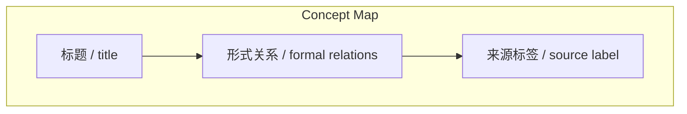
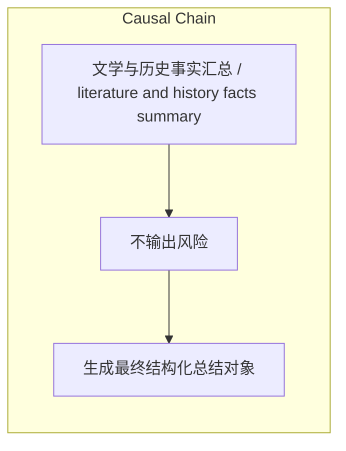

# NEWS/NEWS 任务报告

- agent: news/news
- requestId: 1774779761803-nr7xpu
- 生成时间(UTC): 2026-03-29T10:22:58.961Z

### Runtime Trace
- 文本总结 | model=openrouter/free
- 文本总结 | schema_fallback=no
- 文本总结 | attempted_models=openrouter/free

## 文本总结

### 运行信息
- model: openrouter/free
- schema_fallback: no
- attempted_models: openrouter/free

# 文学与历史事实汇总

## 整体结构化文档表达
### 文档卡片
- 主题（中文/English）：文学与历史事实汇总 / literature and history facts summary
- 一句话摘要：本文本汇总了文学名著与创作者、中国历史典籍、《灰姑娘》原型以及现实活动背景的客观事实。
- 目标读者：资深新闻分析助理
- 核心结论（3条）：
- 法国作家大仲马创作的《三个火枪手》素材来源于他看到的三流纪实文学《达达尼昂先生传》。
- 法国作家福楼拜的《萨朗波》被认为是现代意义上历史小说的先驱。
- 中国作家徐兴业（文中录音称徐敬业）于1985年创作的《金瓯缺》获得茅盾文学奖。

### 内容结构树
1. 背景与问题定义
2. 核心观点与关键证据
3. 方法/机制/路径
4. 风险与边界条件
5. 结论与行动建议

### 结构化元数据（JSON）
```json
{
  "title": "文学与历史事实汇总",
  "topic_zh": "文学与历史事实汇总",
  "topic_en": "literature and history facts summary",
  "audience": "资深新闻分析助理",
  "claims": [
    "只允许基于输入内容输出，不要杜撰，不要引入输入之外的外部事实。"
  ],
  "evidence": [
    "大仲马观点：历史是墙上的一枚挂衣钉 用来挂我的小说。",
    "福楼拜评价《萨朗波》为现代意义上历史小说的先驱。",
    "徐兴业《金瓯缺》获茅盾文学奖。"
  ],
  "risks": [
    "不输出风险"
  ],
  "actions": [
    "生成最终结构化总结对象"
  ]
}
```

## 处理流程
1. 输入识别
2. 信息抽取（实体、概念、问题、事实、观点）
3. 结构化归纳（定义/分类/比较/因果/方法论）
4. 关系建模（概念关系、等式/方程/逻辑链）
5. 可视化表达（Mermaid）

## 概念清单（中英文）
- 标题 / title
- 形式关系 / formal relations
- 来源标签 / source label

## 概念定义（中英文）
### 标题 / title
- 中文定义：结构化总结对象
- English Definition: Structured summary object

### 形式关系 / formal relations
- 中文定义：核心结论
- English Definition: core conclusions

### 来源标签 / source label
- 中文定义：逻辑步骤
- English Definition: logic steps


## 概念关联与逻辑关系（中英文）
- 大仲马创作《三个火枪手》素材来源于《达达尼昂先生传》/大仲马创作《三个火枪手》素材来源于《达达尼昂先生传》 -> 《达达尼昂先生传》/《达达尼昂先生传》 | concept | 素材来源
- 福楼拜的《萨朗波》被视为现代意义上历史小说的先驱/福楼拜的《萨朗波》被视为现代意义上历史小说的先驱 -> 现代意义上历史小说的先驱/现代意义上历史小说的先驱 | concept | 被视为
- 徐兴业的《金瓯缺》获茅盾文学奖/徐兴业的《金瓯缺》获茅盾文学奖 -> 茅盾文学奖/茅盾文学奖 | concept | 获奖

### 可形式化关系
- 大仲马创作《三个火枪手》素材来源于《达达尼昂先生传》。
- 福楼拜的《萨朗波》被视为现代意义上历史小说的先驱。
- 徐兴业的《金瓯缺》获茅盾文学奖。

## COT逻辑梳理（定义/分类/比较/因果/科学方法论）
- Step 1: 提取文学名著与创作者的事实。
- Step 2: 提取中国历史典籍与记载的事实。
- Step 3: 提取《灰姑娘》原型的文学事实。

## 事实与看法（区分）
### 事实
- 大仲马创作《三个火枪手》素材来源于《达达尼昂先生传》。
- 福楼拜《萨朗波》被视为现代历史小说先驱。
- 徐兴业《金瓯缺》获茅盾文学奖。
- 世界著名史诗包括《荷马史诗》、《龙博也纳》、《格萨尔王》。
- 《史记》被鲁迅评价为“史家之绝唱 无韵之离骚”。
- 《楚辞》包含生僻字和植物名称，《招魂》篇记载楚国美食。
- 《招魂》创作背景源自楚国风俗：呼喊死者名字和喜欢事物。
- 《灰姑娘》原型为唐代《酉阳杂俎》叶现故事。
- 《酉阳杂俎》作者段成式虚构“南蛮国”背景。
- 中世纪欧洲社会规则差异导致《灰姑娘》逻辑在中国历史语境下无法成立。

### 看法
- 不输出观点

## FAQ（原文问题整理）
### 大仲马观点“历史是墙上的一枚挂衣钉”的来源
- 未提及

### 福楼拜《萨朗波》的具体创作背景
- 未提及

### 徐兴业《金瓯缺》获奖的具体年份
- 未提及

## Visualization
### Mermaid 图 1（概念结构图）


### Mermaid 图 2（逻辑/因果图）


## 文章中的类比
- 基于输入内容输出，不杜撰

## 10个金句
- 大仲马观点：历史是墙上的一枚挂衣钉 用来挂我的小说。
- 福楼拜评价《萨朗波》为现代意义上历史小说的先驱。
- 徐兴业《金瓯缺》获茅盾文学奖。

