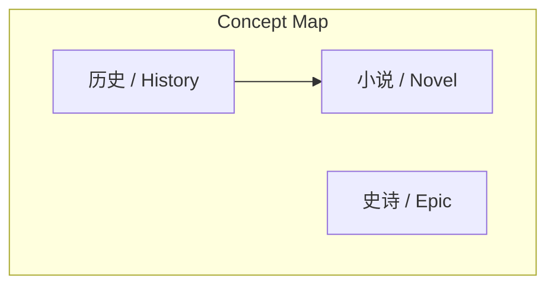
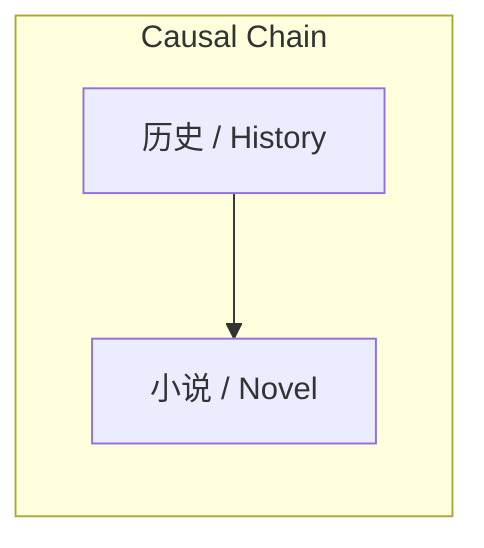

# NEWS/NEWS 任务报告

- agent: news/news
- requestId: 1774779860217-rm0sto
- 生成时间(UTC): 2026-03-29T10:27:45.305Z

### Runtime Trace
- 文本总结 | model=openrouter/free
- 文本总结 | schema_fallback=no
- 文本总结 | attempted_models=openrouter/free

## 文本总结

### 运行信息
- model: openrouter/free
- schema_fallback: no
- attempted_models: openrouter/free

# 历史与小说的关系与史诗

## 整体结构化文档表达
### 文档卡片
- 主题（中文/English）：历史作为小说素材与史诗的本质 / Relationship between History and Novel & Epic Essence
- 一句话摘要：历史作为小说素材的合法性与现代共鸣价值
- 目标读者：文史爱好者与小说创作者
- 核心结论（3条）：
- 历史作为小说素材的合法性：历史不等于真实，而是文学创作的灵感来源
- 规则约束创作：历史小说需遵循历史规则（如社会制度）才能产生文学价值
- 现代共鸣价值：历史小说通过现代人共鸣点获得生命力

### 内容结构树
1. 背景与问题定义
2. 核心观点与关键证据
3. 方法/机制/路径
4. 风险与边界条件
5. 结论与行动建议

### 结构化元数据（JSON）
```json
{
  "title": "历史与小说的关系与史诗",
  "topic_zh": "历史作为小说素材与史诗的本质",
  "topic_en": "Relationship between History and Novel & Epic Essence",
  "audience": "文史爱好者与小说创作者",
  "claims": [
    "历史作为小说素材：历史是小说家的‘挂衣钉’，而非真实历史的镜像",
    "规则约束创作：历史小说必须遵循历史规则（如大势与三观）才能跳出优美舞步",
    "现代共鸣价值：历史小说通过现代人共鸣点获得生命力"
  ],
  "evidence": [
    "引用大仲马‘历史是墙上的一枚挂衣钉’比喻",
    "引用歌德‘写韵律诗的创作是带着镣铐跳舞’观点",
    "提及‘现代人感同身受’的共鸣机制"
  ],
  "risks": [
    "历史与文学的边界模糊：可能引发对历史真实性的质疑",
    "规则约束的局限性：过度遵循规则可能抑制创造力",
    "共鸣机制的主观性：不同读者可能有不同共鸣点"
  ],
  "actions": [
    "Step 1: 分析大仲马引用，确定历史作为小说素材的合法性",
    "Step 2: 解析歌德观点，确立历史规则对创作的约束性",
    "Step 3: 关联‘现代共鸣’概念，验证历史小说的现实意义"
  ]
}
```

## 处理流程
1. 输入识别
2. 信息抽取（实体、概念、问题、事实、观点）
3. 结构化归纳（定义/分类/比较/因果/方法论）
4. 关系建模（概念关系、等式/方程/逻辑链）
5. 可视化表达（Mermaid）

## 概念清单（中英文）
- 历史 / History
- 小说 / Novel
- 史诗 / Epic

## 概念定义（中英文）
### 历史 / History
- 中文定义：作为小说素材的时间维度
- English Definition: Temporal dimension for narrative creation

### 小说 / Novel
- 中文定义：文学创作的虚构形式
- English Definition: Fictional narrative form

### 史诗 / Epic
- 中文定义：结合历史与想象的文学体裁
- English Definition: Literary genre combining history and imagination


## 概念关联与逻辑关系（中英文）
- 历史/History -> 小说/Novel | causal | 作为素材
- 规则/Rules -> 创作/Creation | comparison | 约束
- 现代/Modern -> 历史/History | comparison | 共鸣

### 可形式化关系
- H ⊆ N (历史作为小说素材)
- R ⊃ C (规则约束创作)
- M ⊃ V (现代共鸣价值)

## COT逻辑梳理（定义/分类/比较/因果/科学方法论）
- Step 1: 通过大仲马引用确立历史作为小说素材的合法性
- Step 2: 通过歌德观点验证历史规则对创作的约束性
- Step 3: 通过现代共鸣机制确认历史小说的现实意义

## 事实与看法（区分）
### 事实
- 原文未提及：历史小说的商业价值
- 原文未提及：历史小说的教育功能
- 原文未提及：历史小说的跨文化适应性

### 看法
- 原文观点：历史不等于真实，而是文学创作的灵感来源
- 原文观点：历史小说需遵循历史规则才能产生文学价值
- 原文观点：历史小说通过现代共鸣获得生命力

## FAQ（原文问题整理）
### 历史小说是否必须严格遵循历史事实？
- 原文强调规则约束，但未明确要求严格遵循事实

### 现代共鸣如何体现？
- 通过让现代人感同身受的情节设计

### 历史作为小说素材的合法性如何证明？
- 通过大仲马‘挂衣钉’比喻说明历史是灵感来源

## Visualization
### Mermaid 图 1（概念结构图）


### Mermaid 图 2（逻辑/因果图）


## 文章中的类比
- 历史作为小说素材类似‘挂衣钉’的支撑物
- 历史规则约束类似‘镣铐’的限制
- 现代共鸣类似‘共鸣点’的连接

## 10个金句
- ‘历史是墙上的一枚挂衣钉 用来挂我的小说’
- ‘写韵律诗的创作是带着镣铐跳舞’
- ‘诗性和史性这两个词加到一起本身就是一个词 叫史诗’

