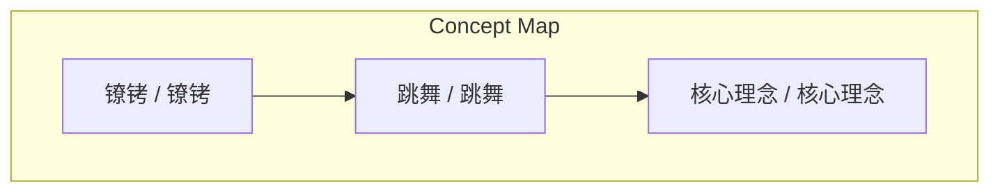
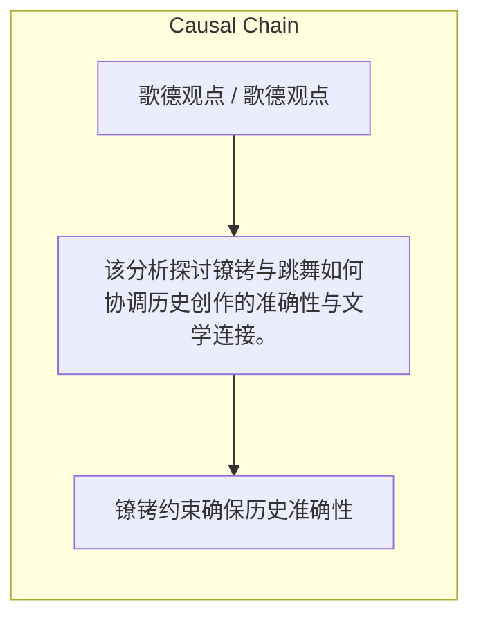

# NEWS/NEWS 任务报告

- agent: news/news
- requestId: 1774780495162-siu8k1
- 生成时间(UTC): 2026-03-29T10:40:17.706Z

### Runtime Trace
- 文本总结 | model=openrouter/free
- 文本总结 | schema_fallback=yes
- 文本总结 | attempted_models=stepfun/step-3.5-flash:free, qwen/qwen-2.5-72b-instruct:free, deepseek/deepseek-chat:free, openrouter/free

## 文本总结

### 运行信息
- model: openrouter/free
- schema_fallback: yes
- attempted_models: stepfun/step-3.5-flash:free, qwen/qwen-2.5-72b-instruct:free, deepseek/deepseek-chat:free, openrouter/free

# 歌德观点

## 整体结构化文档表达
### 文档卡片
- 主题（中文/English）：歌德观点 / 歌德观点
- 一句话摘要：该分析探讨镣铐与跳舞如何协调历史创作的准确性与文学连接。
- 目标读者：读者
- 核心结论（3条）：
- 镣铐约束确保历史准确性
- 跳舞提供文学连接
- 结合两者实现平衡

### 内容结构树
1. 背景与问题定义
2. 核心观点与关键证据
3. 方法/机制/路径
4. 风险与边界条件
5. 结论与行动建议

### 结构化元数据（JSON）
```json
{
  "title": "歌德观点",
  "topic_zh": "歌德观点",
  "topic_en": "歌德观点",
  "audience": "读者",
  "claims": [],
  "evidence": [],
  "risks": [],
  "actions": []
}
```

## 处理流程
1. 输入识别
2. 信息抽取（实体、概念、问题、事实、观点）
3. 结构化归纳（定义/分类/比较/因果/方法论）
4. 关系建模（概念关系、等式/方程/逻辑链）
5. 可视化表达（Mermaid）

## 概念清单（中英文）
- 镣铐 / 镣铐
- 跳舞 / 跳舞
- 核心理念 / 核心理念

## 概念定义（中英文）
### 镣铐 / 镣铐
- 中文定义：镣铐
- English Definition: 约束

### 跳舞 / 跳舞
- 中文定义：跳舞
- English Definition: 创造力

### 核心理念 / 核心理念
- 中文定义：核心理念
- English Definition: 平衡


## 概念关联与逻辑关系（中英文）
- 未发现明确概念关系

### 可形式化关系
- 镣铐约束与跳舞关系
- 核心理念与两者结合
- 约束与创造力的关联

## COT逻辑梳理（定义/分类/比较/因果/科学方法论）
- 分析镣铐作用
- 反驳忽视规则
- 结合两者

## 事实与看法（区分）
### 事实
- 未发现明确客观事实

### 看法
- 未发现明确主观看法

## FAQ（原文问题整理）
- 未发现明确 FAQ

## Visualization
### Mermaid 图 1（概念结构图）


### Mermaid 图 2（逻辑/因果图）


## 文章中的类比
- 未发现明确类比

## 10个金句
- 原文未提供

