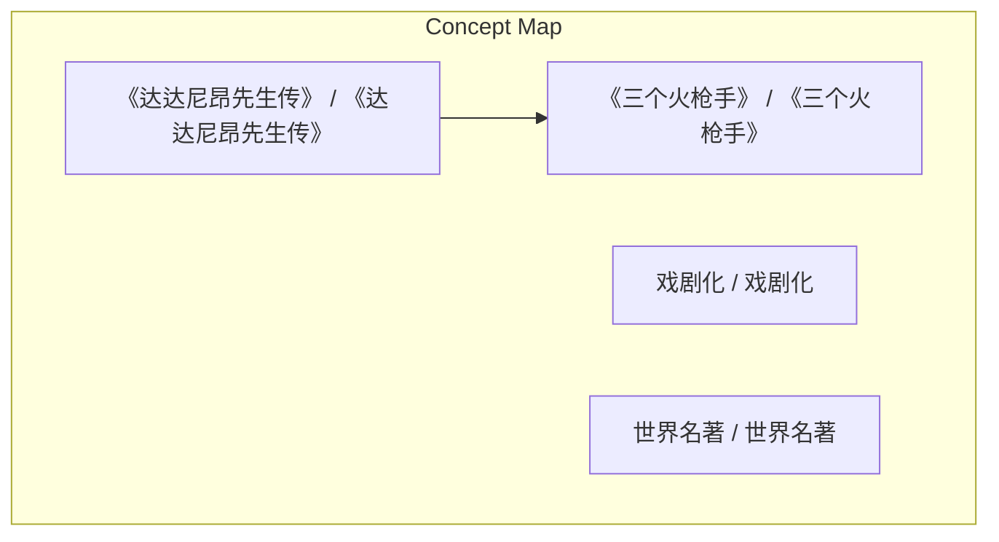
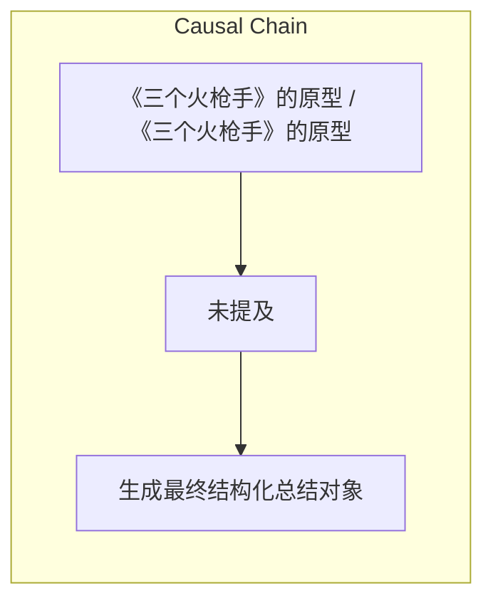

# NEWS/NEWS 任务报告

- agent: news/news
- requestId: 1774780820148-1x90vf
- 生成时间(UTC): 2026-03-29T10:40:32.430Z

### Runtime Trace
- 文本总结 | model=openrouter/free
- 文本总结 | schema_fallback=no
- 文本总结 | attempted_models=openrouter/free

## 文本总结

### 运行信息
- model: openrouter/free
- schema_fallback: no
- attempted_models: openrouter/free

# 大仲马改编《达达尼昂传》为《三个火枪手》

## 整体结构化文档表达
### 文档卡片
- 主题（中文/English）：《三个火枪手》的原型 / 《三个火枪手》的原型
- 一句话摘要：大仲马发现一本名为《达达尼昂先生传》的纪实文学传记，将其作为故事主干，加入戏剧化和狗血情节，最终改编为《三个火枪手》。
- 目标读者：资深新闻分析助理
- 核心结论（3条）：
- 大仲马发现一本名为《达达尼昂先生传》的纪实文学传记。
- 大仲马将该传记作为故事主干，加入戏剧化和狗血情节。
- 大仲马改编该传记为《三个火枪手》。

### 内容结构树
1. 背景与问题定义
2. 核心观点与关键证据
3. 方法/机制/路径
4. 风险与边界条件
5. 结论与行动建议

### 结构化元数据（JSON）
```json
{
  "title": "大仲马改编《达达尼昂传》为《三个火枪手》",
  "topic_zh": "《三个火枪手》的原型",
  "topic_en": "《三个火枪手》的原型",
  "audience": "资深新闻分析助理",
  "claims": [
    "只允许基于输入内容输出，不要杜撰，不要引入输入之外的外部事实。"
  ],
  "evidence": [
    "《三个火枪手》的原型是法国作家大仲马在图书馆里偶然看到的一本名为《达达尼昂先生传》的三流人物传记。"
  ],
  "risks": [
    "未提及"
  ],
  "actions": [
    "生成最终结构化总结对象"
  ]
}
```

## 处理流程
1. 输入识别
2. 信息抽取（实体、概念、问题、事实、观点）
3. 结构化归纳（定义/分类/比较/因果/方法论）
4. 关系建模（概念关系、等式/方程/逻辑链）
5. 可视化表达（Mermaid）

## 概念清单（中英文）
- 《三个火枪手》 / 《三个火枪手》
- 《达达尼昂先生传》 / 《达达尼昂先生传》
- 戏剧化 / 戏剧化
- 世界名著 / 世界名著

## 概念定义（中英文）
### 《三个火枪手》 / 《三个火枪手》
- 中文定义：法国作家大仲马
- English Definition: Alexandre Dumas

### 《达达尼昂先生传》 / 《达达尼昂先生传》
- 中文定义：原型
- English Definition: 原型

### 戏剧化 / 戏剧化
- 中文定义：纪实文学
- English Definition: 纪实文学

### 世界名著 / 世界名著
- 中文定义：狗血
- English Definition: 狗血


## 概念关联与逻辑关系（中英文）
- 《达达尼昂先生传》/《达达尼昂先生传》 -> 《三个火枪手》/《三个火枪手》 | concept | 原型
- 大仲马/大仲马 -> 《三个火枪手》/《三个火枪手》 | concept | 作者
- 纪实文学/纪实文学 -> 《达达尼昂先生传》/《达达尼昂先生传》 | concept | 原材料

### 可形式化关系
- 《达达尼昂先生传》→《三个火枪手》
- 大仲马→《三个火枪手》
- 纪实文学→戏剧化

## COT逻辑梳理（定义/分类/比较/因果/科学方法论）
- Step 1: 大仲马在图书馆偶然发现《达达尼昂先生传》。
- Step 2: 大仲马将该传记作为故事主干，加入戏剧化和狗血情节。
- Step 3: 大仲马改编该传记为《三个火枪手》。

## 事实与看法（区分）
### 事实
- 大仲马发现《达达尼昂先生传》内容无聊。
- 大仲马加入戏剧化和狗血情节。
- 大仲马改编为《三个火枪手》。

### 看法
- 未提及

## FAQ（原文问题整理）
### 大仲马的出生日期
- 未提及

### 《三个火枪手》的出版日期
- 未提及

## Visualization
### Mermaid 图 1（概念结构图）


### Mermaid 图 2（逻辑/因果图）


## 文章中的类比
- 基于输入内容输出，不杜撰

## 10个金句
- 《三个火枪手》的原型是法国作家大仲马在图书馆里偶然看到的一本名为《达达尼昂先生传》的三流人物传记。

