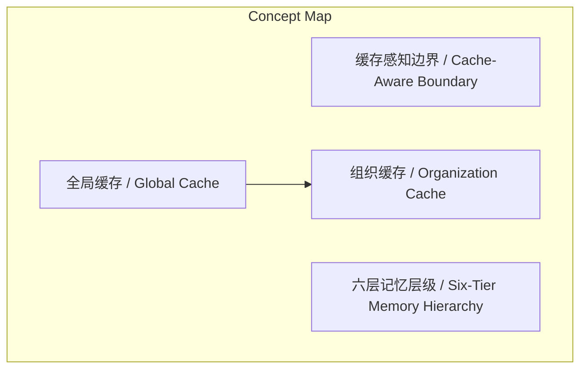
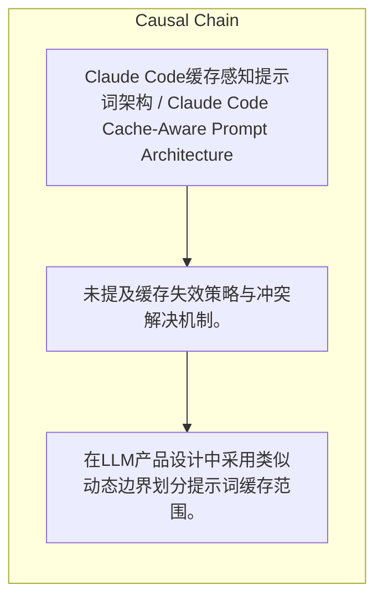

# NEWS/NEWS 任务报告

- agent: news/news
- requestId: 1775090213007-5metjx
- 生成时间(UTC): 2026-04-02T00:37:22.038Z

### Runtime Trace
- 文本总结 | model=stepfun/step-3.5-flash:free
- 文本总结 | schema_fallback=no
- 文本总结 | attempted_models=stepfun/step-3.5-flash:free

## 文本总结

### 运行信息
- model: stepfun/step-3.5-flash:free
- schema_fallback: no
- attempted_models: stepfun/step-3.5-flash:free

# Claude Code缓存感知提示词架构解析

## 整体结构化文档表达
### 文档卡片
- 主题（中文/English）：Claude Code缓存感知提示词架构 / Claude Code Cache-Aware Prompt Architecture
- 一句话摘要：Claude Code通过动态边界划分全局/组织缓存提示词与六层记忆系统，优化API调用成本与上下文管理。
- 目标读者：LLM API产品开发者
- 核心结论（3条）：
- 系统提示词通过动态边界划分为全局缓存（cacheScope: 'global'）与组织缓存（cacheScope: 'org'），以降低跨用户重复计算成本。
- 提示词记忆采用六层优先级结构（Managed→User→Project→Local→AutoMem→TeamMem），后加载层覆盖先加载层。
- CLAUDE.md等用户文件通过独立上下文通道注入，避免触碰缓存提示词，保障响应速度。

### 内容结构树
1. 背景与问题定义
2. 核心观点与关键证据
3. 方法/机制/路径
4. 风险与边界条件
5. 结论与行动建议

### 结构化元数据（JSON）
```json
{
  "title": "Claude Code缓存感知提示词架构解析",
  "topic_zh": "Claude Code缓存感知提示词架构",
  "topic_en": "Claude Code Cache-Aware Prompt Architecture",
  "audience": "LLM API产品开发者",
  "claims": [
    "全局缓存内容（身份指令、编码规范等）通过Blake2b哈希跨用户共享，计算一次服务所有人。",
    "组织缓存内容（环境信息、语言偏好等）在组织内共享，同一组织不同会话可复用。",
    "记忆层级优先级规则类似于司法管辖：地方法规（Local）覆盖省级（Project），省级覆盖国家（Managed）。"
  ],
  "evidence": [
    "源码中存在常量SYSTEM_PROMPT_DYNAMIC_BOUNDARY作为缓存分界标识。",
    "记忆层级明确列出Managed/User/Project/Local/AutoMem/TeamMem六层，并说明越晚加载优先级越高。",
    "文中指出CLAUDE.md文件被注入为用户上下文，独立于系统提示词缓存通道。"
  ],
  "risks": [
    "未提及缓存失效策略与冲突解决机制。",
    "未说明TeamMem同步中乐观锁的具体实现细节。",
    "未提及密钥扫描规则（40+条）的技术实现与误报率。"
  ],
  "actions": [
    "在LLM产品设计中采用类似动态边界划分提示词缓存范围。",
    "设计多层级上下文系统时，明确优先级覆盖规则。",
    "将用户自定义配置与核心系统提示词分离，通过独立通道传输。"
  ]
}
```

## 处理流程
1. 输入识别
2. 信息抽取（实体、概念、问题、事实、观点）
3. 结构化归纳（定义/分类/比较/因果/方法论）
4. 关系建模（概念关系、等式/方程/逻辑链）
5. 可视化表达（Mermaid）

## 概念清单（中英文）
- 缓存感知边界 / Cache-Aware Boundary
- 全局缓存 / Global Cache
- 组织缓存 / Organization Cache
- 六层记忆层级 / Six-Tier Memory Hierarchy

## 概念定义（中英文）
### 缓存感知边界 / Cache-Aware Boundary
- 中文定义：通过动态边界标识划分可缓存与不可缓存提示词内容的机制。
- English Definition: Mechanism to partition prompt content into cacheable and non-cacheable sections via a dynamic boundary marker.

### 全局缓存 / Global Cache
- 中文定义：对所有用户完全相同的系统提示词部分，通过哈希跨用户共享。
- English Definition: System prompt section identical for all users, shared across users via hashing.

### 组织缓存 / Organization Cache
- 中文定义：在同一组织内共享的会话相关提示词部分。
- English Definition: Session-dependent prompt section shared within the same organization.

### 六层记忆层级 / Six-Tier Memory Hierarchy
- 中文定义：从企业策略到团队共享记忆的六个优先级上下文层级。
- English Definition: Six priority-based context tiers ranging from enterprise policies to team-shared memories.


## 概念关联与逻辑关系（中英文）
- 全局缓存/Global Cache -> 组织缓存/Organization Cache | comparison | 共享范围不同：全局跨所有用户，组织仅限同一组织内。
- 系统提示词/System Prompt -> 用户上下文/User Context | comparison | 传输通道分离：前者走缓存通道，后者走独立通道，互不干扰。
- 早期记忆层/Early Memory Tier -> 后期记忆层/Later Memory Tier | comparison | 覆盖关系：后期层内容优先级更高，可覆盖早期层规则。

### 可形式化关系
- ∀用户u, 若提示词片段p ∈ 全局缓存范围，则Hash(p)在Claude API全局缓存中仅计算一次，∀调用复用。
- 设记忆层级L = [Managed, User, Project, Local, AutoMem, TeamMem]，优先级函数P(L_i) > P(L_j) 当且仅当 i > j（索引从0开始）。
- 令C_cache为缓存提示词通道，C_context为用户上下文通道，则∀用户文件f ∈ CLAUDE.md，f ∈ C_context ∧ f ∉ C_cache。

## COT逻辑梳理（定义/分类/比较/因果/科学方法论）
- Step 1: 识别成本瓶颈——系统提示词重复处理导致API调用成本高，需通过缓存优化。
- Step 2: 设计缓存边界——引入动态边界常量，将提示词分为全局（固定）与组织（可变）两部分，分别设置cacheScope。
- Step 3: 扩展上下文管理——构建六层记忆系统，通过加载顺序控制优先级，并将CLAUDE.md等文件通过独立通道注入。

## 事实与看法（区分）
### 事实
- 源码中存在常量SYSTEM_PROMPT_DYNAMIC_BOUNDARY。
- 全局缓存标记为cacheScope: 'global'，组织缓存标记为cacheScope: 'org'。
- 记忆层级包括Managed、User、Project、Local、AutoMem、TeamMem共六层。
- CLAUDE.md文件被注入为用户上下文，不在系统提示词内。
- TeamMem支持API同步，包含乐观锁和40多条密钥扫描规则。

### 看法
- 该缓存感知架构是LLM API产品中最直接可复用的设计模式。

## FAQ（原文问题整理）
### 为什么CLAUDE.md不在系统提示词中？
- 为避免触碰缓存提示词，通过独立用户上下文通道注入，保障缓存命中率与响应速度。

### 记忆层级优先级如何工作？
- 越晚加载的文件优先级越高，类似司法管辖：Local覆盖Project，Project覆盖Managed等。

### 全局缓存如何实现跨用户共享？
- 通过Blake2b哈希计算全局提示词内容，哈希值相同则复用缓存，仅计算一次。

## Visualization
### Mermaid 图 1（概念结构图）


### Mermaid 图 2（逻辑/因果图）


## 文章中的类比
- 缓存边界如同船体水线：水上部分（全局）固定，水下部分（组织）因货（会话数据）而异。
- 记忆层级优先级如同司法管辖：地方法规（Local）覆盖省级（Project），省级覆盖国家（Managed）。

## 10个金句
- 你的CLAUDE.md文件呢？它们根本不在系统提示词里。
- 同一艘船，不同的货物。
- 效果类似于司法管辖：地方法规覆盖省级法规，省级覆盖国家法规。

