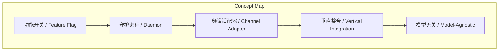
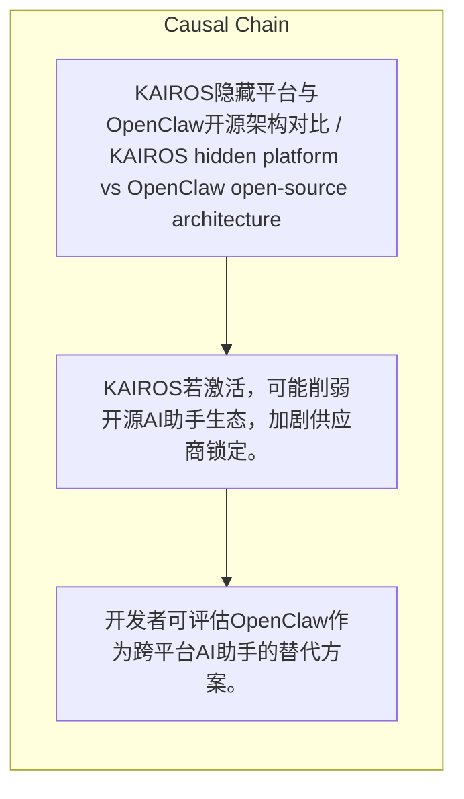

# NEWS/NEWS 任务报告

- agent: news/news
- requestId: 1775090247078-watioq
- 生成时间(UTC): 2026-04-02T00:38:15.593Z

### Runtime Trace
- 文本总结 | model=stepfun/step-3.5-flash:free
- 文本总结 | schema_fallback=no
- 文本总结 | attempted_models=stepfun/step-3.5-flash:free

## 文本总结

### 运行信息
- model: stepfun/step-3.5-flash:free
- schema_fallback: no
- attempted_models: stepfun/step-3.5-flash:free

# KAIROS与OpenClaw架构战略对比

## 整体结构化文档表达
### 文档卡片
- 主题（中文/English）：KAIROS隐藏平台与OpenClaw开源架构对比 / KAIROS hidden platform vs OpenClaw open-source architecture
- 一句话摘要：Claude Code中隐藏的KAIROS平台与开源OpenClaw架构高度相似，但生态策略对立，形成类似iPhone与Android的垂直整合与开放竞争格局。
- 目标读者：技术决策者、AI产品分析师、开源社区
- 核心结论（3条）：
- KAIROS是Claude Code中已完整实现但通过GrowthBook功能开关隐藏的始终在线AI平台。
- OpenClaw是开源、模型无关的类似架构，当前可用且支持多平台原生集成。
- 两者架构核心组件趋同，但生态策略分化：KAIROS闭源垂直整合，OpenClaw开源开放，类比移动生态竞争。

### 内容结构树
1. 背景与问题定义
2. 核心观点与关键证据
3. 方法/机制/路径
4. 风险与边界条件
5. 结论与行动建议

### 结构化元数据（JSON）
```json
{
  "title": "KAIROS与OpenClaw架构战略对比",
  "topic_zh": "KAIROS隐藏平台与OpenClaw开源架构对比",
  "topic_en": "KAIROS hidden platform vs OpenClaw open-source architecture",
  "audience": "技术决策者、AI产品分析师、开源社区",
  "claims": [
    "KAIROS功能在源码中完整实现，但外部版本编译为false。",
    "OpenClaw架构包含网关守护进程、多频道适配器、主动调度等，与KAIROS蓝图几乎完全重合。",
    "若KAIROS激活，OpenClaw对Claude用户可能冗余，但OpenClaw提供数据自主与模型选择。"
  ],
  "evidence": [
    "源码显示KAIROS包含Agent SDK守护进程、双向MCP频道集成、主动<tick>模式、终端焦点检测等。",
    "OpenClaw架构包括openclaw gateway、18+频道适配器、定时/webhook唤醒、原生消息格式。",
    "原文明确类比：KAIROS类似iPhone（垂直整合），OpenClaw类似Android（开源开放）。"
  ],
  "risks": [
    "KAIROS若激活，可能削弱开源AI助手生态，加剧供应商锁定。",
    "OpenClaw的模型无关性可能因Claude主导地位而边缘化。",
    "功能开关策略反映Anthropic对全栈控制的战略意图。"
  ],
  "actions": [
    "开发者可评估OpenClaw作为跨平台AI助手的替代方案。",
    "关注KAIROS开关状态变化，判断Anthropic产品战略转向。",
    "在数据主权要求高的场景，优先采用OpenClaw类开源架构。"
  ]
}
```

## 处理流程
1. 输入识别
2. 信息抽取（实体、概念、问题、事实、观点）
3. 结构化归纳（定义/分类/比较/因果/方法论）
4. 关系建模（概念关系、等式/方程/逻辑链）
5. 可视化表达（Mermaid）

## 概念清单（中英文）
- 功能开关 / Feature Flag
- 守护进程 / Daemon
- 频道适配器 / Channel Adapter
- 垂直整合 / Vertical Integration
- 模型无关 / Model-Agnostic

## 概念定义（中英文）
### 功能开关 / Feature Flag
- 中文定义：通过布尔值控制代码编译或运行的机制
- English Definition: Mechanism to control code compilation or runtime via boolean value

### 守护进程 / Daemon
- 中文定义：后台持续运行的进程
- English Definition: Background process running continuously

### 频道适配器 / Channel Adapter
- 中文定义：连接不同消息平台的接口组件
- English Definition: Interface component connecting messaging platforms

### 垂直整合 / Vertical Integration
- 中文定义：企业控制产业链多个环节的策略
- English Definition: Strategy where a company controls multiple stages of the supply chain

### 模型无关 / Model-Agnostic
- 中文定义：不依赖特定AI模型的架构设计
- English Definition: Architecture design independent of specific AI models


## 概念关联与逻辑关系（中英文）
- KAIROS/KAIROS -> OpenClaw/OpenClaw | comparison | 架构高度相似但生态策略对立
- Anthropic/Anthropic -> OpenClaw社区/OpenClaw community | comparison | 全栈控制 vs 开放生态
- iPhone模式/iPhone model -> Android模式/Android model | comparison | 垂直整合 vs 开放多样性

### 可形式化关系
- KAIROS.状态 = 隐藏（feature('KAIROS')=false） ∧ 功能集=完整实现
- Design(KAIROS) ≈ Design(OpenClaw)（核心组件：守护进程、频道抽象、主动调度、结构化通信）
- 生态策略：KAIROS = 闭源 ∧ 仅限Claude；OpenClaw = 开源 ∧ 模型无关 ∧ 用户数据自主

## COT逻辑梳理（定义/分类/比较/因果/科学方法论）
- Step 1: 源码分析确认KAIROS是通过feature('KAIROS')开关控制的完整平台，包含守护进程、多频道集成等，但外部版本开关为false，功能隐藏。
- Step 2: OpenClaw作为开源项目，其网关守护进程、多频道适配器、主动调度等设计与KAIROS核心组件高度重合。
- Step 3: 对比得出两者解决相同问题（持久化、多频道、主动式助手）但策略不同：KAIROS追求Anthropic端到端控制，OpenClaw强调开放与用户自主，形成类似移动生态的竞争格局。

## 事实与看法（区分）
### 事实
- KAIROS在源码中已完整实现，包括Agent SDK守护进程、MCP频道集成、主动<tick>模式、终端焦点检测、GitHub webhook订阅、SendUserMessage工具。
- OpenClaw架构包含openclaw gateway、18+频道适配器（WhatsApp、Telegram等）、定时/webhook唤醒、原生消息格式、推送通知、语音唤醒。
- 两者均采用持久守护进程、频道抽象、入站推送、主动调度、结构化通信的核心设计。

### 看法
- 初始报道低估KAIROS，将其视为单一功能，实则是一步战略棋。
- KAIROS与OpenClaw的架构趋同是独立收敛的工程设计结果，类似桥梁工程师面对同一条河流。
- Android式开放生态可能长期占据多数用户，但iPhone式垂直整合可能捕获更高价值。

## FAQ（原文问题整理）
### KAIROS何时可能激活？
- 未提及具体时间，仅说明等待布尔值从false翻转为true。

### OpenClaw是否支持Claude模型？
- 是，README推荐使用Anthropic模型，但也支持替代方案。

### KAIROS的终端焦点检测有何作用？
- 当用户切换离开终端，代理视为“用户没有在主动观看”并变得更加自主。

## Visualization
### Mermaid 图 1（概念结构图）


### Mermaid 图 2（逻辑/因果图）


## 文章中的类比
- KAIROS:Anthropic :: iPhone:Apple（垂直整合、端到端控制）
- OpenClaw:社区 :: Android:Google（开源开放、模型无关、用户自主）
- KAIROS功能开关 = 未发布的战略储备，类似苹果未公开的实验室功能

## 10个金句
- 完全成型 蓄势待发 等待一个布尔值从 false 翻转为 true。
- 同样的房间 不同的门禁。
- 两位桥梁工程师面对同一条河流 各自独立地收敛到悬索桥设计。

