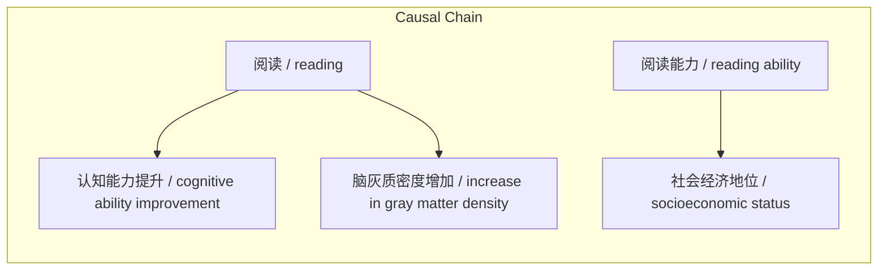

# NEWS/NEWS 任务报告

- agent: news/news
- requestId: 1775914401334-ompf0j
- 生成时间(UTC): 2026-04-11T13:36:59.928Z

### Runtime Trace
- 文本总结 | model=openrouter/free
- 文本总结 | schema_fallback=no
- 文本总结 | attempted_models=stepfun/step-3.5-flash:free, qwen/qwen-2.5-72b-instruct:free, deepseek/deepseek-chat:free, openrouter/free

## 文本总结

### 运行信息
- model: openrouter/free
- schema_fallback: no
- attempted_models: stepfun/step-3.5-flash:free, qwen/qwen-2.5-72b-instruct:free, deepseek/deepseek-chat:free, openrouter/free

# 阅读提升认知能力与社会经济地位

## 整体结构化文档表达
### 文档卡片
- 主题（中文/English）：阅读对认知能力与社会经济地位的影响 / The Impact of Reading on Cognitive Ability and Socioeconomic Status
- 一句话摘要：阅读不仅能提升认知能力，还能显著预测未来的社会经济地位。
- 目标读者：普通大众
- 核心结论（3条）：
- 阅读能提升专注力、思维计划性、流畅性、想象力等多方面认知能力。
- 阅读者在双侧脑的颞叶后部、顶叶区域的脑灰质密度显著增加，神经纤维区域白质密度也显著增加。
- 7岁时的阅读能力能够显著正向预测42岁时个体的社会经济地位，其预测力超过了童年期的家庭社会经济地位。

### 内容结构树
1. 背景与问题定义
2. 核心观点与关键证据
3. 方法/机制/路径
4. 风险与边界条件
5. 结论与行动建议

### 结构化元数据（JSON）
```json
{
  "title": "阅读提升认知能力与社会经济地位",
  "topic_zh": "阅读对认知能力与社会经济地位的影响",
  "topic_en": "The Impact of Reading on Cognitive Ability and Socioeconomic Status",
  "audience": "普通大众",
  "claims": [
    "阅读可以提升专注力、思维的计划性、流畅性、想象力等多方面的认知能力。",
    "阅读者跟文盲相比，在双侧脑的颞叶后部、顶叶区域的脑灰质密度显著增加。",
    "在连接左右脑后部脑区的神经纤维区域白质密度显著增加。",
    "7岁时的阅读能力能够显著正向预测42岁时个体的社会经济地位（包括职业、住房和收入）。",
    "阅读能力的预测力超过了童年期的家庭社会经济地位。"
  ],
  "evidence": [
    "研究表明，阅读可以提升专注力、思维的计划性、流畅性、想象力等多方面的认知能力。",
    "研究表明，7岁时的阅读能力能够显著正向预测42岁时个体的社会经济地位（包括职业、住房和收入）。"
  ],
  "risks": [],
  "actions": []
}
```

## 处理流程
1. 输入识别
2. 信息抽取（实体、概念、问题、事实、观点）
3. 结构化归纳（定义/分类/比较/因果/方法论）
4. 关系建模（概念关系、等式/方程/逻辑链）
5. 可视化表达（Mermaid）

## 概念清单（中英文）
- 认知能力 / cognitive ability
- 脑灰质 / gray matter
- 白质 / white matter
- 社会经济地位 / socioeconomic status

## 概念定义（中英文）
### 认知能力 / cognitive ability
- 中文定义：个体感知、记忆、思维、问题解决等心理过程的能力
- English Definition: The ability of an individual to perceive, remember, think, and solve problems.

### 脑灰质 / gray matter
- 中文定义：大脑皮层中含有神经细胞体的部分
- English Definition: The part of the cerebral cortex that contains neuronal cell bodies.

### 白质 / white matter
- 中文定义：大脑中含有髓鞘化的神经纤维束的部分
- English Definition: The part of the brain that contains myelinated nerve fiber bundles.

### 社会经济地位 / socioeconomic status
- 中文定义：个体或群体在社会中的经济和社交地位
- English Definition: The economic and social position of an individual or group in society.


## 概念关联与逻辑关系（中英文）
- 阅读/reading -> 认知能力提升/cognitive ability improvement | causal | 提升
- 阅读/reading -> 脑灰质密度增加/increase in gray matter density | causal | 导致
- 阅读能力/reading ability -> 社会经济地位/socioeconomic status | causal | 预测

### 可形式化关系
- 阅读能力 → 认知能力提升
- 阅读能力 → 脑灰质密度增加
- 阅读能力 → 社会经济地位

## COT逻辑梳理（定义/分类/比较/因果/科学方法论）
- 研究表明，阅读可以提升专注力、思维的计划性、流畅性、想象力等多方面的认知能力。
- 研究表明，阅读者跟文盲相比，在双侧脑的颞叶后部、顶叶区域的脑灰质密度显著增加，在连接左右脑后部脑区的神经纤维区域白质密度显著增加。
- 研究表明，7岁时的阅读能力能够显著正向预测42岁时个体的社会经济地位（包括职业、住房和收入），其预测力超过了童年期的家庭社会经济地位。

## 事实与看法（区分）
### 事实
- 阅读可以提升专注力、思维的计划性、流畅性、想象力等多方面的认知能力。
- 阅读者跟文盲相比，在双侧脑的颞叶后部、顶叶区域的脑灰质密度显著增加。
- 在连接左右脑后部脑区的神经纤维区域白质密度显著增加。
- 7岁时的阅读能力能够显著正向预测42岁时个体的社会经济地位（包括职业、住房和收入）。
- 阅读能力的预测力超过了童年期的家庭社会经济地位。

### 看法
- 未发现明确主观看法

## FAQ（原文问题整理）
- 未发现明确 FAQ

## Visualization
### Mermaid 图 1（概念结构图）


### Mermaid 图 2（逻辑/因果图）


## 文章中的类比
- 未发现明确类比

## 10个金句
- 原文未提供

